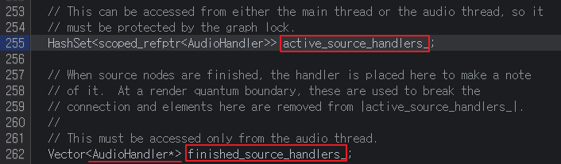

# CVE-2020-6449


💡 이 문서는 Man Yue Mo님의 [GHSL-2020-040: Use After Free in Chrome WebAudio](https://securitylab.github.com/advisories/GHSL-2020-040-chrome/) 문서를 번역한 내용입니다.   

💡 [+]은 제가 이해하는데 필요했던 추가적인 내용을 작성한 것입니다.   

## **Summary**

UaF in `DeferredTaskHandler::BreakConnections(2)`

## **Product**


Chrome

## **CVE**


CVE-2020-6449

## **Tested Version**


Chrome version: master branch build 79956ba, asan build 80.3987.132 Operating System: Ubuntu 18.04

## **Details**


이 issue는 issue 1057593과 동일한 crash가 나지만 root cause와 fix가 다르다.

1057593과 유사하게 `BaseAudioContext`의 중지와 `AudioScheduleSourceNode`의 중지가 동일한 퀀텀에서 발생하면 `BaseAudioContext`가 일시 중단되는 동안 `AudioScheduleSourceNode`가 소멸될 수 있다. 이 시점에서 `DeferredTaskHandler`의 `active_source_handlers_`[[1]](#1-chromium-code-search)는 `DeferredTaskHandler::BreakConnections`[[2]](#2-chromium-code-search)에서 사용되기 전에 해당 `AudioScheduleSourceHandler`를 활성 상태로 유지하는 역할을 한다.

`DeferredTaskHandler::BreakConnections`의 코드는 묵시적으로 `done_source_handlers_`가 `active_source_handlers_`의 하위 집합이므로 `active_source_handlers_`가 `finished_source_handlers_`의 `raw pointer`를 활성 상태로 유지한다고 가정한다. (`active_source_handlers_.erase`에서 볼 수 있듯이 `finished`가 `active_source_handlers_`에 포함되어 있다고 가정함)

그러나 문제는 `active_source_handlers_`가 `DeferredTaskHandler::ClearHandlersToBeDeleted` 메서드[[3]](#3-chromium-code-search)에 의해 지워질 수 있는 반면 `finished_source_handlers_` 는 동시에 지워지지 않아 `finished_source_handlers_`에 댕글링 포인터가 남게 되어 `BreakConnections`에서 `UaF`가 발생한다.

```cpp
**// void DeferredTaskHandler::BreakConnections()**
	for (auto* finished : finished_source_handlers_) {
      // Break connection first and then remove from the list because that can
      // cause the handler to be deleted.
      finished->BreakConnectionWithLock();     //<-- `active_source_handlers_` may have been cleared, and finished is already freed
      active_source_handlers_.erase(finished); //<-- assumes `active_source_handlers_` contains finished
    }

```

`ClearHandlersToBeDeleted`를 호출하는 `BaseAudioContext::Uninitialize`를 트리거하는 컨텍스트를 파괴하면 `active_source_handlers_`를 지운 다음 DeferredTaskHandler::BreakConnections를 트리거하여 UaF를 발생시킬 수 있다.

### **[1]** [Chromium Code Search](https://source.chromium.org/chromium/chromium/src/+/bf433ad6dcfcaac460512bb45a53d5a2ea5356f9:third_party/blink/renderer/modules/webaudio/deferred_task_handler.h;l=255;drc=67e598a2ae32101acac19318c0c56830c12a303f?originalUrl=https:%2F%2Fcs.chromium.org%2F)



third_party/blink/renderer/modules/webaudio/deferred_task_handler.h

- **[+]**
    
    ### WTF::HashSet
    
    [Chromium Code Search](https://source.chromium.org/chromium/chromium/src/+/master:third_party/blink/renderer/platform/wtf/hash_set.h)
    
    base나 std 라이브러리에 우선하여 WTF에 정의된 타입을 사용해야 한다. 그 중 가장 인기 있는 것은 vectors, **hashsets**, hashmaps, strings 이다. 블링크에서는 WTF::Vector, **WTF::HashSet**, WTF::HashMAp, WTF::String, WTF::AtomicString을 std::vector, std::*set, std::*map, std::string을 대신하여 사용하여야 한다.
    
    
    [WTF (Web Template Framework)](https://chromium.googlesource.com/chromium/src/+/refs/heads/main/third_party/blink/renderer/platform/wtf/README.md)
    

### **[2]** [Chromium Code Search](https://source.chromium.org/chromium/chromium/src/+/bf433ad6dcfcaac460512bb45a53d5a2ea5356f9:third_party/blink/renderer/modules/webaudio/deferred_task_handler.cc;l=83;drc=67e598a2ae32101acac19318c0c56830c12a303f?originalUrl=https:%2F%2Fcs.chromium.org%2F)


third_party/blink/renderer/modules/webaudio/deferred_task_handler.cc

- **[+]**
    
    
    
    third_party/blink/renderer/modules/webaudio/audio_node.cc
    
    finished_source_handlers_를 참조하고 있는 포인터의 수를 줄이는 것으로 추측됨 
    

### **[3]** [Chromium Code Search](https://source.chromium.org/chromium/chromium/src/+/bf433ad6dcfcaac460512bb45a53d5a2ea5356f9:third_party/blink/renderer/modules/webaudio/deferred_task_handler.cc;l=361;drc=67e598a2ae32101acac19318c0c56830c12a303f;bpv=1;bpt=1?originalUrl=https:%2F%2Fcs.chromium.org%2F)


third_party/blink/renderer/modules/webaudio/deferred_task_handler.cc

### [+] **summary**
    
`DeferredTaskHandler::BreakConnections`에서 raw pinter(finished)의 reference count하나씩 지운 다음, raw pointer(finished)를 erase해준다. 만약 이 함수 전에, `DeferredTaskHandler::ClearHandlersToBeDeleted` 에서 raw pointer들을 저장하고 있는 hashset인 active_source_handlers_가 clear 된다면, raw pointer(finished)들은 전부 댕글링 포인터가 되어서 UaF가 발생할 수도 있다.
    

### **Impact**

Use-after-free in renderer.

## **Coordinated Disclosure Timeline**


- 09/03/2020 Reported as [Chromium Issue 1059686](https://bugs.chromium.org/p/chromium/issues/detail?id=1059686)
- 18/03/2020 [Fixed in version 80.0.3987.149](https://chromereleases.googleblog.com/2020/03/stable-channel-update-for-desktop_18.html)
    - [+] Patch[4c57222340cfb78edadf08532f4468c676df5395 - chromium/src.git - Git at Google](https://chromium.googlesource.com/chromium/src.git/+/4c57222340cfb78edadf08532f4468c676df5395)
	
        


        `finished_source_handlers_` 를 raw pointer가 아니라 smart pointer인 base::scoped_refptr<>로 관리한다.
        
        또한 실직적으로 UaF가 발생하는 것을 막기 위해 `DeferredTaskHandler::ClearHandlersToBeDeleted` 에서 active_source_handlers_를 clear하기 전에 finished_source_handlers_부터 clear하는 코드를 추가하였다.
        
        ### reference count를 관리해주는 이유
        
        가비지 컬렉터 알고리즘 중에 reference counting을 이용한 알고리즘이 있다. 해당 객체의 reference count가 0이 되면 메모리에서 해제시킨다. 이를 위해 포인터를 해제시킬때 reference count를 관리한다.
        
        ### base::scoped_refptr
        
        [Smart Pointer Guidelines - The Chromium Projects](https://www.chromium.org/developers/smart-pointer-guidelines)
        
        - Chromium에서 사용하는 포인터는 주로 `std::unique_ptr<>`과 `base::scoped_refptr<>`이다.
        - base::scoped_refptr<> 은 `std::shared_ptr<>`과 비슷한 개념이다.
        - **std::unique_ptr<>**
            - 객체에 대한 유일한 "소유권"이 있음을 보장하는 포인터
            - 복사 불가능, 소유권 없이 객체 삭제 불가
        - **std::shared_ptr<>**
            - 객체를 참조하고 있는 포인터의 개수를 보유한 포인터
            - 포인터의 개수가 0일 경우, delete로 메모리 해제 ***(reference count 방식)***
                
                

## **Credit**


This issue was discovered and reported by GHSL team member [@m-y-mo (Man Yue Mo)](https://github.com/m-y-mo).

## **Contact**


You can contact the GHSL team at `securitylab@github.com`, please include the `GHSL-2020-040` in any communication regarding this issue.
