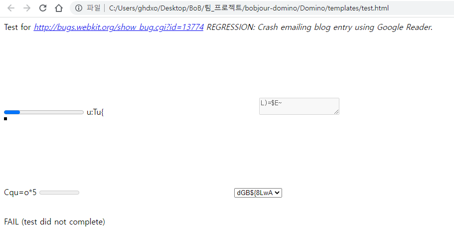

# Domino.md

# 목차

1. [퍼징 아이디어](#1-퍼징-아이디어)   
    1.1. [퍼징 아이디어](#11-퍼징-아이디어)   
2. [Domino 퍼저](#2-Domino-퍼저)   
    2.1.[퍼징 방식](#21-퍼징-방식)   
    2.2.[퍼징 테스트](#22-퍼징-테스트)   
3. [뮤테이션 전략](#3-뮤테이션-전략)   
    3.1. [Domato](#31-Domato)   
    3.2. [Template-Based Fuzzing](#32-Template-Based-Fuzzing)   
4. [작동 화면](#4-작동-화면)   
5. [결론](#5-결론)   
    5.1. [결과](#51-결과)   
    5.2. [개선 점](#52-개선-점)
---
# 1. 퍼징 아이디어

## 1.1. 퍼징 아이디어

Domino는 [Domato Fuzzer](https://github.com/googleprojectzero/domato)(링크)에 Template-Based Fuzzing 방식을 추가로 적용하여 만든 DOM Fuzzer이다. 우리가 만들었던 Fuzzer들 중 가장 많은 크래시 로그를 찾아냈던 Fuzzer이기도 하다.

방식을 요약하면 [source.chromium.org](http://source.chromium.org/)에서 carsh poc들을 찾아 template으로 만들고 해당 template들을 랜덤으로 뽑아 mutation 후 test를 하는 방식이다.

Fuzzing 환경은 우분투와 윈도우 모두 지원한다.

- [GIthub - Domino_Fuzzer](https://github.com/BOB-Jour/Domino_Fuzzer)

# 2. Domino 퍼저

## 2.1. 퍼징 방식

Domino의 퍼징 방식은 normal 모드와 iframe 모드 두 가지로 구분되고 사용자가 선택할 수 있다.

### 2.1.1. normal 모드

normal 모드는 사용자가 템플릿들을 미리 만들어 `~\Domino\Test_Templates`  디렉토리에 넣어두면 해당 템플릿들 중 하나를 랜덤으로 골라 Domato 태그들이 있는 위치에 코드를 생성해 치환하여 test.html를 생성하고 테스트를 바로 진행하는 모드이다. 



normal 모드 Fuzzing Test 화면

위는 normal 모드로 생성한 test.html을 실행시킨 모습이다.

test.html의 코드는 `~\Domino\templates\test.html` 에서 확인할 수 있다.

### 2.1.2 iframe 모드

iframe 모드는 iframe 내에 Domato로 Generate된 템플릿 코드를 실행한 후 실행 도중 강제로 iframe을 `iframe.remove()`로 제거하면서 발생하는 사이트 이펙트 취약점을 발견해 내는 것을 목표로 만든 모드이다. 실제로 iframe을 실행 도중 중간에 제거하는 것으로 19년, 20년도에 크래시들이 나왔었다.

기본적으로 다음의 템플릿을 사용한다.

```python
<html>
<script>
    function poc()
    {
        var iframe = document.createElement('iframe');
        iframe.width = %d; 
        iframe.height = %d; 
        iframe.src = './iframe_tc.html';
        document.body.appendChild(iframe);

        setTimeout( _=> {
            iframe.remove();
            location.href = 'http://127.0.0.1:8080/flag?iframe_test'; 
        }, %d); 
    }
</script>
		<body onload="poc()">
</body>
</html>
```

- iframe 창 크기 또한 크래시에 영향을 줄 수 있기 때문에 위의 템플릿을 사용해서 랜덤으로 iframe의 `width`와 `height`를 계속해서 설정하여 띄워주도록 했다.
- 또한 `setTimeout`을 사용하여 랜덤한 시간 동안 iframe을 실행하고 도중에 `iframe.remove()`를 호출하여 iframe을 제거하도록 하였다.

아래는 iframe모드로 생성된 iframe_test.html을 실행한 모습이다.


### 2.2. 퍼징 테스트

Domino의 퍼징 테스트는 아래와 같은 방식으로 진행된다.


### 2.2.1. 구성

- Domino_server.py (웹 서버)
    - Domino_server는 클라이언트(크롬)로부터 접속 요청이 들어오면 testcase를 Domino를 이용하여 생성하고 생성된 testcase.html을 보내주는 역할을 한다.
- run_fuzz.py (모니터)
    - 모니터는 실행한 크롬을 계속 모니터링하면서 크래시가 발생한 경우 해당 testcase와 로그를 수집한다.
    - 또한 모니터는 크롬이 장시간 실행되는 경우 내부적으로 메모리 구조가 일반적인 경우와 조금 달라질 수 있기 때문에 5분 단위로 강제 종료 후 다시 실행시킨다.

### 2.2.2. 흐름

1. 웹 서버 실행
2. 모니터 실행
    - 크롬 실행
3. 크롬이 웹 서버에게 testcase 요청
4. 요청을 받은 웹 서버는 testcase 생성 후 해당 testcase 전송
5. 크롬은 testcase 실행
6. 만약 4 중 크래시가 발생한 경우 모니터가 testcase, log 수집 및 크롬 종료 후 재실행
    - 크래시가 발생하지 않았다면 3 ~ 5 반복
7. 크래시 없이 실행 중 5분이 경과하면 크롬 종료 후 재실행
    - 재실행 후 3 ~ 5 반복

### 2.2.3. 공통 템플릿

흐름의 3번 과정을 위해서는 크롬이 스스로 테스팅을 끝낸 후 웹 서버에게 요청을 해야 할 필요가 있다. 이 과정을 위해 normal 모드와 iframe 모드의 템플릿에 추가하는 공통 방식으로 아래와 같은 방법을 사용하였다.

- normal 모드
  
    ```html
    <html>
    <TestCase>
    </html>
    
    <html>
    <head>
        
        <!-- Refresh_HTML 
        <meta http-equiv="refresh" content="0"> -->
        RELOAD_HTML
        <script type='text/javascript'>
    				setTimeout("location.href='http://127.0.0.1:8080/flag?test'",0);
        </script>
    </head>
    <body>
    </body>
    </html>
    ```
    
    normal 모드에서는 위와 같이 testcase html 아래에 서버에 요청을 위한 html 코드가 추가로 붙게 된다. 브라우저는 html을 파싱, 실행할 때 html 태그가 두개가 존재하면 상단의 html을 먼저 완료 한 후 그 다음이 html을 실행하는 특성이 있는데 이점을 이용하여 상단의 html이 파싱, 실행되며 테스팅이 끝나면 이어서 아래의 새로고침 html의 내용이 실행되면서 서버에 새로고침을 자동으로 요청하게 되는 방식이다.
    
    이 방식을 사용하면 동기식으로 Fuzzing이 가능하다는 장점이 있다.
    
- iframe 모드
  
    ```html
    <html>
    <head>
        Refresh_HTML
        <meta http-equiv="refresh" content="3"> 
    </head>
    <body>
    </body>
    </html>
    
    <html>
    <script>
        function poc()
        {
            var iframe = document.createElement('iframe');
            iframe.width = %d; 
            iframe.height = %d; 
            iframe.src = './test.html';
            document.body.appendChild(iframe);
    
            setTimeout( _=> {
                iframe.remove();
                location.href = 'http://127.0.0.1:8080/flag?iframe_test'; 
            }, %d); 
        }
    </script>
    <body onload="poc()">
    </body>
    </html>
    ```
    
    iframe 모드에서는 위처럼 `iframe.remove()` 다음에 바로 이어서 새로고침을 하도록 되어 있다.
    
    특이한건 normal 모드와는 다르게 상단에 refresh를 하는 html 코드가 있다는 것인데 이는 가끔씩 실행 후 서버에 재요청을 하지 않는 경우가 있어 이런 경우를 대비해 3초 후 강제로 새로고침을 하도록 하였다.
    

### 2.2.4. testcase 생성 제한

위 공통 템플릿을 보면 서버에 접속을 하는 url이 `http://127.0.0.1:8080/flag?test` 인 것을 볼 수 있다. 보면 `flag`에 요청하고 GET 파라미터로 `test` 또는 `iframe_test`를 붙여주는 것을 볼 수 있는데 이는 testcase가 크롬에서 실행되고 있는 도중 `url()` 과 같은 것을 사용하여 웹 서버에 접근 요청 → testcase 생성(덮어씌워짐)이 되는 경우를 방지하기 위해 고안한 방식이다. 이런 일이 발생할 경우 크래시가 발생하였을 때 제대로된 testcase가 저장이 되지 않는 문제가 발생할 수 있기 때문에 고안하고 적용하게 되었다.

flag를 거치지 않고 testcase 생성 요청이 오는 경우 웹 서버는 잘못된 요청이라고 판단하고 testcase를 생성하지 않는다.

# 3. 뮤테이션 전략

### 3.1. Domato

Google Project Zero팀에서 만든 DOM Fuzzer이다. DOM Fuzzer는 이름대로 브라우저의 DOM(Document Object Model)을 대상으로 Mutation 또는 Generate을 진행하는 것을 말한다. Domato는 크게 generator.py와 grammer.py, *.txt 파일들로 구분되는데 각각 하는 일은 다음과 같다.

- generator.py : testcase를 생성합니다. (main 코드)
- grammer.py : 문법적으로 유효한 코드를 생성한다.
- *.txt 파일 : txt파일에는 html, js, css 등 각각 해당하는 언어의 문법이 모든 경우의 수에 맞춰 만들어져 있다.
  
    ```bash
    #XPathEvaluator
    <new XPathExpression> = <XPathEvaluator>.createExpression("<xpath>");
    <new XPathExpression> = <XPathEvaluator>.createExpression("<xpath>",<XPathNSResolver>);
    <new XPathNSResolver> = <XPathEvaluator>.createNSResolver(<Element>);
    <new XPathResult> = <XPathEvaluator>.evaluate("<xpath>",<Element>);
    <new XPathResult> = <XPathEvaluator>.evaluate("<xpath>",<Element>,<XPathNSResolver>);
    <new XPathResult> = <XPathEvaluator>.evaluate("<xpath>",<Element>,<XPathNSResolver>,<fuzzint>);
    <new XPathResult> = <XPathEvaluator>.evaluate("<xpath>",<Element>,<XPathNSResolver>,<fuzzint>,<XPathResult>);
    <new XPathResult> = <XPathEvaluator>.evaluate("<xpath>",document);
    <new XPathResult> = <XPathEvaluator>.evaluate("<xpath>",document,null,XPathResult.ANY_TYPE,<XPathResult>);
    ```
    
    위 예시처럼 되어있고 위 예시에 보이는 <> 태그들은 실제로 생성될 때 올바른 값들로 치환되며 제대로된 코드가 생성되게 된다.
    

기존의 Domato generator.py는 템플릿을 받지 않고 바로 랜덤한 코드를 생성해주기 때문에 우리는 Domato를 Template Based Fuzzing에 사용하기 위해 가장 먼저 generator.py를 클래스화 하였다. 

- 클래스화 된 Domato - generator.py 사용법
  
    ```python
    // ~/domato/generator.py
    if __name__ == '__main__':
        # test
        domato = Domato()
        with open('./template.html', 'r') as fp:
    				temp = fp.read()
        testcase = domato.generator(temp) # testcase 생성
    ```
    

### 3.2. Template-Based Fuzzing

Template-Based Fuzzing은 취약점이 발생할 가능성이 높은 몇 개의 템플릿을 미리 만들어두고 해당 템플릿의 값을 추가 혹은 변경해가며 Fuzzing을 진행하는 방식을 말한다.

구글은 크래시를 발생시켰던 html코드들을 [source.chromium.org](http://source.chromium.org/)에 저장해놓고 있는데 그 것들을 ‘Domato 제너레이트가 가능한 형태로 템플릿화 하여 실행시켜본다면 비슷한 곳에서 발생하는 취약점을 찾을 수 있지 않을까?’라는 생각으로 적용해본 방식이다.

- [source.chromium.org](http://source.chromium.org/)에 접속하여 `file:html$ third_party/blink/web_tests crash` 로 검색하면 크래시를 발생시켰던 html 코드들이 나온다.

### 3.2.1. 템플릿 예시

- 우리가 만든 템플릿 중 하나는 아래와 같다.

```html
<!-- third_party/blink/web_tests/fast/multicol/anonymous-block-split-crash.html -->
<html>
<head>
<htmlfuzzer>
<style>
#test0 { -webkit-column-count: 2; }
#test1::after { display: block; content: ''; }
#test2:nth-last-child(2n) { content: ''; }
#test2 { -webkit-column-span: all; }
#test4 { float: right; }
<cssfuzzer>
</style>
<script>

window.onload = function() {
    test0 = document.createElement('div');
    test0.setAttribute('id', 'test0');
    document.body.appendChild(test0);
    test1 = document.createElement('div');
    test1.setAttribute('id', 'test1');
    test0.appendChild(test1);
    test2 = document.createElement('div');
    test2.setAttribute('id', 'test2');
    test1.appendChild(test2);
    test3 = document.createElement('span');
    test1.appendChild(test3);
    test3.appendChild(document.createTextNode('A'));
    test4 = document.createElement('table');
    test4.setAttribute('id', 'test4');
    test1.appendChild(test4);
    test0.style.display = 'run-in'; 
    test4.style.display = 'table-column';
    document.body.offsetTop;
    document.designMode = 'on';
    document.execCommand('selectall');
    document.execCommand('inserttext', '');
    document.body.offsetTop;
    document.body.innerHTML = "PASS";
    <jsfuzzer>
}
</script>
</head>
<body>
</body>
</html>
```

- 위 템플릿을 보면 중간중간에 <htmlfuzzer>, <cssfuzzer>, <jsfuzzer>와 같은 태그들이 보일텐데 해당 태그들은 Domato에서 각 부분에 대한 랜덤한 코드를 생성한 후 치환하는 위치는 표시해두는 일종의 키워드이다. 따라서 사용자가 템플릿을 만든 후 원하는 위치에 위의 태그들을 심어두면 그 위치에 해당하는 코드들이 생성된다.

# 4. 작동 화면


- 왼쪽은 chromium, 오른쪽 상단은 대시보드, 오른쪽 하단은 Domino_server의 로그이다.
- 대시보드 표시 목록
    - StartTime : 퍼징 시작 시간
    - RunTime : 실행 시간
    - Crash : 수집된 Crash 로그 개수
    - Lastest Crash : 마지막으로 수집된 Crash 로그 개수
    - Dcheck Failed : 수집된 Dcheck 로그 개수
    - TestCase : 생성된 모든 TestCase 개수
    - Chrome Count : 재시작된 chromium 개수
    - Chrome PID : 현재 실행중인 choromium의 PID

# 5. 결론

## 5.1. 결과

Domino는 굉장히 많은 DCHECK 로그들을 찾아내 주었고 몇 개의 ASAN 로그도 찾아내 주었지만 
매우 아쉽게도 대부분 악용 가능성이 없는 것들이었다. 퍼징 도중 중간에 한번 heap-of-poison 로그도 떴었지만, 재현이 불가능한 크래시 로그여서 제보를 할 수는 없었다...

## 5.2. 개선 점

이유는 잘 모르겠지만 현재 크래시 로그를 수집할 때 최대 5분의 시간이 걸린다. 때문에 크래시 발생 후 크롬이 재실행되며 Fuzzing이 다시 시작하기까지 불필요한 딜레이가 발생한다. 이 문제는 Domino에서 사용한 Fuzzing Test 방식을 적용한 우리가 만든 모든 Fuzzer들(Glitch, Pleaser)에서 발생하고 있다. 이 점에 대한 해결 방법은 후에 우리의 Fuzzing Test방식을 사용하는 사람들에게 맡기겠다.
