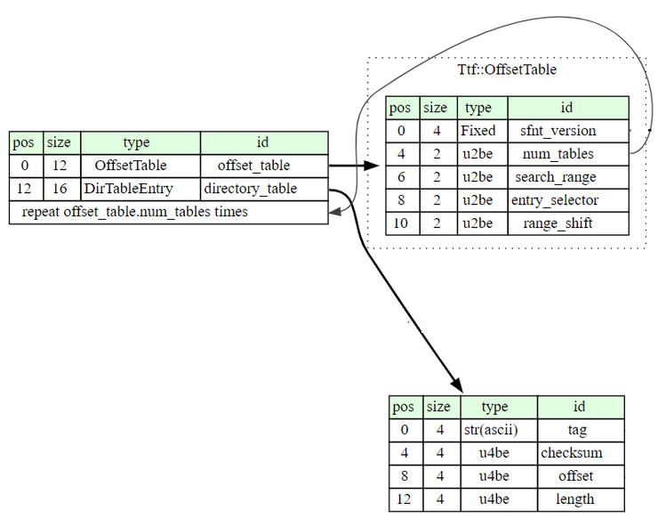

# Glitch-TTF와 멀티미디어 파일에 관하여
1. [TTF](#1-TTF)   
1.1. [TTF 파일의 구조](#11-TTF-파일의-구조)   
1.2. [TTF 태그에 관한 세부 내용](#12-TTF-태그에-관한-세부-내용)   
1.2.1. [\<sbix\>](#121-sbix)   
---

# 1. TTF

## 1.1. TTF 파일의 구조

- 여러 테이블들이 연이어 나열된 구조. 이 테이블을 ‘태그’ 라고 부른다.
- 첫 번째 테이블, 즉 TTF 파일의 시작 부분은 언제나 `Font directory` 라는 태그이다. 해당 태그의 구조는 아래 사진과 같다.
    - `offset_table`은 현재 TTF 파일의 메타 데이터를 저장하며, `directory_table`은 `Font directory` 태그 이후로 이어질 태그들의 오프셋과 길이 등의 태그 관련 메타 데이터를 저장한다. 이 구조는 <그림 1> 에 명시적으로 표현되어 있으며, 실제 TTF 파일 바이너리 내에서 표현되는 형태는 <그림 2>와 같다.
        
        
        
        <그림 1>
        
        
        
        <그림 2>-빨간 박스가 `offset_table`, 파란 박스가 `directory_table` 이다.
        
    - 아래 <그림 3>에서 볼 수 있듯, `directory_table` 은 현 TTF 파일에 포함된 태그들에 대한 정보를 나열하고 있다.
        
        
        
        <그림 3>- `directory_table`의 구성
        
- `Font directory` 태그 이후로는, `directory_table` 에 명시된 태그들의 필드가 쭉 나열된다. TTF 파일에 필수적으로 포함되어야 하는 태그의 종류는 아래 <표 1>과 같다.
    
    
    
    <표 1>-TTF 파일에 필수로 포함되는 태그들
    

## 1.2. TTF 태그에 관한 세부 내용

Glitch 퍼저를 개발하기 위해 모인 팀인 우리(홍택균, 이윤희, 이주협)는 TTF에 포함될 수 있는 모든 태그에 대해 각자 조사를 진행했고, 조사한 내용을 문서 형태로 정리하여 함께 공유했다. 그러나, 이미 존재하는 TTF 태그에 대한 개발자 문서를 단순히 공부하여 정리한 것이니만큼 이 절에 팀원이 작성했던 문서를 모두 표현하는 것은 비효율적이라 판단했다. 

따라서 TTF 폰트 파일에서 멀티미디어 파일을 사용할 때 관여하는 `sbix` 태그에 관한 내용만을 게시하고, 다른 태그들의 내용은 참고했던 문서를 명시함으로써 이 절은 마무리하려 한다.

TTF 파일에 포함될 수 있는 모든 태그들에 대한 개발자 문서는 [여기](https://developer.apple.com/fonts/TrueType-Reference-Manual/)로 가면 확인할 수 있다. 

### 1.2.1. \<sbix\>

- png, jpec, tiff 등의 포맷을 가진 이미지 파일들의 bitmap data에 TTF가 접근할 수 있게 해주는 테이블이다.
- 태그의 헤더는 다음의 <그림 4>와 같다.
    
    
    
    <그림 4>
    
    위 <그림 4>에서 등장하는 strike란, 각 glyph[1]의 정보를 모두 가지고 있는 구조체이다. 즉 `strikeOffset[numStrikes]` 는 Bitmap strike의 오프셋을 알려주고 있다. `StrikeOffset[numStrikes]` 필드에 명시된 오프셋을 따라가 확인한 Bitmap strike의 구조는 아래 <그림 5>와 같다.
    
    ([1]: glyph는 폰트에서 표현 가능한 하나의 글자를 의미한다)
    
    
    
    <그림 5>
    
    
    
    <그림 6>-Bitmap strike의 구성과 설명
    
    <그림 5>의 첫 번째 초록색이 `ppem`, 두 번째 초록색이 `resolution`, 이하 노란색, 주황색, 파란색, 회색 영역이 각 glyph 구조체가 Bitmap strike를 기준으로 갖는 오프셋을 의미한다.
    
    특정 이미지를 한 개의 glyph로 사용하고 싶다면, 해당 이미지에 대한 비트맵 데이터는 대응되는 glyph의 데이터로 변형되어 TTF 파일 안에 저장되어야 한다. 따라서, glyph의 데이터는 `glyph data record` 구조체로 정돈되어 TTF 파일 내에서 표현되게 된다.
    
    
    
    <그림 7>-`glyph data record` 구조체의 구성과 설명
    
    위 구조체의 `graphicType` 를 보면, 현재는 오직 jpg, pdf, png, tiff 만이 정의되어 있다고 명시하고 있다. 그러나, 코드 오디팅 결과, jpg, pdf, tiff과 관련한 처리 기제는 FreeType 라이브러리에서 미구현된 상태였다. 실제로 사용 중인 이미지 포맷은 png 뿐인 것이다. png 파일에 관한 자세한 설명은 이 [문서](https://m.blog.naver.com/PostView.naver?isHttpsRedirect=true&blogId=gnsehfvlr&logNo=220733132744)에서 찾아볼 수 있다.
