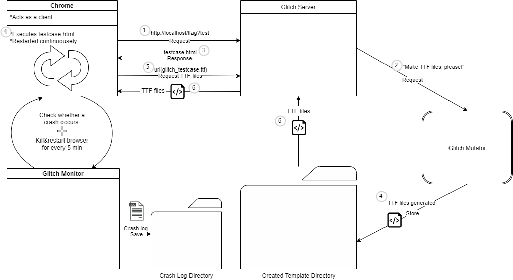
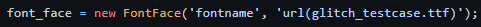
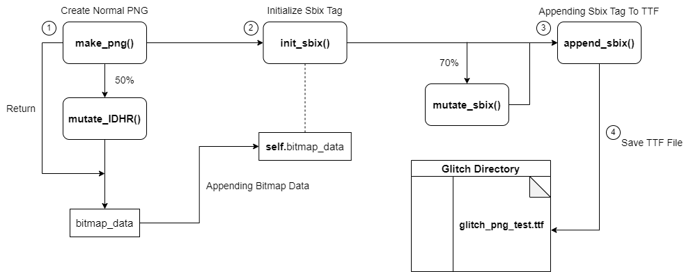
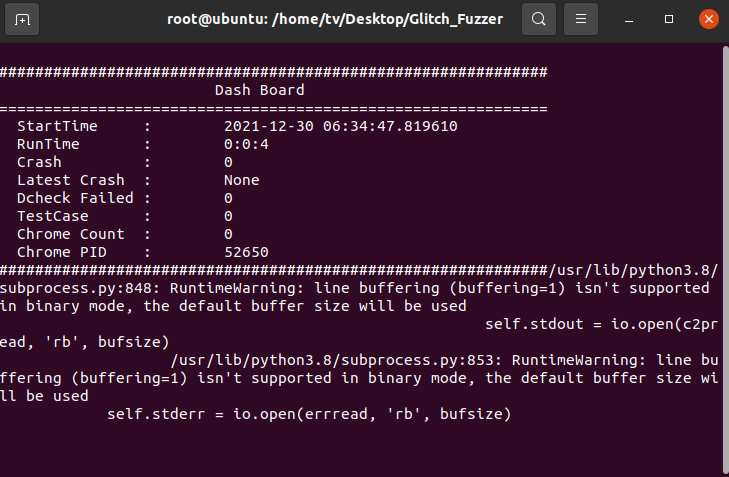

# Glitch.md
# 목차
1. [퍼징 아이디어](#1-퍼징-아이디어)   
  1.1. [배경이 된 취약점:CVE-2020-15999](#11-배경이-된-취약점-cve-2020-15999)   
    1.1.1. [취약점 유형](#111-취약점-유형)   
    1.1.2. [FreeType이란?](#112-freeType이란)   
    1.1.3. [TTF 헤더 구조](#113-ttf-헤더-구조)   
    1.1.4. [PNG 헤더 구조](#114-png-헤더-구조)   
    1.1.5. [근본 원인(Root Cause)](#115-근본-원인root-cause)   
    1.1.6. [어택 벡터 선정](#116-어택-벡터-선정)   
  1.2. [퍼징 아이디어 선정](#12-퍼징-아이디어-선정)   
2. [Glitch 퍼저](#2-glitch-퍼저)   
  2.1.[퍼저 구조](#21-퍼저-구조)   
  2.2.[Glitch 퍼저의 실행 단계](#22-glitch-퍼저의-실행-단계)   
3. [뮤테이션 전략](#3-뮤테이션-전략)   
  3.1. [뮤테이터 구조](#31-뮤테이터-구조)   
  3.2. [뮤테이터 실행 과정](#32-뮤테이터-실행-과정)   
4. [실행 결과](#4-실행-결과)   
5. [결론](#5-결론)   
  5.1. [결과](#51-결과)   
  5.2. [보완책](#52-보완책)   

---

# 1. 퍼징 아이디어

## 1.1. 배경이 된 취약점: CVE-2020-15999

이 절에서는 `CVE-2020-15999`에 관해 간략히 설명하고, 이를 이해하기 위한 정보 또한 간략히 서술한다. 자세한 원데이 분석 보고서는 [여기](../../1_vulnerability_analysis_whitepapers/cve-2020-15999/README.md)

### 1.1.1. **취약점 유형**

> `==169196==ERROR: AddressSanitizer: heap-buffer-overflow`
> 

**FreeType** 에서 발생한 **Heap Overflow** 취약점이다.

### 1.1.2. **FreeType이란?**

**텍스트를 비트맵으로 렌더링** 하는 데 사용되는 **소프트웨어 개발 라이브러리** . 기타 **글꼴 관련 작업** 을 지원한다. 자세한 내용은 [여기](https://freetype.org/freetype2/docs/index.html)

### 1.1.3. **TTF 헤더 구조**

TTF (True Type Font) 파일은 일련의 태그[^1]들이 나열되어 있는 구조를 취하고 있다. 특정 태그가 TTF 파일에 포함되어 있을 경우, TTF 파일의 헤더에 그 이름과 간략한 정보를 명시한 후 TTF 파일의 바디에 태그의 자세한 데이터를 기록해 두는 것을 원칙으로 한다.

[^1]: 태그: 특정 기준으로 분류되는 데이터를 테이블 형식으로 가지고 있는 구조체.

아래 표는 TTF에 필수적으로 포함되어야 하는 9개 태그들이다.

| 태그 이름 | 테이블 |
| --- | --- |
| cmap | 문자 코드를 glyph 인덱스에 매핑 |
| glyf | glyph 데이터 |
| head | font 헤더 |
| hhea | 가로에 대한 헤더 |
| hmtx | 가로에 대한 행렬 |
| loca | glyph 데이터 테이블의 시작 부분 부터 glyph까지의 오프셋을 저장 |
| maxp | font에 대한 메모리 요구 사항을 설정 |
| name | 다국어 문자열을 OpenType font와 연결 |
| post | PostScript 프린터에서 TrueType 또는 OpenType font를 사용하는 데 필요한 추가 정보 |

<표 1-TTF 태그 종류와 기능>

**추가. `sbix` 태그가 `CVE-2020-15999`의 첫 번째 핵심인데, 그것은 이 태그에 PNG 등의 멀티미디어 파일의 정보를 저장하기 때문이다.**

TTF 파일 구조에 관한 자세한 내용은 [여기](https://docs.fileformat.com/font/ttf/).

### 1.1.4. **PNG 헤더 구조**

PNG란 그림 파일 형식 중 한 종류이며 그 구조는 크게 4개의 청크(chunk)로 이루어져 있다. 이 절에서는 PNG 파일의 헤더 구조와 청크에 관해 설명한다.

| 청크 이름 | 설명 |
| --- | --- |
| IHDR | 이미지 헤더 정보 영역 |
| PLTE | 색깔 정보 영역 |
| IDAT | 실제 이미지 데이터 영역 |
| IEND | PNG 파일의 끝 |

<표 2-PNG 파일을 구성하는 4가지 청크>

위 표에 나온 것과 같이, PNG 파일은 총 4개의 청크로 구성된다. 그 중 헤더 역할을 하는 것이 바로 첫 번째에 표시된 IHDR 청크인데, 아래 코드는 IHDR 청크의 구조를 보여주는 코드이다.

```java
Length : 00 00 00 0D (13 byte),
Chunk Type : 49 48 44 52 "IHDR" (4 byte),
Chunk Data (13 byte),
 {
   Width (4 byte),
   Height (4 byte),
   Bit depth (1 byte),
   Color Type (1 byte),
   Compression method (1 byte),
   Filter method (1 byte),
   Interlace method (1 byte),
 }
```

위에 표시된 IHDR 청크의 구조를 보면, `Width` 와 `Height` 라는 항목이 있다. 이 두 항목은 PNG 이미지의 가로, 세로 길이를 지정하는 항목인데, 바로 이들이 `CVE-2020-1599`의 두 번째 핵심 요소로서 기능한다.

여기 설명된 이외의 자세한 PNG 파일 구조를 알고 싶다면 [여기](https://ryanking13.github.io/2018/03/24/png-structure.html)

### 1.1.5. **근본 원인(Root Cause)**

위 정보를 토대로 우리는 `CVE-2020-1599`에 대한 Root Cause 분석을 진행했고, 그 결과로 나온 것을 이 절에서 짤막히 설명하려 한다. 언급된 취약점이 발발한 과정은 아래와 같다:

1. FreeType에서 비트맵 청크 크기를 정할 때 **Height 값이 저장되는 변수** 는 **16비트로 고정된다.**
2. 그러나, 실제 PNG 헤더에 명시된 Height 값은 **32비트이다.**
3. 따라서, PNG 파일 데이터를 읽어와 FreeType에서 사용할 때 **정수 잘림** 이 발생한다.
4. 결과적으로 Bitmap Data를 메모리에 할당할 시, PNG의 실제 Height 값이 16비트 크기를 넘어서는 불일치 현상이 발생하게 된다.
5. 따라서, Heap Overflow가 발생한다.

정리하자면, `CVE-2020-15999`의 근본 원인은 **'FreeType 폰트 중 한 종류인 TTF 상에서 PNG 파일의 정보를 처리할 때 발생한 Heap overflow 취약점'** 으로 압축될 수 있다.

### 1.1.6. 어택 벡터 선정

앞선 `1.1.1`~ `1.1.5` 절에서, FreeType을 사용하는 폰트 `TTF` 에서 발생한 취약점인 `CVE-2020-15999` 에 대해 설명했다. 당시 이 취약점 분석을 통해 **1) FreeType을 사용하는 폰트에서 멀티미디어 데이터를 가져와 사용할 때** , **2) 비슷한 종류의 취약점이 발생** 할 수 있으리라는 가능성이 제기되었다.  특히나 **FreeType에서는 멀티미디어 파일의 종류를 단순한 이미지 파일 하나로 한정하지 않았으므로** 충분한 variant cases가 발생할 수 있다고 판단했다. 따라서 우리는 FreeType을 사용하는 폰트들이 어택 벡터로서 충분한 가치가 있다는 결론을 내리게 되었다.

결론적으로 우리는 FreeType을 사용하는 폰트들을 어택 백터로 선정하게 되었다.

## 1.2. 퍼징 아이디어 선정

어택 벡터를 선정했으니, 이제는 어택 벡터의 어떤 갈래가 더 가능성이 있고, 퍼징으로 공략하기에 유리한지를 판단해야 했다. 이러한 어택 벡터 검토를 위한 조건을 브레인스토밍하였더니, 아래와 같은 결과가 나왔다.

| 검토 사항 |
| --- |
| 1. FreeType을 사용하는 폰트 중, TTF 폰트 외 다른 형식의 폰트에서도 멀티미디어를 사용하는가? |
| ┗1-1. (다른 형식의 폰트에서도 사용한다면) 어떤 멀티미디어를 사용하는가? |
| 2. TTF 파일 내부에서 PNG 외에도 다른 멀티미디어를 사용하는가? |
| ┗2-1. (다른 멀티미디어를 사용한다면) 어느 부분에서 취약점이 터질 수 있겠는가? |

<표 3-어택 벡터에 대한 검토 사항>

위 조건들을 검토해 보니, 아래 <표 4>와 같은 결과가 나왔다.

| 검토 사항 | 결과 |
| --- | --- |
| 1. FreeType에서 TTF 폰트 외 다른 형식의 폰트에서도 멀티미디어를 사용하는가? | X |
| ┗1-1. (다른 형식의 폰트에서도 사용한다면) 어떤 멀티미디어를 사용하는가? | 검토 불가 |
| 2. TTF 파일 내부에서 PNG 외에도 다른 멀티미디어를 사용하는가? | X |
| ┗2-1. (다른 멀티미디어를 사용한다면) 어느 부분에서 취약점이 터질 수 있겠는가? | 검토 불가 |

특히, TTF 파일 내부에서 PNG 외에도 다른 멀티미디어를 사용하는지 여부는 코드 오디팅을 통해 확인해 보니 타 멀티미디어 포맷 사용 계획은 있으나 구현은 하지 않은 상태인 것으로 확인되었다.

즉, 기존에 취약점이 발생했던 경로 이외로의 확장이 불가능한 상황이었으므로 우리는 `CVE-2020-15999` 와 동일한 어택 벡터를 공략하기로 결정했다.

# 2. Glitch 퍼저

Glitch 퍼저의 깃허브 주소는 [여기](https://github.com/BOB-Jour/Glitch)

이 절에서는 우리가 만든 Glitch 퍼저의 대략적인 구조에 대해 설명한다. 본 퍼저의 핵심이라 할 수 있는 뮤테이터는 3절에서 더욱 자세히 설명한다.

## 2.1. 퍼저 구조

아래는 Glitch 퍼저의 구조를 도식화한 그림이다. 2.1절에서 Glitch 퍼저의 각 모듈에 대한 대략적인 설명을 진행한 후, 2.2절에서 실행 흐름은 어떻게 되는지 설명하겠다.

Glitch는 크게 **세 가지의 모듈** 로 구성되어 있다. **첫째, Glitch Server** , **둘째, Glitch Mutator** , **셋째, Giltch Monitor** 가 바로 그것이다. Glitch Server에 대한 클라이언트 역할은 Chrome browser가 수행하며, 이러한 **Server-Client 구조** 를 차용함으로써 **`TTF` 파일을 html 형식으로 실행할 때의 번거로움을 없앨 수 있었다.**

**Glitch 서버** 는 클라이언트의 요청을 감지하여 testcase.html을 클라이언트에게 보내줌과 동시에 뮤테이터에게 `TTF` 파일의 생성을 요청하고, 이후 클라이언트가 TTF 파일을 요청할 경우 만들어진 TTF 파일을 보내주는 역할을 한다. 

또한, **뮤테이터** 의 경우 확률적인 값 삽입과 태그의 필드 변형을 통해 testcase를 생성하도록 했으며, **모니터** 는 브라우저 프로세스를 일정 주기로 강제 종료 후 새롭게 실행시키고, 테스트 케이스 실행 결과를 체크해 크래시인지 여부를 판단하며, 만일 크래시인 경우 기록을 남기도록 했다. 이렇게 구성된 Glitch를 실행시켰을 때의 흐름은 아래와 같다.



<그림 1-Glitch 퍼저의 실행 구조>

## 2.2 Glitch 퍼저의 실행 단계

Glitch 퍼저의 실행 단계는 아래와 같다. 

> 1.   모니터가 실행된다.
> 
> 1. 모니터는 크롬 프로세스를 실행한다.
> 2. 실행된 크롬 프로세스가 url([http://localhost/flag?test](http://localhost/flag?test))을 통해 서버에 접근한다.
>     - 이 때, 이 요청은 아래 사진처럼 url을 통해 이루어진다.
>         
>         
>         
> 3. 서버는 url을 통한 접근을 인식하고, 뮤테이터에게 `TTF` 파일 생성을 요청한다.
> 4. 생성된 `TTF` 파일을 뮤테이터가 폴더에 저장한다.
> 5. 4~5 작업을 끝낸 서버가 testcase.html을 클라이언트에게 보낸다.
> 6. 크롬 프로세스가 testcase.html을 받아서 실행하는 중,  `url(glitch_testcase.ttf)`로 서버에게 `TTF`파일을 요청한다.
> 7. 요청을 받은 서버는 폴더에 저장된 `TTF`를 크롬 프로세스에게 전달해 준다.
> 8. 3~8 반복
> 9. 그 동안 모니터는 크래시가 발생하는지 여부를 계속 체크하며, 5분 주기로 브라우저 프로세스를 종료한 후 1번부터 다시 실행한다.

본 퍼저의 핵심은 뮤테이터라고 할 수 있다. Glitch 뮤테이터는 기존에 존재하는 TTF 파일 형식에서 멀티미디어 파일을 불러올 때 영향을 주는 태그를 선정해 그에 대한 뮤테이션을 수행하며, 해당 기능의 구현을 위해 TTF 파일의 태그들에 대한 심층적인 조사를 수행했다. 이어질 3절에서는 수행했던 조사와, 뮤테이터에 들어간 아이디어에 관해 상세히 설명한다.

# 3. 뮤테이션 전략

이 절에서는 우리의 뮤테이션 전략, 즉 Glitch 뮤테이터와 그 아이디어에 관해 자세히 설명한다.

Glitch 뮤테이터는 `TTF` 파일에서 멀티미디어를 사용할 때 관여하는 `<sbix>` 태그에 대한 필드값의 뮤테이션을 수행한다. 이를 구현하기 위해 `TTF` 파일의 필드에 대한 자료조사를 수행했으며 관련 내용은 [여기](https://developer.apple.com/fonts/TrueType-Reference-Manual/)에서 확인할 수 있다.

뮤테이션 방식은 확률적으로 결정되는데, 자세한 사항은 이어지는 내용에서 설명한다. 

## 3.1. 뮤테이터 구조



<그림 2>-Glitch 뮤테이터의 구조

뮤테이터는 크게 5가지의 메소드로 구성되어 있다. 

1. `make_png()`: PNG 바이너리를 생성하는 메소드.
2. `mutate_IDHR()`: IDHR Chunk 값을 50% 확률로 뮤테이션하는 메소드.
3. `init_sbix()`: sbix 태그를 생성하는 메소드.
4. `mutate_sbix()`: sbix 태그 속성 값을 70% 확률로 뮤테이션하는 메소드.
5. `append_sbix()`: sbix 태그를 TTF 파일에 적용해 주는 메소드.
6. `make_ttf()`: 1~5까지의 메소드를 내부에서 순서에 맞게 호출하며, 호출된 메소드들의 결과물을 모아 ttf 파일을 만드는 메소드.

확률은 차후 유지보수 과정에서 변할 수 있다.

## 3.2. 뮤테이터 실행 과정

뮤테이터를 실행했을 때, 코드의 흐름은 아래와 같다.

1. PNG 바이너리를 생성한다.
2. 50%의 확률로 IDHR Chunk 값을 뮤테이트한다. 
3. sbix 태그를 생성한다.
4. 70%의 확률로 sbix 태그 속성 값들을 뮤테이트 시킨다.
5. 생성된 sbix 태그를 `TTF` 파일에 적용한다.
6. 만들어진 `TTF` 파일을 디렉토리에 저장한다.

# 4. 실행 결과



<그림 3>-Glitch 퍼저의 대시보드. 

실제로 Glitch 퍼저를 작동시켰을 때의 대시보드는 위의 <그림 3>과 같다. Domato 퍼저의 대시보드를 그대로 사용하였으며, 상당히 직관적인 형태이므로 자세한 설명은 생략하는 것으로 한다.

Glitch 퍼저를 약 **일주일** 동안 당시 기준 **최신 버전의 크롬(스테이블)** 에 대해 실행한 결과, 아래의 표와 같은 결과가 나왔다. 퍼저의 근거로 삼았던 `CVE-2020-15999` 를 제외하면 아무 크래시도 나오지 않았기 때문에, 문제가 있다고 판단하여 퍼저 작동을 중지하게 되었다.

| 크래시 | 0개 |
| --- | --- |
| 유니크 크래시 | 0개 |
| 분석한 크래시 | 0개 |

# 5. 결론

## 5.1. 결과

1. 어택 벡터 선정 시, 해당 어택 벡터에서 최근 어느 정도의 빈도로 어느 수준의 취약점이 발생했는지 확인하지 않았다.
2. 이미 패치가 되어 더는 동일한 취약점이 발생하지 않을 것이 확실한 어택 벡터를 공략했다.
3. 선정된 어택 벡터에 대해 다수의 CVE를 재현할 수 있는지 여부를 확인하지 않았다. 즉, 배경으로 삼은 CVE 하나를 재현하는 데에만 그쳤다.

정리하자면, Glitch 퍼저가 실패한 이유는 근거가 빈약했기 때문이었다. 따라서, 이어질 5.2절에서 서술할 보완책은 어택 벡터 선정과, 퍼저 아이디어 결정의 근거를 탄탄하게 굳히는 것을 목표로 하고 있다.

## 5.2. 보완책

1. 최근 일정 기간 동안 발생한 브라우저 취약점들의 어택 벡터 종류와, 그 빈도와 심각도를 측정해 가장 빈도가 높은 어택 벡터를 공략한다.
    
    → 이 보완책을 실행하기 위해 크롬 취약점을 리스팅한 웹 페이지를 크롤링하여 파싱하는 [파서](https://github.com/BOB-Jour/CRP)를 개발했고, 크롤링 결과를 토대로 어택 벡터를 선정해 작성한 것이 바로 WebIDL 퍼저인 [Pleaser](https://github.com/BOB-Jour/Pleaser)이다.
    
2. 1에서 선정한 어택 벡터에서 발생했던 취약점들 중 최근 일정 기간 동안 발생했던 취약점들을 모두 분석해서 공통 패턴을 찾고, 해당 패턴을 퍼징 아이디어로 활용한다.
    
    → 그러나 시간이 부족하여 이 보완책은 아이디어 단계에서 멈췄다.
