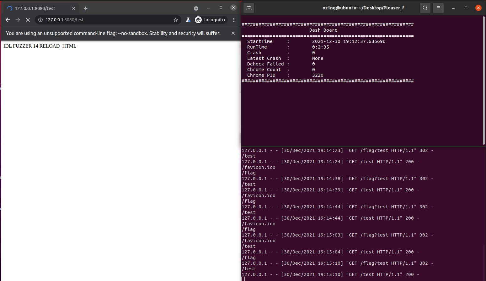

# Pleaser.md
# 목차

1. [퍼징 아이디어](#.-퍼징-아이디어)   
    1.1. [퍼징 아이디어](#11-퍼징-아이디어)   
2. [Pleaser 퍼저](#2-Pleaser-퍼저)   
    2.1.[WIP - WebIDL Parser](#21-WIP---WebIDL-Parser)   
    2.2.[JS Code Generator](#22-JS-Code-Generator)   
    2.3.[IDLR](#22-IDLR---IDL-Rule)   
3. [뮤테이션 전략](#3-뮤테이션-전략)   
4. [작동 화면](#4-작동-화면)   
5. [결론](#.5결론)   
    5.1. [결과](#51-결과)   
    5.2. [고도화 아이디어](#52-고도화-아이디어)

---

# 1. 퍼징 아이디어

## 1.1. 퍼징 아이디어

Pleaser는 WebIDL로부터 알아낸 정보를 기반으로 Chrome에서 사용하는 API들에 대해 Fuzzing을 하는 Fuzzer(정확인 제너레이터)이다. 이 Fuzzing 아이디어는 [Jason Kratzer](https://hacks.mozilla.org/author/jkratzermozilla-com/)님이 작성하신 [Fuzzing Firefox with WebIDL](https://hacks.mozilla.org/2020/04/fuzzing-with-webidl/)이라는 글(이하 아이디어 글)에서 얻어왔으며 해당 아이디어의 내용은 우리가 번역한 다음의 글을 통해 자세히 볼 수 있다. 

- 번역 글 : [WebIDL로 파이어폭스 퍼징하기](./WebIDL로_파이어폭스_퍼징하기.md)

### 1.1.1. 위 아이디어를 사용한 이유

아이디어 글의 원본이 작성된 날짜는 2020년 4월이다. 왜 1년도 더 지난 이 아이디어를 사용했냐면, 해당 글의 마지막에 이 아이디어를 사용한 Fuzzer가 매우 심각한 보안 취약점들을 계속해서 발견하고 있기 때문에 공개를 할 수 없다고 나와 있는데 2021년 말인 현재까지도 해당 Fuzzer에 대한 것은 아이디어 글을 제외하고는 아무것도 공개되지 않은 상태이기 때문에 현재까지도 현역으로 사용되고 있다고 판단하였고 때문에 1년이 지난 지금도 충분히 사용해볼 수 있을 것이라고 생각했다.

### 1.1.2. 아이디어의 장점

WebIDL을 이용한 Fuzzing은 기본적으로 IDL파일을 파싱한 정보를 가지고 코드를 생성하기 때문에 범용성이 매우 뛰어나다. 따라서 한번 제대로 만들어 둔다면 API에 대해 아주 자세한 지식이 없더라도 Fuzzing을 할 수 있다는 장점이 있다.

### 1.1.3. 아이디어의 단점

유효한 코드를 생성하기 어렵다는 점이 있다. 이 문제를 해결하기 위해서 아이디어 글에서는 GrIDL을 만들어 유효성 검증을 하고 있다. Pleaser 또한 GrIDL와 비슷한 기능을 하는 IDLR을 만들어 최대한 유효한 코드를 만들기 위한 노력을 하였다. 하지만 사용되는 모든 메소드, 속성에 대한 값에 규칙을 만들어주어야 한다는 점과 이를 자동화할 마땅한 방법을 찾지 못해 일일이 하나하나 직접 만들어 점이 존재했고 이는 구현 난이도를 매우 높게 만들었다. 

# 2. Pleaser 퍼저

WebIDL 퍼저는 WIP, JS Code Generator, IDLR로 구성되어 있다. 

## 2.1. WIP - WebIDL Parser

### 2.1.1. 개요

WebIDL Parser는 WebIDL 파일을 파싱하여 딕셔너리화하는 파서이다. 파싱된 데이터는 이후 JS Code Generator에서 JS Code를 생성할 때 사용된다. 

### 2.1.2. 구조

- 인터페이스
  
    인터페이스는 API에서 실질적으로 사용하는 메소드와 속성에 대한 정보를 담고 있다. JS 코드를 생성할 때 주로 참조하는 부분이기도 하여 가장 핵심적인 부분이다.
    
    ```json
    	"인터페이스_id": {
    		// 상속 인터페이스 정보
    		"Inherit": "상속 받은 인터페이스",
    		// 생성자 정보
    		"Constructor": { 
    			"extend": ["extend-attribute 정보"],
    			"args": [{ // 매개변수는 복수개 존재할 수 있으므로 리스트로 저장
    				"keyword": "optional 등 키워드에 대한 정보",
    				"extend": ["extend-attribute 정보"],
    				"type": [{ // 매개변수 타입이 복수개 있는 경우가 있어 리스트로 저장
    					"sync_type": "Sequence, Promise 등에 대한 정보",
    					"type": "매개변수의 타입(자료형)"
    				}],
    				"identifier": "매개변수의 id",
    				"default": "default 값"
    			}]
    		},
    		// 인터페이스에 포함된 메소드 정보
    		"Method": {
    			"메소드_id": [{
    				"keyword": "", 
    				// 메소드의 매개 변수에 대한 정보
    				"args": [{
    					"keyword": "optional 등 키워드에 대한 정보",
    					"extend": ["extend-attribute 정보"],
    					"type": [{
    						"sync_type": "Sequence, Promise 등에 대한 정보",
    						"type": "매개변수의 타입(자료형)"
    					}],
    					"identifier": "매개변수의 id",
    					"default": "default 값"
    				}],
    				// 메소드의 리턴 타입에 대한 정보
    				"return": {
    					"sync_type": "Sequence, Promise 등에 대한 정보",
    					"type": "메소드의 리턴 타입(자료형)에 대한 정보"
    				},
    				// 메소드의 extend-attribute에 대한 정보
    				"extend": ["CallWith=ScriptState", " RaisesException"],
    				// 메소드의 id
    				"identifier": "메소드_id",
    				// 메소드가 포함된 인터페이스 id
    				"interface": "인터페이스_id"
    			}],
    		},
    		// 인터페이스에 포함된 속성 정보 
    		"Attribute": {
    			"localDescription": {
    				"keyword": "readonly",
    				"extend": [""],
    				"Type": [{
    					"sync_type": "",
    					"type": "RTCSessionDescription?"
    				}],
    				"type": null,
    				"identifier": "localDescription",
    				"default": "",
    				"interface": "RTCPeerConnection"
    			},
    		// 인터페이스의 Expose 정보 
    		"Exposed": ["Window"]
    	}
    ```
    
    - 인터페이스에서 파싱하는 정보는 크게 다음과 같다.
        - 상속 인터페이스 정보
        - 생성자 정보
        - 인터페이스에 포함된 메소드 정보
        - 인터페이스에 포함된 속성 정보
        - 인터페이스의 Expose 정보
- 딕셔너리
  
    딕셔너리는 키와 값으로 이루어진 자료구조로 WebIDL에서의 딕셔너리는 C언어의 구조체와 비슷하다. 주로 메소드와 매개변수, 속성의 타입(자료형)으로 사용된다.
    
    ```json
    	"딕셔너리_id": [{
    		"keyword": "required 등의 키워드",
    		"extend": ["키의 extend-attribute 정보"],
    		"type": [{
    			"sync_type": "Sequence, Promise 등에 대한 정보",
    			"type": "키 값의 타입(자료형)"
    		}],
    		"identifier": "키 id",
    		"default": "키의 default 값"
    	}]
    ```
    
- Enumerate
  
    Enumerate는 해당하는 값을 나열한 것으로 주로 메소드와 매개변수, 속성의 타입(자료형)으로 사용된다.
    
    ```json
    "Enum_id": ["Value1", "Valu2", "Valu3"]
    ```
    
- Typedef
  
    Typedef는 타입(자료형)의 이름을 다른 이름으로 변경하는 문법이다.
    
    ```json
    "Typedef_id": [{
    		"extend": [],
    		"type": {
    			"sync_type": "",
    			"type": "기존 타입1(자료형)"
    		}
    	}, {
    		"extend": [],
    		"type": {
    			"sync_type": "",
    			"type": "기존 타입2(자료형)"
    		}
    	}]
    ```
    
    - 파싱하는 정보는 다음과 같다.
        - 기존 타입의 extend-attribute
        - 기존 타입의 정보
- callback
  
    callback은 메소드의 매개변수의 타입으로 사용된다.
    
    ```json
    {
    	"Callback_id": {
    		// Callback의 리턴 타입 정보
    		"type": {
    			"sync_type": "Sequence, Promise 등에 대한 정보",
    			"type": "리턴 타입(자료형)"
    		},
    		// Callback의 매개변수 정보
    		"args": [{
    			"keyword": "매겨변수의 키워드 정보",
    			"extend": ["매개변수의 extend-attribute 정보"],
    			"type": [{
    				"sync_type": "Sequence, Promise 등에 대한 정보",
    				"type": "매개변수의 타입(자료형)"
    			}],
    			"identifier": "매개변수의 id",
    			"default": "매개변수의 default 값"
    		}]
    	}
    }
    ```
    
    - 파싱하는 정보는 다음과 같다.
        - Callback의 리턴 타입 정보
        - Callback의 매개변수 정보

### 2.1.2. 기능

### 2.1.2.1. parse_idl

parse_idl은 idl 파일을 파싱하는 메소드이다. Interface, Dictionary, Enum, Typedef, Callback에 대한 파싱 기능을 한번에 제공하고 사용 방법 또한 매우 간단하다는 장점이 있다.

- 사용법
  
    ```python
    wip = WIP()
    with open('idl_file.idl', 'r') as fp:
    		wip.parse_idl(fp.read())
    		wip.save()
    ```
    
    - 매개변수로 *.idl 파일을 읽어온 값을 그대로 넣어주면 된다.

### 2.1.2.2. finder

WIP에는 finder라는 특별한 기능을 가진 메소드가 있다. finder는 사용해야할 타입(Interface, dictionary, enum, typedef, callback)이 사전에 파싱된 딕셔너리에 존재하지 않는 경우 해당 정보가 어느 파일 안에 있는지 확인 할 때 사용하는 메소드이다. 이 finder를 이용해서 파싱되지 않은 정보를 포함한 idl 파일을 찾은 후 해당 파일을 파싱하여 부족한 타입 데이터를 보충한다. 

- 장점
  
    finder를 활용하면 불필요한 IDL 데이터까지 파싱할 필요 없이 필요한 데이터들만 효율적, 그리고 자동으로 파싱하여 사용할 수 있습니다.
    
- 사용법
  
    ```python
    wip = WIP()
    with open(wip.finder("찾을_타입_id"), 'r') as fp:
    		wip.parse_idl(fp.read())
    		wip.save()
    ```
    

### 2.1.2.3. save / load

save / load 메소드는 파싱된 정보를 json 파일로 저장, 불러오기 기능을 제공하는 메소드이다. 

interface, enum, dictionary, callback, typedef에 대해 각각 .json 파일로 저장하거나 각각 파일의 데이터를 불러온다.

- 사용법
  
    ```python
    wip = WIP()
    wip.load('./data_dir_path')
    wip.save('./data_dir_path')
    ```
    

## 2.2. JS Code Generator

### 2.2.1. 개요

JS Code Generator는 이름대로 JS 코드를 생성해준다. WIP을 통해 파싱된 정보를 가지고 메소드와 속성 값을 사용하는 코드를 생성하는 Pleaser의 실질적인 Main 함수이다. 

### 2.2.2. 생성 규칙

- 기본 규칙
  
    기본적인 코드 생성 규칙은 다음과 같습니다.
    
    1. 모든 인터페이스 초기화 코드 생성
        - 이때 생성자가 있는 인터페이스의 경우 꼭 필요한 최소한의 인자로만 인터페이스를 초기화한다.
    2. 인터페이스 랜덤 선택
    3. 다음의 선택지 중 하나를 선택하여 코드 생성
        1. 선택된 인터페이스의 메소드를 호출하는 코드를 생성할 것인가?
        2. 선택된 인터페이스의 속성의 값을 바꾸는 코드를 생성할 것인가?
        3. 선택된 인터페이스의 메소드/속성을 제거할 것인가?
        4. 선택된 인터페이스를 새롭게 초기화 할 것인가?
        5. 선택된 인터페이스를 제거 또는 재생성 할 것인가?
    4. a가 선택된 경우
        - 메소드의 매개변수를 생성하는 코드를 생성
        - 만약 특정 매개변수에 대한 타입이 이미 어떠한 메소드의 리턴 값으로 받아둔 변수가 존재하면 해당 변수를 사용합니다.
            - 이 방식을 통해 약간의 메소드 의존성을 해결 할 수 있습니다.
        - 만약 callback에 대한 코드를 생성해야 하는 경우에는 c와 d가 둘 중 한 방식을 선택한 후  선택된 방식과 동일하게 진행한다. 그리고 리턴되는 타입만 맞춰주는 코드를 생성한다.
    5. b가 선택된 경우
        - Attribute의 타입에 맞는 값을 생성하는 코드를 생성
        - 만약 eventhandler에 대한 attribute라면 c와 d가 둘 중 한 방식을 선택한 후 해당 방식으로 코드를 생성한다.
    6. c가 선택된 경우
        - 선택된 인터페이스의 메소드와 Attribute 중 하나를 선택하고 제거하는 코드를 생성
        - 생성하는 방식은 다음과 같다.
          
            ```jsx
            o[interface_index].property_id = null;
            window.gc();
            ```
            
            chrome은 `-js-flags="--expose-gc"` 옵션을 주면 `window.gc()`가 활성화 된다.
            
            (`window.gc()`는 Garbage Collector를 호출하는 메소드이다.)
            
            따라서 선택된 인터페이스의 특정 프로퍼티를 null로 초기화 한 후 Garbage Collector를 호출하여 메모리에 할당된 프로퍼티를 제거한다.
            
            만약 제거된 부분을 다시 사용하려 한다면 크래시가 발생할 것이다.
        
    7. d가 선택된 경우
        - 선택된 인터페이스를 새롭게 호출하는 코드를 생성한다.
        - 이 경우 생성자를 사용하는 인터페이스의 경우 꼭 필요한 매개변수 + 다른 매개변수들을 사용한다.
        - c가 선택되어 코드가 제거된 경우 d가 선택되면 제거된 프로퍼티를 다시 할당 받을 수 있게 된다.
    8. e가 선택된 경우
        - 10% 확률로 선택된 인터페이스를 제거한다.
        - 만약 선택된 인터페이스가 이미 제거된 경우 20%의 확률로 다시 생성한다.
        - 당연히 인터페이스가 제거된 후에 매개변수나 attribute의 값으로 사용하기 위해 제거된 인터페이스의 메소드나 attribute는 사용을 하지 않는다.

이 생성 규칙으로 100개에서 500개 사이의 메소드와 속성에 대한 코드를 생성한다.

### 2.2.3. 생성 템플릿

- 메인 코드
  
    ```python
    var o = [];     
    (async function (){{
    	...
    }})();
    ```
    
    - 기본적으로 위의 템플릿을 사용하여 asycn function으로 둘러 쌓고 그 안에서 메소드와 속성들을 생성한다. 이런 방식을 사용하는 이유는 몇몇 인터페이스의 메소드들은 Promise(비동기)로 작동하는 것들이 있는데 해당 메소드가 사용 될 때마다 async function 구조에 넣어서 실행 후 결과를 받고 다음 메소드에 대한 코드를 생성하는 방식은 전체 코드의 길이가 쓸데없이 길어지기 때문에 처음부터 async로 묶어 두고 그 안에서 비동기 메소드들을 한번에 처리하는 방식을 사용하였다.
    - 또한 동기식으로 Fuzzing을 하기 위해 비동기 메소드를 동기식으로 실행할 방법이 필요했는데 그걸 위한 방법으로 await을 사용했고 이 때문에도 async function로 묶어줄 필요가 있었다.
- 인터페이스 초기화
  
    ```python
    async function test_INIT(){{
    		o[0] = MediaStreamTrack;
    		var arg1 = "Random";
    		o[1] = new RTCPeerConnectionIceEvent(arg1);
    		...
    }}
    await test_INIT();
    ```
    
    - 위의 코드 내에 모든 인터페이스에 대한 초기 코드를 생성합니다. 초기 코드를 생성하는 것 또한 async function에 포함시키는 이유는 몇몇 생성자는 인자로 비동기 메소드의 리턴 값을 받기 때문에 이런 템플릿을 사용했다.
- 메소드 생성
  
    ```python
    async function test{count}(){{
    		var arg0 = await o[{interface_index}].names();
        return arg0 
    }}
    var result{result_count} = await test{count}();
    ```
    
    - 특정 인터페이스의 특정 메소드를 호출하기로 하였으면 해당 메소드를 호출 후 리턴 값을 리턴받도록 했다. 리턴받은 데이터는 후에 해당 데이터의 타입이 인자나 Attribute의 변경 값으로 필요한 경우 사용하게 된다.
- Attribute(속성) 생성
  
    ```jsx
    async function test{count}(){{
    		o[{interface_index}].{attribute_id} = {value};
        return o[{interface_index}].{attribute_id}
    }}
    var result{result_count} = await test{count}();
    ```
    
    - 메소드 생성과 비슷하지만 선택된 인터페이스의 특정 Attribute(속성)에 대한 값을 그대로 리턴한다. 리턴받은 데이터는 메소드 때와 마찬가지로 해당 데이터의 타입이 메소드의 인자나 Attribute의 변경 값으로 필요한 경우 사용된다.

### 2.2.4. 테스트 케이스 생성

테스트 케이스는 다음의 템플릿을 사용한다.

```jsx
<html>
	<head>
		<script>
			{code}
		</script>
	</head>
	<body>
		IDL FUZZER {gen_count}
	</body>
</html>

<html>
	<head>
    RELOAD_HTML
    <script type='text/javascript'>
			setTimeout("location.href='http://127.0.0.1:8080/flag?test'",0);
    </script>
	</head>
	<body>
	</body>
</html>
```

JS Code Generator를 통해 실제 생성된 JS 코드를 `<head>` 태그에 넣어서 실행한다.

왜냐면 `<head>`태그와 `<body>`태그 어느 쪽에 JS 코드가 있느냐에 따라 브라우저가 JS 코드를 파싱해서 실행하는 시기가 다르기 때문이다. 

- `<head>` 태그에 있으면 html을 파싱하다 js를 만난 경우 js를 다 fetch+실행한 후 나머지 html을 이어서 파싱한다.
- `<body>` 태그에 있으면 html먼저 파싱 후 마지막에 js를 실행한다.

동기식 퍼징을 위해 HTML 맨 뒤에 새로운 html 태그를 추가하여 서버에게 리다이렉트를 요청하는 코드를 넣어놨는데 만약 `<body>`에 넣어둔다면 js코드가 실행되기도 전에 해당 리다이렉트 코드가 실행될 수 있으므로 `<head>`에 넣었다.

### 2.2.5. 개선점

이 JS Code Generator만으로 Fuzzing을 하기에는 너무 부족하다.  특정 메소드와 속성(Attribute)에 대한 코드를 위의 생성 규칙에 따라 만드는 것으로는 문법적으로 올바른 코드를 생성할 수는 있겠지만 실제로 무난히 작동이 되는 유효한 코드를 생성하는 것은 불가능하기 때문이다. 이를 해결하기 위해 우리는 각 메소드와 Attribute에 대해 들어가는 규칙을 정한 **IDLR을 구현**하기로 하였다.

## 2.3. IDLR - IDL Rule

### 2.3.1. 개요

JavaScript 코드를 생성할 때, 퍼징 할 method를 선정한 후 코드를 생성하기 위해서는 올바른 인자를 필요로 한다. 물론 유효한 타입의 인자를 생성하긴 하지만, 동일한 타입의 모든 인자가 다 유효한 것은 아니다. IDLR은 method를 호출하는 코드를 생성할 때, 유효한 인자를 전달해주기 위해서 만든 rule book이다. generator는 코드를 생성하기 위해 해당 타입의 인자를 생성해낸 후, 그 인자가 유효한지 IDLR에 질문하여 그 답을 얻는다.

### 2.3.2. 구조

```json
{
    interface:{
        propertyname:{
            valid_arg_identifier:{
                method: []
                attribute: []
                enum: []
                dictionary: {}
                wipTypes: {
                    int: ()     -> (min, max)
                    string: ''  -> (Regular Expression)
                    array: {
                        0: {
                        }
                        ...
                    }
                    null: False,
                    boolean: False
                }
            }
            valid_arg_identifier:{
                ...
            }
        }
    }
}
```

각각에 해당하는 정보는 다음과 같다.

- interface: property가 속한 interface의 이름
- propertyname: property의 이름
- valid_arg_identifier: property가 필요로 하는 인자의 id, 인자의 개수만큼 존재
    - method: 인자가 특정 method의 output으로 생성이 가능할 경우 해당 method를 <interface name>.<method name>으로 저장
    - attribute: 인자가 특정 attribute로 생성이 가능할 경우 해당 attribute를 <interface name>.<attribute name>으로 저장
    - enum: 인자를 특정 enum으로 사용이 가능할 경우 해당 enum의 이름을 저장
    - dictionary: 인자의 type이 dictionary일 경우 해당 dictionary에 대한 정보를 저장. dictionary 안에는 dictionary의 각 key에 해당하는 value로 어떤 것이 가능한지에 대해서 다시 method, attribute, enum, dictionary, wipTypes에 대한 규칙을 정의
    - wipTypes: 인자가 wip.Types에 속한 기본 타입일 경우 어떤 타입이냐에 따라 세부적인 규칙을 정의
        - int: 인자가 숫자일 경우 가능한 숫자의 최솟값과 최댓값을 서술
        - string: 인자가 문자열일 경우 가능한 문자열을 Regular Expression을 통해 표현
        - array: 인자가 배열일 경우 각 index에 따른 rule을 dictionary처럼 다시 정의
        - null: 인자가 null이 가능할 경우 True, 아닐 경우 False
        - boolean: 인자가 boolean이 가능할 경우 True, 아닐 경우 False

### 2.3.3. 룰

룰은 아래와 같이 메소드를 통해 추가하는 형식을 사용한다. 호출 가능한 method, 사용가능한 attribute, enum, 형식에 맞는 dictionary와 wipTypes를 정의한다. wipTypes에는 int, string, array, null, boolean으로 총 5가지 유형의 자료형으로 구분한다. int는 튜플을 정의하여 최소값과 최대값을 선언해주고, string은 정규식으로 정의된 문자열로 정의한다. array는 각 인덱스를 키값으로 dictionary 형태로 구성하며 그에 대응하는 값을 정의한다. null은 null이 포함할 수 있는 변수라면 True, 그렇지 않다면 False로 정의하며 boolean 또한 True나 False가 포함할 수 있는 변수라면 True, 그렇지 않다면 False로 정의한다.

아래는 실제로 RTCPeerConnectionIceEvent 생성자에 대해 작성한 메소드이다.

```python
def rule_RTCPeerConnectionIceEvent(self):
        rule = {
            'type':{
                'method': [],
                'attribute': [],
                'enum': [],
                'dictionary': {},
                'wipTypes': {
                    'int': None,
                    'string': '.+',
                    'array': None,
                    'null': False,
                    'boolean': False
                }
            },
            'eventInitDict':{
                'candidate':{
                    'method': ['getLocalCandidates', 'getRemoteCandidates', 'RTCIceCandidate'],
                    'attribute': ['candidate'],
                    'enum': [],
                    'dictionary': {},
                    'wipTypes': {
                        'int': None,
                        'string': None,
                        'array': None,
                        'null': True,
                        'boolean': False
                    }
                },
                'url':{
                    'method': [],
                    'attribute': [],
                    'enum': [],
                    'dictionary': {},
                    'wipTypes': {
                        'int': None,
                        'string': '/(http(s)?:\/\/)([a-z0-9\w]+\.*)+[a-z0-9]{2,4}/gi',
                        'array': None,
                        'null': True,
                        'boolean': False
                    }
                },
                'bubbles':{
                    'method': [],
                    'attribute': [],
                    'enum': [],
                    'dictionary': {},
                    'wipTypes': {
                        'int': None,
                        'string': None,
                        'array': None,
                        'null': False,
                        'boolean': True
                    }
                },
                'cancelable':{
                    'method': [],
                    'attribute': [],
                    'enum': [],
                    'dictionary': {},
                    'wipTypes': {
                        'int': None,
                        'string': None,
                        'array': None,
                        'null': False,
                        'boolean': True
                    }
                }
            }
        }
        self.append_rule('RTCPeerConnectionIceEvent', 'RTCPeerConnectionIceEvent', rule)
```

### 2.3.4. 문제점

직접 구현할 당시 다음과 같은 문제점들이 있었다.

1. IDLR을 사용하는 알고리즘 자체가 IDLR의 rule을 참고하여 올바른 인자를 생성하는 것이 아닌, 무작위로 생성한 후 이를 IDLR의 rule을 참조하여 맞는지 검증하는 방식이었기에 비효율적이었다.
2. 1.의 이유로 인해서 IDLR의 rule에 맞지 않는 인자가 생성되었을 경우 새로운 인자를 생성하며, 이 과정이 반복되면 무한 loop에 빠질 위험도 존재하였다.
3. IDLR의 rule을 만들기 위해서 참고한 문서나 자료들이 정형화되어있는 것이 아니고, 특정 인자를 사용한 코드를 테스트하기 위해서는 관련 API의 사용법과 같은 내용들을 완벽히 숙지하여야 했기 때문에 완벽히 정형화된 rule을 만들기가 쉽지 않았다.
4. 더불어 WebRTC와 관련된 API들에 대한 문서조차 모두 존재하지 않았으며 IDL파일과 불일치되는 부분도 있었다.

### 2.3.5. 개선 방향

위와 같은 문제점을 통해서 아래와 같은 개선 방향을 떠올릴 수 있었다.

1. 코드 생성 후 IDLR에 질의하는 방식이 아닌, IDLR의 rule을 참조하여 애초부터 올바른 코드를 생성하는 알고리즘을 활용한다.
2. 생성된 코드를 실행하였을 때, 에러 발생 시 해당 rule에 대한 정보를 기록하여 fuzzer가 스스로 테스트하면서 rule을 자체적으로 수정해나갈 수 있도록 한다.

다음과 같은 방법으로 위의 4가지 문제점을 해결함과 동시에 overhead를 줄이고 더 효율적으로 fuzzing할 수 있으리라 생각하였다.

# 3. 뮤테이션 전략

먼저 WIP으로 원하는 API에 대한 WebIDL 파일들을 전부 파싱한다. 그리고 유효한 값들을 생성하기 위해 IDLR에 해당하는 메소드들에 대한 룰을 추가한다. 마지막으로 JS Code Generator를 사용하여 랜덤한 순서로 해당 API의 메소드, attribute들을 사용하며 퍼징을 진행한다. 이때의 생성 규칙은 2.2.2.를 참고하면 된다.

우리는 WebRTC API를 타겟으로 선정했다. 이유는 우리가 만든 [CRP](https://github.com/BOB-Jour/CRP)를 이용하여 근 3개월(7월~10월)간 가장 많은 취약점이 발견된 대상을 확인해봤고 그 결과로 WebRTC에서 많은 취약점이 나왔었다는 것을 알 수 있었기 때문이다. 따라서 WebRTC와 관련된 모든 WebIDL 파일을 수집한 뒤 전부 파싱한 후 퍼징을 시도 했었다.

# 4. 작동 화면



- 왼쪽은 chromium, 우측 상단은 대시보드, 우측 하단은 Pleaser_server 로그이다.
- 왼쪽의 chromium에는 몇 번째로 실행된 TestCase인지 표시한다.
- 대시보드의 내용은 다음과 같다.
    - StartTime : 퍼징 시작 시각
    - RunTime : 퍼징 진행 시간
    - Crash : 수집된 Crash 로그 개수
    - Lastest Crash : 마지막으로 수집된 로그의 수집 시간
    - Dcheck Failed : 수집된 Dcheck fail 로그 개수
    - Chrome Count : 재실행된 chromium 개수
    - Chrome PID : 현재 실행 중인 chromium의 PID

# 5. 결론

## 5.1. 결과

Pleaser는 아직 개발 진행 중이며 소스코드는 개발이 완료된 이후 깃헙에 공개할 예정이다.

개발을 진행하면서 변경되는 사항이 있는 경우 주기적으로 해당 글을 업데이트 하여 공유를 하겠다.

## 5.2 고도화 아이디어

### Log-Guided Fuzzing 방식 적용

IDLR을 수동으로 하는 것은 양이 너무 많아 힘들고 사람이라 실수를 할 수 있다는 큰 단점이 존재했다. 그래서 이점을 보완하기 위해 Log-Guided Fuzzing과 동시에 적용하여 유효한 값을 생성하는 방식이다. 먼저 Log-Guided Fuzzing이란 말이 생소할텐데 Log-Guided Fuzzing은 **USENIX 2021**에 실린 **Android SmartTVs Vulnerability Discovery via Log-Guided Fuzzing**이라는 제목의 논문에서 처음으로 쓰인 Fuzzing 방식이다. 이 Fuzzing 방식을 요약하면 잘못된 값을 넣었을 때 유효성 검사를 위해 출력되는 특정 로그들을 가지고 유효한 입력 값을 만들어내는 방식이다.

현재 JS Code Generator를 통해 생성된 testcase를 실행하면 아래와 같이 [유효성 검사 로그]가 나온다.


에러 로그들을 살펴보면 거의 전부가 해당 로그에 해당하는 로그 포맷이 있어 규칙에 맞춰 생성되는 것을 확인 할 수 있다. 따라서 위의 로그를 수집 후 Interface에는 있지만 실제로는 구현되어 있지 않거나 사용되지 않는 메소드 및 Attribute들에 대한 것들을 쉽게 걸러낼 수 있다. 


또한 메소드나 생성자의 경우 매개변수가 잘못되어 제대로 실행이 되지 않은 경우 위의 [유효성 검사 로그2]와 같이 어느 값이 잘못되었고 유효한 값에 대한 정보도 나오기 때문에 전부 수동으로 룰을 구성하는 IDLR만을 사용하는 것보다 더 효율적으로 유효한 값을 생성할 수 있을 것이다.
