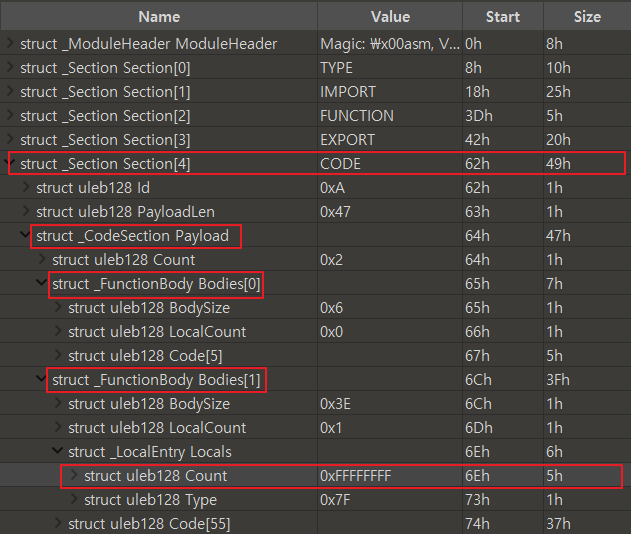

# watTF.md

# 목차
1. [퍼징 아이디어](#1-퍼징-아이디어) <br>
1.1. [배경이 된 취약점: CVE-2018-6036](#11-배경이-된-취약점)	<br>
2. [퍼저 구조](#2-퍼저-구조)   <br>
2.1. [LLVM Compiler](#21-LLVM-Compiler)   <br>
2.2. [wabt](#22-wabt)	<br>
2.3. [dharma](#23-dharma)	<br>
2.4. [fuzzer (python code)](#24-fuzzer)	<br>
3. [뮤테이션 전략](#3-뮤테이션-전략)   <br>
3.1. [구현 방법](#31-구현-방법)   <br>
3.2. [뮤테이션 예시](#32-뮤테이션-예시)	<br>
3.3. [뮤테이션 도식](#33-뮤테이션-도식)  	<br>
4. [작동 화면](#4-작동-화면)	<br>
4.1. [사용법](#41-사용법)	<br>
4.2. [작동 화면](#42-작동-화면)	<br>
5. [결론](#5-결론)   <br>

# 1. 퍼징 아이디어

## 1.1. 배경이 된 취약점: CVE-2018-6092

### 1.1.1. 취약점 유형

> `==69118==ERROR: AddressSanitizer: heap-buffer-overflow`
> 

Google V8 JavaScript 엔진의 WebAssembly(WASM) 기능에서 Integer underflow 취약점으로 인한 heap-buffer-overflow이다.

### 1.1.2. 루트 커즈



v8은 로컬 함수를 디코딩할 때 검사를 수행하는데, 32bit 플랫폼에서 integer overflow로 인해 이 검사를 건너뛸 수 있다. 이렇게 되면 로컬 함수의 수가 많아지고 로컬이 할당될 때 memory corruption이 발생할 수 있다.

```cpp
// src/wasm/function-body-decoder-impl.h
if ((count + type_list->size()) > kV8MaxWasmFunctionLocals) {
        decoder->error(decoder->pc() - 1, "local count too large");
        return false;
}
```

count에는 실제로 0xffffffff가 들어가게 되는데, 이때 count의 자료형이 uint32_t이기 때문에 최대값인 4294967295가 들어가게 된다.

하지만 계산할때는 integer overflow가 일어나 이 값이 -1로 들어가게 되어 저 if문 검증을 건너뛸 수 있게 된다.

결국, 유효하지(검증되지) 않은 count 값을 인자로, insert함수를 실행하게 되고, 여기서 memory corruption이 발생할 수 있다. 

```cpp
type_list->insert(type_list->end(), count, type);
```

## 1.2. 퍼징 아이디어

Count를 늘렸더니 로컬 함수의 개수가 많아지고 이 공간을 할당할 때 메모리 커럽션 발생한 것을 보고 wasm에서 변수 혹은 함수의 Index(순서)를 바꾸고 js에서 바뀐 index에 해당하는 변수나 함수를 호출하게 되면 어떻게 될까?라는 idea를 떠올리게 되었다.

# 2. 퍼저 구조

- 설계된 퍼저 구조는 아래와 같다.


- fuzzer의 주요 component는 다음과 같다.
    1. LLVM 컴파일러
    2. wabt
    3. dharma
    4. fuzzer (python code)
    

## 2.1. LLVM Compiler

### 2.1.1. 사용 이유

wasm seed파일을 만들 수 있는 방법에는 크게 두 가지가 있다.

**Emscripten을 사용하여 컴파일**


**LLVM을 사용하여 컴파일**


두 경우의 큰 차이점은 Emscripten으로 컴파일 하였을 경우 JavaScript glue code가 생성이 되지만 LLVM으로 컴파일 할 경우 glue code가 생성되지 않는다는 것이다. 이에 따라 fuzzer의 input 자체의 크기 또한 차이가 커지며 fuzzer의 overhead를 결정짓는 매우 중요한 요인으로 작용한다.

따라서 watTF에서는 더 overhead가 적은 LLVM을 통한 컴파일 방법을 사용하기로 하였다. 비록 LLVM으로 컴파일을 하게 되면 JavaScript glue code를 사용할 수 없기에 c코드에 libc함수를 사용하지 못하지만, watTF의 퍼징 벡터는 WebAssembly JavaScript API이며, 이를 fuzzing하는데 libc의 사용은 필수적인 요소가 아니기 때문에 배제하였다.

### 2.1.2. 사용법

- LLVM 컴파일러를 사용하기 위해서 우선적으로 llvm을 설치하여야 한다.

`sudo apt-get install llvm`

- 컴파일할 c코드를 생성한다.

```c
// Filename: add.c
int add(int a, int b) {
  return a*a + b;
}
```

- 다음과 같이 wasm파일을 생성할 수 있다. 아래의 과정은 c를 IR로 변환, IR을 object file로 변환, linking까지의 일련의 과정이 포함되어 있으며 최적화 기능까지 추가되어있는 명령어이다.

`clang --target=wasm32 -O3 -flto -nostdlib -Wl,--no-entry -Wl,--export-all -Wl,--lto-O3 -o add.wasm add.c`

## 2.2. wabt

### 2.2.1. 사용 이유

watTF 퍼저의 가장 핵심 요소는 wasm mutator이다. 이 wasm 파일을 mutation 하기 위해서는 format을 깨지 않는 선에서 변경해야 하기 때문에 필수적으로 wat파일 및 wasm파일의 구조 분석이 필요하며 wat파일을 parsing하는 기능이 필요하다. 때문에 parser를 제작하거나, 또는 기존에 존재하는 parser를 이용하여야 한다. 우리는 이미 존재하는 wabt라는 tool에서 wat파일을 wasm파일로 변경할 때 사용되는 parsing 로직을 그대로 이용하여 mutator를 제작하고자 하였다.

### 2.2.2. 제작 과정

wabt의 코드를 수정하기에 앞서 wasm 파일 구조를 분석할 필요가 있었다. [[공식 문서]](https://webassembly.github.io/spec/core/binary/index.html)를 참고하여 wasm 파일 구조 분석을 진행했다.

분석한 wasm 파일 구조를 토대로 wabt를 이용하여 wat파일을 wasm파일로 변환할 때 특정 section을 치환하면서 mutation하는 방법으로 구현하였다. wabt 코드를 어떻게 수정하였는지는 [github](https://github.com/BOB-Jour/WatTF_Fuzzer)에서 확인할 수 있다.

### 2.2.3. 사용법

- 기존의 wabt 사용법에서 -m option을 통해서 생성할 wasm파일의 개수를 추가로 지정해 줄 수 있다.

`./wat2wasm <wat file> -m <number of mutated wasm>`

## 2.3. dharma

### 2.3.1. 사용 이유

본격적으로 JavaScript code를 생성하기 위해서 code generator가 필요하였다. 대표적인 grammar based generator로는 domato와 dharma가 있는데, 의도한 token들을 효율적으로 관리하기 위해서 dharma가 더 편리하다는 판단 하에 dharma를 이용하기로 하였다.

### 2.3.2. 템플릿 제작

위의 wabt로 생성된 wasm파일을 template에 삽입하는 과정이 필요하다. 또 앞서 설명한 것과 같이 wasm파일과 JavaScript 파일은 서로 상호작용이 필요하기 때문에 wasm에 존재하는 함수를 export하는 정보인 exports.txt에 대한 정보를 template에 삽입하여야 한다.

### 2.3.3. 사용법

- 기존 dharma 사용법과 동일하다

`dharma -grammars <template file> -storage <저장 위치> -format js -count <생성할 js파일 개수>`

## 2.4. fuzzer (python code)

- watTF fuzzer는 다음 4개의 구성요소가 있다.
1. watTF
2. mutator
3. monitor
4. Dashboard

### 2.4.1. watTF

- 지정된 option에 따라서 주기적으로 mutator를 이용하여 input을 생성해준다.
- monitoring해주는 thread를 생성한다.
- 전체적으로 모든 thread를 관리하며 fuzzer를 총괄해주는 main code이다.

### 2.4.2. mutator

- 지정된 option에 따라 특정 개수의 JavaScript file을 생성한다.

### 2.4.3. monitor

- 지정된 JavaScript file을 v8에서 실행한 후, 모든 코드가 실행되었을 때 crash가 일어났는지 검사한다.
- 만약 crash가 일어났다면 해당 crash를 일으킨 파일을 로그파일에 저장한다.

### 2.4.4. Dashboard

- 현재 퍼저의 현황을 보여줄 수 있는 Dashboard를 총괄한다.
- 총 seed의 개수, 실행된 testcase의 개수, 실행 시간, 발견된 crash 개수 등의 정보를 포함한다.

# 3. 뮤테이션 전략

## 3.1. 구현 방법

앞서 2.2.에서 wabt에 대해 설명했듯이, 뮤테이터는 wabt라는 툴을 이용하여 만들어졌다. wat파일을 wasm의 형태로 변환할 때, 각 section별로 데이터를 정리한 다음, stream을 따라서 그대로 binary로 쓸 때 다른 token으로 바꿔치기하는 방법을 사용하였다.

```jsx
// wabt/src/tools/wat2wasm.cc:172
for(int i=0; i<N; i++){
    if (Succeeded(result)) {
      MemoryStream stream(s_log_stream.get());
      s_write_binary_options.features = s_features;
      result = WriteBinaryModule(&stream, module.get(), s_write_binary_options);

      if (Succeeded(result)) {
        if (s_outfile.empty()) {
          s_outfile = DefaultOuputName(s_infile);
        }
        char c[3];
        sprintf(c, "%02d", i);
        std::string S = default_path + default_name + std::string(c) + std::string(".wasm");
        WriteBufferToFile(S.c_str(), stream.output_buffer());
      }
    }
  }
```

다음은 수정한 wabt 코드 중 일부를 나타낸 것이다. `WriteBinaryModule()` 함수의 코드를 수정하여 뮤테이션을 진행하였다.

## 3.2. 뮤테이션 예시

아래는 뮤테이션을 어떻게 진행하였는지 그 예시를 보여준다.

```jsx
// wabt/src/binary-writer.cc:898
		case ExprType::LocalGet: {
      Index index = GetLocalIndex(func, cast<LocalGetExpr>(expr)->var);
      WriteOpcode(stream_, Opcode::LocalGet);
      if(Rand() < _percentage)
        WriteU32Leb128(stream_, (rand()%(index+1))-1, "local index"); // index
      else 
        WriteU32Leb128(stream_, index, "local index"); // index
      break;
    }
```

위 수정된 코드처럼 일정 확률로 index가 들어가야 하는 값이 -1부터 index사이의 값으로 랜덤하게 바뀌도록 수정하였다. 그 결과 아래 그림과 같은 변화가 일어난다.

**Before**

```jsx
; function body 1
0000060: 00                  ; func body size (guess)
0000061: 00                  ; local decl count
0000062: 20                  ; local.get
0000063: 00                  ; local index
0000064: 20                  ; local.get
0000065: 01                  ; local index
0000066: 6a                  ; i32.add
0000067: 0b                  ; end
0000060: 07                  ; FIXUP func body size
0000057: 10                  ; FIXUP section size
```

**After**

```jsx
; function body 1
0000060: 00                  ; func body size (guess)
0000061: 00                  ; local decl count
0000062: 20                  ; local.get
0000063: 01                  ; local index
0000064: 20                  ; local.get
0000065: ff                  ; local index
0000066: ff
0000067: ff
0000060: ff
0000057: 
…
```

색칠된 부분의 값이 변하는 것을 확인할 수 있다.

## 3.3 뮤테이션 도식

전체적으로 wasm 파일 구조에 따른 뮤테이션이 적용된 도식을 다음과 같이 나타낼 수 있다. wasm 파일 구조에 관한 내용은 2.2.2.절에서 살펴볼 수 있다.


# 4. 작동 화면

## 4.1. 사용법

watTF 퍼저의 사용 방법은 아래와 같다. thread의 개수, 한 번에 생성하는 wasm파일의 개수, 한 번에 생성하는 js 파일의 개수를 지정해줄 수 있다.

```
usage: watTF.py [-h] [-t T] [-m M] [-d D]

[watTF description]

optional arguments:
  -h, --help  show this help message and exit
  -t T        number of threads
  -m M        number of mutated wasm files
  -d D        number of mutated js files
```

## 4.2. 작동 화면


작동화면은 다음과 같다.

- StartTime: 퍼저 실행 시간을 나타낸다.
- RunTime: 퍼저가 얼마나 실행되었는지를 나타낸다.
- TestCase: 현재까지 실행된 총 테스트케이스의 개수를 나타낸다.
- Dcheck Failed: 수집된 dcheck의 개수를 나타낸다.
- Crash: 수집된 crash의 개수를 나타낸다.
- Unique Crash: 수집된 crash 중 유일한 것들의 개수를 나타낸다.
- V8 PID: 현재 실행중인 V8의 pid를 나타낸다.
- Seed: 현재 몇 번째 Seed가 mutate되고 있는지 나타낸다.
- Seed Cycle: Seed들이 총 몇 번씩 mutate되었는지 나타낸다.

# 5. 결론

## 5.1. 결과

최종적으로 유의미한 crash를 얻지 못했다. 그 이유로는 다음 2가지를 생각하였다.

1. mutation할 수 있는 가짓수가 적었다. javascript 문법이라는 syntax를 깨지 않는 선에서 mutation을 진행하여야 했고, 또 wasm 파일 구조를 깨지 않는 선에서 wasm파일을 mutation하여야 했기 때문에 변형 가능한 가짓 수가 무척 적음을 개발하면서 느꼈다.
2. 최신 동향에 둔감했다. 최근에 나온 WebAssembly API와 관련된 issue를 보면 대부분 null dereference나 dcheck와 같이 유의미하지 못한 issue가 대부분이었다.

따라서 위와 같은 이유를 근거로, 또한 우리의 mutator가 관련된 CVE들의 poc를 커버할 수 있고, 그 이상의 mutation을 수행함에도 불구하고 유의미한 crash를 얻지 못했다는 것으로 미루어 보아 더이상 WebAssebmly JavaScript API에서 유의미한 crash가 나오기는 힘들 것이라고 결론지었다.
