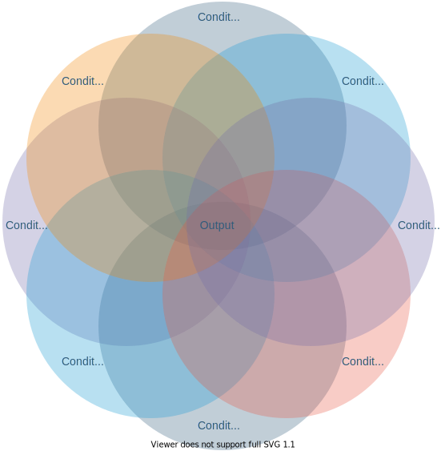

# Overview.md
# 목차
1. [서문](#1-서문)   
2. [CodeQL](#2-codeql)   
3. [프로젝트 수행](#3-프로젝트-수행)   
3.1. [어떤 형태의 취약점을 노릴 것인가?](#31-어떤-형태의-취약점을-노릴-것인가)   
3.2. [어떤 쿼리로 검색할 것인가?](#32-어떤-쿼리로-검색할-것인가)   
3.2.1. [취약점들의 근본 원인에서 공통적으로 확인되는 패턴 확정하기](#321-취약점들의-근본-원인에서-공통적으로-확인되는-패턴-확정하기)   
3.3. [검색 결과를 어떻게 분석할 것인가?](#33-검색-결과를-어떻게-분석할-것인가)   
4. [결과](#4-결과)   
5. [결론](#5-결론)   
6. [참고 문헌](#6-참고-문헌)   
---
# 1. 서문

CodeQL이란, 현재는 깃헙에 인수된 LGTM 이라는 회사에서 개발 및 사용되어 오던 시맨틱 정적 분석 엔진이다. CodeQL로 특정 코드 안에 존재하는 취약점을 검색해 오는 방식은 PL/SQL을 이용해 DBMS에서 원하는 데이터를 fetch 해오는 방식과 거의 동일하다. 자세한 이야기는 아래 [CodeQL](#2-codeql) 항목에서 진행하도록 하겠다.

CodeQL이라는 쿼리 언어의 특성상 어떤 쿼리를 작성하는지에 따라 원하는 정보를 가져올 수 있음을 판가름한다. 따라서 우리는 쿼리를 작성하기에 앞서 충분한 공부가 필요했고, 그로부터 어떻게 목표에 접근할지를 결정했다. 자세한 이야기는 아래 [프로젝트 수행](#3-프로젝트-수행) 항목에서 진행한다.

그럼 이제부터, 우리가 CodeQL로 크롬 웹 브라우저에서 취약점을 찾아내기 위해 진행한 프로젝트에 대해 자세히 서술하도록 하겠다.

# 2. CodeQL

CodeQL이란 데이터베이스 쿼리 언어의 형태를 띤 언어를 사용해 취약점 코드 패턴을 검색하는 시맨틱 정적 분석 엔진이다. 이 때 CodeQL에서 질의를 위해 사용되는 언어를 QL이라 부른다. QL은 Datalog라는 DB 관리 언어에 그 기반을 두고 있는데, 그 특성상 모든 연산이 논리연산으로 취급된다는 특징이 있고 SQL 언어에 비해 퍼포먼스가 떨어진다는 단점을 가진다. 그러나, 역시 Datalog의 특성상 SQL 언어보다 복잡한 로직을 가진 쿼리를 표현할 수 있다는 장점 또한 가진다.

전용 쿼리 언어의 특성, 그리고 코드를 데이터베이스화하여 원하는 패턴의 코드를 검색해 온다는 개념으로 인해 CodeQL 사용은 기존의 쿼리 언어를 통한 DBMS의 사용과 매우 흡사하다는 특징을 가진다.

CodeQL은 사용 시에 크게 **3단계** 의 과정을 거친다. 

1. **코드베이스 추출(Extract)**
    1. Init: Codeql Database 디렉토리 구조 생성
        
        : `codeql database create {databasename} -l cpp -c gcc -o {current codename} {output codename}`  명령어를 실행하면 가장 먼저 수행되는 단계이다. CodeQL DB의 기본 디렉토리 구조를 생성한 후, 프로그램을 이루는 코드를 수집하고 분석하여 `AST(Abstract Syntax Tree)` 구조 형태로 만든다.
        
    2. Extraction: 대상 코드로부터 관계 표현 추출
        
        : 만들어진 AST상의 각각의 노드, 즉 관계 표현 정보들을 추출해 저장한다. 이 과정에 extractor라는 프로세서가 관여하며, 이렇게 추출된 표현 정보들이 저장된 파일을 `trap` 이라 부른다.
        
    3. Finalize: 생성된 모든 관계 표현들을 import하여 하나의 Database 생성
        
        : `trap` 파일 상에 있는 관계 표현 정보들을 병합하여 하나의 온전한 DB로 만든다. 이 때, 생성되었던 `database`, `code`, `database schema`를 한 디렉토리에 넣고 그 디렉토리를 `snapshot`이라 부른다. CodeQL 쿼리를 이용해 질의할 때, 이 `snapshot` 내부의 정보를 참고해 결과를 검색하게 된다.
        
    - 생성된 DataBase 폴더 내부 구조
        - codeql-database.yml : database
        - db-cpp 폴더 : schema
        - log 폴더
        - src.zip : code
2. **쿼리 컴파일**
    - 생성된 CodeQL DB에 대해 질의를 하기 위해서는 QL이라는 CodeQL 전용 질의 언어를 이용해  쿼리를 짜야 한다. 검색해 오려는 데이터의 범주를 쿼리가 결정하므로 **쿼리를 주의깊게 논리적으로 짜는 것이 매우 중요하다.**
    - 쿼리는 클래스화, 계승, override 등이 가능해 매우 유연하게 사용할 수 있다.
    - 작성한 쿼리를 CodeQL DB에 대해 실행해 원하는 조건에 부합하는 코드를 검색해 오려면 쿼리를 컴파일하는 과정이 필요하다. `python` 이나 `c++` 등으로 작성한 코드를 실제로 실행하려면 컴파일해 프로그램 형태로 만드는 과정이 필요한 것과 동일한 개념이다.
    
    참고 사진:
    

QL 쿼리를 작성했을 때, 쿼리로 작성한 조건들은 마치 벤 다이어그램처럼 작동한다. 모든 조건들을 충족하는 가운데 지점만이 Output이 된다.   

실제로 쿼리의 조건들이 작용하는 모습을 벤 다이어그램에 비유했다. 쿼리의 조건들은 매우 많아질 수 있다. 역시 조건을 모두 충족하는 코드만이 Output이 될 수 있다.   

3. **컴파일된 쿼리 실행해 조건에 맞는 코드 가져오기(Querying)**
    - 쿼리를 올바르게 작성했다면, 컴파일된 쿼리를 실행할 경우 원하는 조건을 모두 충족하는 코드들이 표의 형태로 데이터화되어 출력된다.
    - 이렇게 **출력된 코드들을 분석** 하며 각 코드부에서 과연 원하는 형태의 취약점이 발생할 수 있는지를 모두 체크하는 것이 마지막 단계이다.

이렇게 CodeQL에 대해 알아본 결과, 우리는 **CodeQL을 사용할 경우 맞닥뜨리게 되는 도전점** 을 총 세 가지로 압축할 수 있었다.

> **첫째, 어떤 형태의 취약점을 노릴 것인가?**
> 
> 
> **둘째, 그것을 어떤 쿼리로 검색할 것인가?** 
> 
> **셋째, 검색으로 나온 결과를 어떻게 분석할 것인가?**
> 

위 세 가지 도전점을 해결하기 위해 우리는 CodeQL을 이용한 크롬 웹 브라우저 버그 헌팅 방법을 고민하게 되었다.

# 3. 프로젝트 수행

이 항목에서는 앞서 설명했던 세 가지 도전점을 해결하기 위한 고민, 그리고 그것을 어떻게 해결했는지, 혹은 해결에 실패했는지에 관해 서술한다. 완전히 기술적이며 매우 세세한 설명은 Designing_CodeQL_queries.md(링크) 참고.

## 3.1. 어떤 형태의 취약점을 노릴 것인가?

이 도전점을 해결하기 위해 'Man Yue Mo'가 쓴 CodeQL을 통한 WebAudio 콜백 취약점 공략기인 [『Variant analysis of Web Audio callback vulnerabilities in Chrome』](https://securitylab.github.com/research/chrome_task_queue_uaf/)(링크)을 읽고 분석했다. 글의 핵심과, 결과로 나온 쿼리를 따로 해석해 둔 문서는 Variant_analysis_of_WebAudio_callback_vulnerabilities_in_chrome_studylog.md(링크)이다. 

위 문서를 읽고 우리가 제시한 CodeQL 이용 버그헌팅 수행 단계는 아래와 같았다.

> 1.  취약점이 자주 발생한 공격벡터를 선정한다.
> 
> 1. 그 공격벡터에서 발생한 취약점들을 리스트업해 근본 원인을 분석한다.
> 2. 취약점들의 근본 원인에서 공통적으로 확인되는 패턴을 확정한다.
> 3. 이러한 패턴의 취약점에 어떤 패치가 되었는지 확인해 분석한다.
> 4. 패치 내역을 피할 수 있으면서, 패턴을 만족하는 코드 내용을 쿼리화한다.

그러나 문제점이 존재했다. 우리가 CodeQL을 사용할 수 있는 시간이 2주일 남짓밖에 되지 않는다는 사실이었다. 이러한 **현실적 문제를 감안하여 우리가 타협한 CodeQL 이용 버그헌팅 수행 단계** 는 아래와 같았다.

> 1.  취약점 패턴을 약식으로 확정한다.
> 
> 1. 확정된 취약점 패턴을 쿼리화한다.
> 2. 작성된 쿼리를 질의하여 검색된 결과를 분석한다.
> 3. 취약점으로 판단되는 검색 결과가 있다면 제보한다.

따라서, 우리는 **원래의 1~3번 과정을 변형해 수행함으로써 취약점 패턴을 빠르게 확립했다**. 이때 참고한 자료는 Blackhat_usa_2021_chrome.md(링크)였다. 

이 자료에서 언급된 **1) 오브젝트의 Lifecycle 관련한 문제는 매우 흔하다는 사실**, 그리고 **2) 발표자들이 찾아낸 취약점들 또한 모두 오브젝트의 Lifecycle과 관련되어 있다는 사실** 에서 우리 또한 오브젝트의 Lifecycle 관련 문제를 찾아보기로 결정하게 되었다.

하지만, 단순히 `raw pointer`를 공략하는 것은 불가능했다. 구글이 이미 자체적인 포인터 형식을 만들어  `raw pointer` 를 모두 그것으로 대체했기 때문이다. 이렇게 구글이 보안성 향상을 위해 자체적으로 만들어 적용한 포인터 개념을 `MiraclePtr` 라 부른다.[^3] `MiraclePtr` 에 관한 자세한 내용은 [여기](https://docs.google.com/document/d/1pnnOAIz_DMWDI4oIOFoMAqLnf_MZ2GsrJNb_dbQ3ZBg/edit)(링크)를 참고하길 바란다.

[^3]: `MiraclePtr`은 개념의 이름이고, 그것을 실제로 구현한 것이 `BackupRefPtr`, `CheckedPtr<T>`이다. 후자의 경우 아직 experimental한 것으로, 크롬 코드에 실적용되지는 않았다. 전자의 경우 코드상에서는 `BackupRefPtr` 알고리즘을 사용하는 `raw_ptr<T>` 로 표현된다.

다행히도 **1)  `MiraclePtr` 가 미적용** 되었고, **2) 포인터와 같은 중간 매개로 Lifecycle이 관리되는 객체** 가 있었다. 바로 **C++의 기본 `stl container`** 였다. `stl container` 객체들의 데이터는 마치 포인터와도 비슷한 `iterator` 라는 객체로 참조될 수 있으며, `iterator` 클래스는 `MiraclePtr`로 대체될 수 없기 때문에 `MiraclePtr`이 적용되지 않는다. 즉, 객체의 Lifecycle 관리 문제로 인해 발생하는 `UAF(Use-After-Free)` 취약점을 노려볼 만한 대상이었다.

따라서 위와 같은 이유를 근거로, 우리는 **`stl container` 중 `std::vector` 객체를 순회하는** `iterator` **객체의 `invalidation` 문제로 인해 발생하는 `UAF` 취약점을 가진 코드** 를 CodeQL로 쿼리해 검색하기로 결정했다.

## 3.2. 어떤 쿼리로 검색할 것인가?

**앞서 [3.1절](#31-어떤-형태의-취약점을-노릴-것인가)(링크)에서 제시했던 '수행 단계' 중 3, 4, 5번 과정에 해당** 하는 부분이다. 3번 과정은 수행했으나, 4, 5번 과정은 실력의 부족으로 수행할 수 없었다. 다시 한 번, 자세한 내용을 보고 싶다면 Designing_CodeQL_queries.md(링크)를 참고하기 바란다.

### 3.2.1. 취약점들의 근본 원인에서 공통적으로 확인되는 패턴 확정하기

`std::vector` 객체와 `iterator` 객체가 연관되는 경우는 `vector` 의 `elements`에 순차적으로 접근해야 할 때 발생한다. 즉, `vector` 의 `elements` 를 순회하는 동작을 시작할 때 해당 `vector` 의 `element` 를 가리키는 `iterator` 가 반드시 생성된다. 

이 조건을 충족하는 패턴 후보는 아래와 같았다:

1. `for(std::vector<T>::iterator : vector)` 
2. `find(std::vector.begin(), std::vector.end(), <T>value)`
3. `std::vector<T>::iterator = find(<T>value)`
4. `find_if(std::vector.begin(), std::vector.end(), predicate)`

이 중 쿼리를 시도해 검색에 성공했던 것은 1, 2, 3번 패턴이며, 더 깊게 조사할 가치가 있는 것은 1번이라 판단, 범위를 좁혀가며 쿼리를 시도하게 되었다. 

## 3.3. 검색 결과를 어떻게 분석할 것인가?

Designing_CodeQL_queries.md(링크)의 5절 『Designing』에 명시된 조건3을 검색 결과들이 충족하는지 전부 코드 오디팅을 통해 확인했다.

# 4. 결과

3-2-1절의 1번 패턴을 검색하기 위한 쿼리는 159개의 검색 결과를 찾아냈으나, 분석 결과 모두 취약점을 일으키지 않는 것으로 판단했다.[^4] 따라서, CodeQL을 이용한 버그 찾기는 목적을 달성하지 못했다.

[^4]: Designing_CodeQL_queries.md(링크) 참고.

# 5. 결론

우리는 2주간 CodeQL을 이용해 크롬 브라우저 소스 코드에서 취약점 패턴을 찾기 위한 소프로젝트를 진행했다. 익스플로잇 가능한 취약점을 찾는다는 목표를 성취하기 위해 1) 자료 조사 2) 수행 계획 제시 3) 계획을 조율해 현실적 수행 계획 제시 4) 프로젝트 수행의 과정을 거쳤으나 실패했다. 우리는 그 실패의 원인을 아래 5가지로 분석해 정의했다. 

> 1.  목표 취약점 패턴을 결정할 때, 3-1절에서 제시한 기존의 버그헌팅 수행 계획을 현실적 한계와 타협하여 약식으로 진행한 점
> 
> 1. 취약점 패턴을 `stl container` 와 연관된 `iterator` 의 `invalidation` 문제로 특정했으나, 해당 문제가 발생하는 범위를 더욱 좁히지 못한 점
> 2. 쿼리에 사용한 라이브러리에 대한 해석이 완전하지 않았다는 점
> 3. 결과 분석 시 심층적 지식의 부족으로 입체적인 분석이 불가능했던 점

차후 동일 주제로 프로젝트를 수행한다는 가정 하에서, 위 실패 원인에 대한 보완책은 아래와 같다.

> 1.  CodeQL을 이용한 크롬 브라우저 버그 헌팅을 프로젝트 메인 주제로 선정한다.
> 
> 1. 목표 취약점 패턴을 결정할 때, 3-1절에 제시된 기존 버그헌팅 수행 계획을 따른다.
> 2. 쿼리를 작성하기 전에, 사용할 라이브러리를 완전히 해석한 후 쿼리를 작성한다.
> 3. 더 많은 전문적인 지식을 쌓은 후 프로젝트에 임한다.

목표를 성취한다는 관점에서는 실패했으나, 프로젝트를 수행하는 과정에서 유효할 가능성이 높은 수행 계획을 수립할 수 있었고, 기존의 시행착오를 보완할 대책을 찾았다는 점은 큰 성과라고 생각한다.

이 글이 이후 CodeQL을 사용한 프로젝트를 시도하려는 사람들에게 도움이 되길 바란다.

# 6. 참고 문헌

[https://www.reddit.com/r/Database/comments/gx23p5/datalog_vs_sql/](https://www.reddit.com/r/Database/comments/gx23p5/datalog_vs_sql/)

[https://core-research-team.github.io/2021-05-01/Finding-bugs-with-CodeQL-Part-1](https://core-research-team.github.io/2021-05-01/Finding-bugs-with-CodeQL-Part-1)

[https://en.wikipedia.org/wiki/Datalog](https://en.wikipedia.org/wiki/Datalog)
