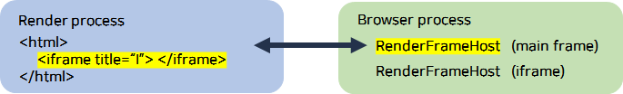
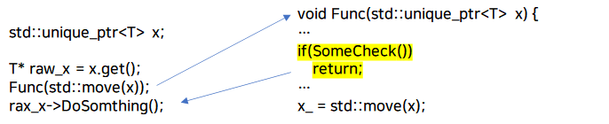

# Blackhat_usa_2021_chrome.md
# 목차
1. [Intro](#1-intro)   
2. [Put in one bug and pop out more: An effective way of bug hunting in Chrome](#2-put-in-one-bug-and-pop-out-morean-effective-way-of-bug-hunting-in-chrome)   
2.1 [Introduction](#21-introduction)   
2.2 [RenderFrameHost Issues](#22-renderframehost-issues)   
2.3 [ERROR RETURN ISSUES](#23-error-return-issues)   
2.4 [WeakPtr Optimization](#24-weakptr-optimization)   
2.5 [THE EOP VULNERABILITY](#25-the-eop-vulnerability)   
3. [Conclusion](#3-conclusion)   
4. [Reference](#4-reference)   


# 1. Intro


CodeQL에 대해 아는 정보가 거의 없었을 때 이 발표자료를 보았다. 어떤 아이디어를 가지고 이러한 쿼리를 작성했는지, 즉 효과적인 쿼리를 위해 어떤 사고방식으로 접근했는지 알아보기 위해 발표자료를 보고 분석을 진행했다. 주어진 시간 내에 모든 내용을 소화하기엔 무리가 있어 그 당시에 필요한 내용을 위주로 분석을 진행했고 글로 정리했다.

- [발표자료](https://www.blackhat.com/us-21/briefings/schedule/#put-in-one-bug-and-pop-out-more-an-effective-way-of-bug-hunting-in-chrome-22855)

# 2. Put in one bug and pop out more:An effective way of bug hunting in Chrome


## 2.1 Introduction


- Variant Analysis : 알려진 취약점을 기반으로 유사한 취약점 찾기
- The Target
    - Chrome
    - CodeQL

## 2.2 RenderFrameHost Issues


### RenderFrameHost(RFH)

웹 사이트를 탐색할 때마다 브라우저 프로세스는 새로운 렌더러 프로세스를 생성한다. 이 프로세스는 JavaScript, HTML 및 CSS와 같은 웹 사이트의 콘텐츠를 구문 분석하여 메인 프레임에 표시한다. 메인 프레임을 추적하고 통신하기 위해 브라우저 프로세스는 렌더러의 메인 프레임을 나타내는 [RenderFrameHostImpl(RFH) 객체](https://source.chromium.org/chromium/chromium/src/+/master:content/browser/renderer_host/render_frame_host_impl.h;l=252;drc=8f5b7ee843864f30c9483a8c64afa0433e2e9b90)를 인스턴스화한다.

웹 사이트에 JavaScript로 언제든지 생성 및 소멸될 수 있는 메인 프레임 내부에 다른 페이지 컨텍스트를 포함하는 여러 하위 프레임(iframe)이 있을 수 있다. 이때, 메인 프레임 내부의 하위 프레임이 메인 프레임과 같으면 렌더러 프로세스는 "frame" 객체를 만들고 frame-tree 데이터 구조를 사용하여 추적할 수 있다. 브라우저 프로세스는 이 동작을 미러링하고 [각각의 새 자식 프레임에 대해 새로운 RFH 객체를 만든다.](https://source.chromium.org/chromium/chromium/src/+/master:content/browser/renderer_host/frame_tree_node.h;l=53;drc=8f5b7ee843864f30c9483a8c64afa0433e2e9b90) 그러나 컨텍스트에 다른 콘텐츠가 포함되는 경우, site isolation으로 인해 브라우저 프로세스가 새로운 렌더러 프로세스를 생성한다.

한마디로 정의하자면 RenderFrameHost(RFH)는 브라우저 프로세스가 렌더러 안에 있는 프레임이랑 통신할 수 있는 통로를 마련해주는 인터페이스라고 이해할 수 있다. 여기서 취약점을 찾기위해 중요한 것은 프레임이 닫히게 되면 RenderFrameHost(RFH)는 소멸하게 된다는 것이다.



### How to Access a RFH?

> Store a `GlobalFrameRoutingId` and using `RenderFrameHost::FromID()` to retrieve it back
> Hold a raw pointer to RFH
> 

### An Example (Chrome Issue 1062091)

#### Root Cause [[crbug]](https://bugs.chromium.org/p/chromium/issues/detail?id=1062091&q=1062091&can=1)

```cpp
InstalledAppProviderImpl::InstalledAppProviderImpl(
    RenderFrameHost* render_frame_host)
    : render_frame_host_(render_frame_host) { // hold raw pointer
  DCHECK(render_frame_host_);
}
```

`InstalledAppProviderImpl`은 RFH를 멤버 변수로 인스턴스화한 raw pointer를 저장한다. Mojo 인터페이스가 RFH객체보다 오래 지속되지 않는다고 보장할 수 있는가? Mojo 인터페이스 객체가 생성되는 방식을 [여기](https://source.chromium.org/chromium/chromium/src/+/main:content/browser/renderer_host/render_frame_host_impl.h;l=1733?q=RenderFrameHostImpl&ss=chromium%2Fchromium%2Fsrc)와 [여기](https://source.chromium.org/chromium/chromium/src/+/main:content/browser/renderer_host/render_frame_host_impl.cc;l=9463;drc=c1d62d8428875969cdc66dade8090d8863b2561e?q=RenderFrameHostImpl&ss=chromium%2Fchromium%2Fsrc)서 확인할 수 있다.

```cpp
void InstalledAppProviderImpl::Create(
    RenderFrameHost* host,
    mojo::PendingReceiver<blink::mojom::InstalledAppProvider> receiver) {
  mojo::MakeSelfOwnedReceiver(std::make_unique<InstalledAppProviderImpl>(host), // pass raw pointer
                              std::move(receiver));
}
```

Mojo 인터페이스 객체를 `mojo::MakeSelfOwnedReceiver` 를 사용하여 인스턴스화할 수 있다. Mojo 인터페이스 객체의 수명은 mojo 연결과 연결되어 있다. mojo 연결이 유지되면 mojo 인터페이스 객체도 활성상태로 유지되고 mojo 연결(브라우저 및 렌더러 프로세스)의 양쪽이 객체 수명을 제어한다는 것을 의미한다. 

`SelfOwnedReceiver`는 `InstalledAppProviderImpl`에 대한 unique_ptr을 가지고 있다. 따라서 `InstalledAppProviderImpl` 객체는 수명이 서로 연결되어 있으므로 RFH객체가 소멸되면 해당 객체가 소멸된다는 것을 보장한다.

```cpp
void InstalledAppProviderImpl::FilterInstalledApps(
... ) {
	...
	if (base::FeatureList::IsEnabled(features::kInstalledAppProvider)) {
		...
		bool is_off_the_record =
        render_frame_host_->GetProcess()->GetBrowserContext()->IsOffTheRecord();
		...
	}
...
}
```

`InstalledAppProviderImpl::FilterInstalledApps`가 호출되기 전에 RenderFrameHost가 free된다면, virtual function은 free된 객체를 호출하게 되어서 UAF가 발생할 수 있다.

    
#### [[Patch]](https://chromium.googlesource.com/chromium/src.git/+/0c0bee9953f5e99dc690bef04391c67e4c146e93)

- `WebContentsObserver`
    - [chromium code search](https://source.chromium.org/chromium/chromium/src/+/master:content/browser/installedapp/installed_app_provider_impl.h;l=19;bpv=1;bpt=1)
    - Mojo 인터페이스 구현이 이 클래스에서 상속되는 경우 구현에 의해 재정의될 수 있는 콜백 이벤트(virtual method) 집합이 제공된다.
    - 이런 콜백에는 RFH 객체가 삭제될 때마다 트리거되는 `RenderFrameDeleted` 함수 가 있다.
    - 예시 :
        
        ```cpp
        void InstalledAppProviderImpl::RenderFrameDeleted(
            RenderFrameHost* render_frame_host) {
          if (render_frame_host_ == render_frame_host) {
            render_frame_host_ = nullptr;
          }
        }
        ```
        
- `FrameServiceBase`
    - `WebContentsObserver`의 Wrapper 클래스
    - `WebContentsObserver` 와 유사하지만 모든 콜백을 구현하고 구현 객체를 생성한 RFH 객체가 삭제되는 즉시 해제되도록 보장한다.
- 위의 메커니즘 중 하나를 사용하여 소유하고 있는 Mojo 인터페이스에 RFH 객체에 대한 UAF 문제가 없도록 보장할 수 있다.

### Finding Bug Variants

- 멤버 변수로써 raw pointer로 RFH를 저장한다.
- `FrameServiceBase`의 서브 클래스가 **아니다.**
- `WebContentsObserver`의 서브 클래스가 **아니거나** `RenderFrameDeleted` 메소드가 구현되지 **않았다.**

### CodeQL query

Issue 1062091의 패치 내용에 기반하여 쿼리를 작성한 것을 확인할 수 있다.

```
class ClassContatinsRFHPtr extends Class {
    ClassContatinsRFHPtr() {
        exists(Field field | this = field.getDeclaringType()
            and (
                field.getType().getName().matches("%RenderFrameHost%*%")
            )
        )
        and 
		not this.getABaseClass().getName().matches("FrameServiceBase")
        and 
		not this.getAMemberFunction().getName().matches("RenderFrameDeleted")
    }
}
```

### Result

Issue 1117348

## 2.3 ERROR RETURN ISSUES


앞서 설명한 RenderFrameHost 수명 문제는 일반적이다. 따라서 쿼리의 패턴을 변경하는 방법이 중요하다. 블랙햇 발표자들은 패턴을 변경하여 14개의 취약점을 찾았고, 5개의 CVE를 획득했다.

### Example

> CVE-2020-6461, crbug/1065704, CVE-2021-21115
> 

위 세 개의 취약점의 Root Cause는 결국 아래와 같다.

> 클래스 인스턴스의 코드 실행 중에 이 인스턴스를 파괴할 수 있는 다른 함수를 호출이 되고, 그 후에 멤버 변수나 멤버 변수에 접근하게 되면 인스턴스가 파괴되었기 때문에 UAF가 발생한다.
> 

### how to "mutate"

위 세 개의 취약점들은 전부 '상정하지 못했던 조건문을 타고 들어가 객체가 해제되었을 때'를 타겟으로 한다. 이를 위해 스마트 포인터가 가리키는 객체의 생명주기에 집중한다.

스마트 포인터가 가리키는 객체의 생명주기에 대한 시나리오는 다음과 같다. 



1. std::unique_ptr로 선언된 포인터를 raw pointer로 다시 저장한다.
2. unique_ptr을 std::move 함수를 이용하여 객체에 대한 소유권을 어떤 함수의 인자로 주면서 호출한다. 그 어떤 함수 안에서 인자로 받은 소유권을 어딘가로 넘기기 전에 함수가 종료되는데, 이때 스마트 포인터가 해제된다. (개발자는 예상하지 못했다.)
3. 함수가 종료되고 난 후, raw pointer는 해제된 영역을 가리키는 댕글링 포인터가 되고, 그 상태에서 virtual function을 호출하면 UAF가 발생한다.

#### std::uniqe_ptr

C++의 스마트포인터 중 하나로, 객체에 대한 유일한 "소유권"이 있음을 보장한다. 복사가 불가능하며 소유권 없이 객체를 삭제하지 못한다.

### CodeQL query

```
1  | ...
2  | and fc.getTarget() = vuln_func
3  | and fc.getAnArgument() = pass
4  | and vuln_func = para.getFunction()
5  | and move.getEnclosingFunction() = vuln_func
6  | and move.getTarget() instanceof StdMove
7  | and move.getAnArgument() = para.getAnAccess()
8  | and ret.getEnclosingFunction() = vuln_func
9  | and not dominates(move, ret)
10 | ...
```

취약한 함수가 `vuln_func`라 가정하고, 그 함수의 인자가 `para`인 것을 찾는다. 그리고 소유권을 넘겨주는 `move` 함수를 둘러싸고 있는 함수가 `vuln_func`여야 한다. 다시 말해서 `vuln_func` 함수의 바디에서 `move` 함수를 호출해야 한다. 이때 `move` 함수의 인자로 들어가는 변수는 `vuln_func`의 인자인 것이 와야한다고 7라인에서 말해주고 있으며, 함수가 종료되는 시점인 `ret`을 포함하는 함수가 `vuln_func`인 것을 검색한다고 8라인에서 명시하고 있다.

여기서 가장 중요한 것은 9라인의 `dominates`이다. loop는 코드 중간부터 시작하는 것이 불가능하다. loop 내부 코드들을 접근하려면 loop 시작 지점(entry basic block)을 항상 통과해야하는데 이를 dominance라고 한다. entry로부터의 모든 경로가 block N에 도달하기 위해 block M을 통과해야 하는 경우, block M은 block N의 dominator이다. `not dominates(move, ret)`을 해석하면 `'move(dominator)가 ret(node)의 dominator가 아니다.'`라고 설명할 수 있다. 이는 `ret`에 도달할 때 `move`를 거치는 것이 아닌 것을 의미한다. `move`를 거치면 `unique_ptr`의 소유권이 넘어가게 되어 계속 관리가 가능해지기 때문에 그 전에 `vuln_func` 함수가 종료되어 `unique_ptr`이 해제 되어야 하는 경우를 검색하는 것이다.

### [crbug.com/1150328](https://bugs.chromium.org/p/chromium/issues/detail?id=1150328)

블랙햇 발표자들이 위의 쿼리를 이용하여 찾은 취약점이다. 결론부터 이야기하면 위 쿼리는 대부분의 반환조건을 충족하기 어려운데 이 취약점이 그 예시이다. 찾고자하는 조건을 전부 만족하여 검색이 되었으나 실제 취약점은 다른 곳에서 발견이 된다.

#### Root Cause

```cpp
void DistillCurrentPageAndView(content::WebContents* old_web_contents) {
  DCHECK(old_web_contents);
  // Create new WebContents.
  content::WebContents::CreateParams create_params(
      old_web_contents->GetBrowserContext());
  std::unique_ptr<content::WebContents> new_web_contents =
      content::WebContents::Create(create_params);
  DCHECK(new_web_contents);

  // Copy all navigation state from the old WebContents to the new one.
  new_web_contents->GetController().CopyStateFrom(
      &old_web_contents->GetController(), /* needs_reload */ true);

  StartNavigationToDistillerViewer(new_web_contents.get(),
                                   old_web_contents->GetLastCommittedURL());

  std::unique_ptr<content::WebContents> old_web_contents_owned =
      CoreTabHelper::FromWebContents(old_web_contents)
          ->SwapWebContents(std::move(new_web_contents), false, false);

  std::unique_ptr<SourcePageHandleWebContents> **source_page_handle**(  // [1]
      new SourcePageHandleWebContents(old_web_contents_owned.release(), true));

  MaybeStartDistillation(std::move(source_page_handle)); // [2]

#if !defined(OS_ANDROID)
  dom_distiller::UMAHelper::LogTimeOnDistillablePage(old_web_contents); // [3] UAF!! 댕글링 포인터 사용
#endif
}
```

1. raw pointer인 `old_web_contents`의 소유권은 `SwapWebContents` 후에 `source_page_handle`로 전달된다.**[1]**
2. asan log 중 일부이다. `DistillCurrentPageAndView` 함수에서 호출하는 `MaybeStartDistillation` 함수의 인자로 unique_ptr인 `source_page_handle` 포인터의 소유권을 넘기고 해제되는 것을 확인할 수 있다**.[2]** 이때 `source_page_handle` 포인터와 연관되어 있는 raw pointer인 `old_web_contents`는 댕글링 포인터가 된다. 
    
    ```
    #5 0x55555e766967 in std::__Cr::unique_ptr<dom_distiller::SourcePageHandleWebContents, std::__Cr::default_delete<dom_distiller::SourcePageHandleWebContents> >::~unique_ptr() ./../../buildtools/third_party/libc++/trunk/include/memory:2
    587:19
    #6 0x55555e766967 in DistillCurrentPageAndView(content::WebContents*) ./../../chrome/browser/dom_distiller/tab_utils.cc:183:3
    ```
    
3. `LogTimeOnDistillablePage` 함수의 인자로 댕글링 포인터인 `old_web_contents`를 사용하게 되는데, 이때 UAF가 발생하게 된다.[3]


#### CodeQL 쿼리로 검색한 곳

```cpp
void MaybeStartDistillation( // [2]
    std::unique_ptr<SourcePageHandleWebContents> source_page_handle) {
  const GURL& last_committed_url =
      source_page_handle->web_contents()->GetLastCommittedURL();
  if (!dom_distiller::url_utils::IsUrlDistillable(last_committed_url)) // [!] CodeQL이 잡은 
    return;

  // Start distillation using |source_page_handle|, and ensure ViewerHandle
  // stays around until the viewer requests distillation.
  SelfDeletingRequestDelegate* view_request_delegate =
      new SelfDeletingRequestDelegate(source_page_handle->web_contents());
  DomDistillerService* dom_distiller_service =
      DomDistillerServiceFactory::GetForBrowserContext(
          source_page_handle->web_contents()->GetBrowserContext());
  std::unique_ptr<**DistillerPage**> distiller_page =
      dom_distiller_service->CreateDefaultDistillerPageWithHandle(
          std::move(source_page_handle)); 

  **std::unique_ptr<ViewerHandle> viewer_handle = dom_distiller_service->ViewUrl(
      view_request_delegate, std::move(distiller_page), last_committed_url); 

  view_request_delegate->TakeViewerHandle(std::move(viewer_handle));
}
```

블랙햇 발표자들이 작성한 CodeQL 쿼리가 실제로 검색한 곳은 아래와 같다. `MaybeStartDistillation` 함수의 인자로 넘어온 unique_ptr인 `source_page_handle` 포인터가 `move` 함수의 인자로 넘어가기 전에 어떤 if문 조건을 만족하면 함수가 종료가 된다. 처음에 쿼리를 작성할 때 검색하고자 하는 조건에는 부합하지만, 실제로 이 부분이 취약점을 야기시키는 루트커즈는 아니다. 

### Found a special case

따라서 블랙햇 발표자들은 쿼리를 보완하기 위해 뮤테이션 전략을 더 추가하게 된다. 이는 `nested message loop`에 관한 것이고 `CVE-2020-16004`를 예시로 설명하고 있다. 프로젝트 기간에 이 부분에 대한 코드 분석이 진행되지 않았음으로 이 보고서에서는 생략하도록 한다.

### Nested message loop Results

> crbug.com/1161147
> 8 UAF bugs about the Linux X11 clipboard
> 2 UAF issues related to the messageBox
> a series of issues in the ozone clipboard
> 

## 2.4 WeakPtr Optimization


### WeakPtr

Chromium은 C++의 스마트포인터 중 하나인 `std::weak_ptr`을 자체적으로 구현하여 `WeakPtr`로 사용하고 있다. 사실 `WeakPtr`은 실제로 스마트포인터가 아니다. 포인터 유형처럼 작동하지만 객체를 자동으로 해제하는데 사용되는 것이 아니라 다른 곳에서 소유한 객체가 아직 살아있는지 여부를 추적하는데 사용된다. 객체가 파괴되면 `WeakPtr`이 자동으로 null로 설정되므로 더 이상 살아있지 않음을 알 수 있다. 따라서 역참조 전에 null인지 테스트 하는 분기문이 존재해야한다. null인 `WeakPtr` 포인터를 맹목적으로 역참조하는 것은 null을 역참조하는 것과 같다. 블랙햇 발표자들은 `WeakPtr`이 null인지 검증하는 분기문에 집중했다.

### What if there is no null-test?

```cpp
1  | template <typename T>
2  | class WeakPtr : public internal::WeakPtrBase {
3  | // ...
4  |   T* operator->() const {
5  |     DCHECKref_.IsValid());
6  |     return get();
7  |   }
8  |
9  |   T* get() const {
10 |      return ref_.IsValid() ? reinterpret_cast<T*>(ptr_) : nullptr;
11 |   }
12 |
13 | }
```

실제 크롬에서 정의한 코드이다. 만약 nullptr 값을 가지고 있는 포인터의 null test를 하지 않을 때 어떤 일이 발생하는지 직접 테스트를 진행하였다. Null pointer dereference가 발생한다고 생각할 수도 있다. 

#### 테스트 코드

```cpp
#include <iostream>

class Bar {
	public:
		virtual void increase() { count_++; }
	private:
		int count_ = 0;
};

class Foo {
	public:
		Foo() {
			inner_ = new Bar();
			is_valid_ = true;
		}
		Bar* get() { return is_valid_ ? inner_ : nullptr; } // nullptr: 객체가 파괴되었음을 가정
		void invalidate() { is_valid_ = false; }
	private:
		Bar* inner_;
		bool is_valid_;
};

int main() {
	Foo* foo = new Foo();
	foo->invalidate();
	for(int i = 0; i < 2; i++)
		foo->get()->increase(); // nullptr->increase()
	std::cout << "Not crash" << std::endl;
	return 0;
}
```

#### 실행 결과

`nullptr`에 대한 virtual function은 프로세스를 중단하는 것을 확인할 수 있다. 

### Finding Bug Variants

`WeakPtr` as class member variable

Being accessed without any null-test

### CodeQL query

#### Step 1 : Find function calls like `foo→method()`

```cpp
foo->method();
```

위 C++ 코드의 형태를 검색하기 위해서 아래와 같은 쿼리를 작성하였다.

```cpp
[weak_ptr.getType().getName()](https://codeql.github.com/codeql-standard-libraries/java/semmle/code/java/Member.qll/type.Member$Field.html).[matches](https://codeql.github.com/codeql-standard-libraries/java/type.string.html)("%WeakPtr<%>%") // WeakPtr< >
and fc.getQualifier() = weak_ptr.getAnAccess().(Expr)
and fc.getTarget().getName().matches("%operator->%") // operator->
```

타입이 `WeakPtr`인 변수 `weak_ptr`을 검색하고, 호출한 함수 포인터 변수 이름의 왼쪽에 있는 표현식이 `weak_ptr`이 접근할 수 있는 것임을 검색한다. 마지막으로 호출한 함수는 virtual function이기 때문에 `operator->`인 것을 검색하여 해당하는 것을 검색한다.

#### Step 2 : There is no null-test before accessing WeakPtr

```cpp
if(condition) {
	// ...
	return;
}
foo->method();
```

위 C++ 코드의 형태를 검색하기 위해서 아래와 같은 쿼리를 작성하였다.

```
weak_ptr.getType().getName().matches("%WeakPtr<%>%") // WeakPtr< >
and fc.getQualifier() = weak_ptr.getAnAccess().(Expr)
and fc.getTarget().getName().matches("%operator->%") // operator->
not exists(IfStmt if_stmt | isWeakPtrCheck(if_stmt, weak_ptr) 
	and dominates(if_stmt.getCondition(), fc)
)
```

`isWeakPtrCheck`는 if문을 의미하는 `if_stmt`에서 `weak_ptr`가 null인지 검증을 하는 함수인 것으로 보인다. not을 붙여서 이러한 검증을 하지 않는 것을 검색한다. 또한 `dominates`를 통해 virtual function인 `fc`에 도달할 때 `if_stmt`의 if문 조건식을 거치지 않는, 즉 if문을 거쳤다가 `fc`에 도달하지 않는 것을 검색한다.

### Results

블랙햇 발표자들은 위와 같은 쿼리를 작성한 후 363개의 결과를 얻었으며 아래와 같은 3개의 CVE를 획득했다고 한다. 프로젝트 기간에 부분에 대한 코드 분석이 진행되지 않았음으로 이 보고서에서는 생략하도록 한다. 

> CVE-2020-15996
> CVE-2020-16014
> CVE-2020-16016
> 

## 2.5 THE EOP VULNERABILITY

Intro에서도 언급했지만, 이 블랙햇 발표자료를 분석한 이유는 CodeQL에 익숙치 않아 CodeQL을 어떻게 활용하는 지 알기 위함이다. 발표자료를 분석할 당시 exploit을 어떻게 하는지에 대해서는 당장의 관심사가 아니었기 때문에 이 부분에 대해서는 생략하도록 했다.                                                                                                                                                                                                                                                                                                                                                 

# 3. Conclusion


효과적인 쿼리를 위해 어떤 사고방식으로 접근했는지에 대해 파악할 수 있었다.

> 1. 원데이의 패치 내역을 패턴화하여 적용되지 않은 부분을 쿼리로 작성하여 검색
> 2. 취약점의 루트커즈를 패턴화하여 해당 부분을 쿼리로 작성하여 검색
> 

동일한 패턴을 이용하기엔 크롬에서 이미 자체적으로 MiraclePtr이라는 개념을 만들어서 소스코드에 적용하고 있어 raw pointer 바인딩을 이용한 익스플로잇은 불가능하게 되었다. 따라서 우리는 다른 패턴을 이용하게 되었고 자세한 것은 [Overview.md](./../Overview.md)와 [Designing_CodeQL_queries.md](./../Designing_CodeQL_queries.md)를 참고하길 바란다.

# 4. Reference


[https://microsoftedge.github.io/edgevr/posts/yet-another-uaf/](https://microsoftedge.github.io/edgevr/posts/yet-another-uaf/)

[https://blog.theori.io/research/escaping-chrome-sandbox/](https://blog.theori.io/research/escaping-chrome-sandbox/)

[https://www.chromium.org/developers/smart-pointer-guidelines/](https://www.chromium.org/developers/smart-pointer-guidelines/)
