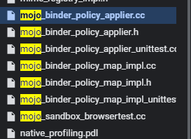

# Review_of_chromium_IPC_vulnerabilities.md

이 글은 이 [게시글](https://securitylab.github.com/research/chromium-ipc-vulnerabilities/)을 공부해 정리한 글입니다.

---
# 목차
- [이 글의 핵심 사항](#이-글의-핵심-사항)   
- [Chromium 멀티프로세스 구조](#chromium-멀티프로세스-구조)   
  * [멀티프로세스 구조의 특징과 이점](#멀티프로세스-구조의-특징과-이점)   
  * [프로세스의 분류](#프로세스의-분류)   
- [Chromium IPC 인터페이스](#chromium-ipc-인터페이스)   
  * [Main channels for IPC](#main-channels-for-ipc)   
  * [Mojo 인터페이스](#mojo-인터페이스)   
    + [Ways to fuzz/test Mojo IPC interfaces](#ways-to-fuzztest-mojo-ipc-interfaces)   
    + [Way 1)](#way-1)   
    + [Way 2)](#way-2)   
  * [Old IPC 인터페이스](#old-ipc-인터페이스)   
- [기존 버그 분석](#기존-버그-분석)   
  * [Category 1: raw pointer 필드를 비정상적으로 관리한 경우](#category-1-raw-pointer-필드를-비정상적으로-관리한-경우)   
    + [1. raw pointer가 owner를 가리키는 경우](#1-raw-pointer가-owner를-가리키는-경우)   
    + [2. raw pointer 클래스의 소멸자가 그 자신의 reference를 없애버리는 경우](#2-raw-pointer-클래스의-소멸자가-그-자신의-reference를-없애버리는-경우)   
  * [Category 2: 콜백을 저장하는 raw pointer](#category-2-콜백을-저장하는-raw-pointer)   
  * [Category 3: RenderFrameHost 수명 문제](#category-3-renderframeHost-수명-문제)   
- [결론](#결론)
---

# 이 글의 핵심 사항:

1. chromium의 샌드박스 모델에 대한 간단 설명
2. IPC에서 발생한 취약점 소개
3. 취약점들을 어떻게 분류했는지
    
    → 핵심: IPC 채널로 인해 트리거되는 취약점들.
    

# Chromium 멀티프로세스 구조

## 멀티프로세스 구조의 특징과 이점:

- Chromium 브라우저는 여러 종류의 프로세스가 함께 돌아가는 프로세스이다.
- 이 각각의 프로세스별로 권한이 다르고, 맡은 업무도 다르다.
    
    →이러한 멀티프로세스 구조는 1) 브라우저 안정성에 좋고 2) 좀 더 점조직적으로 권한을 분산해 줄 수 있다.
    
    - 2)의 경우, OS 레벨에서의 샌드박싱을 이용해서 각 프로세스에게 샌드박스를 적용함으로써 가능하다.
- 이런 다양한 권한, 다양한 기능을 가진 프로세스끼리 통신해야 한다.
    
    → 이를 위해 IPC를 사용한다=IPC 메시지를 보낸다고 표현한다.
    

## 프로세스의 분류:

- 보안적 관점으로 봤을 때, 크로미움 프로세스는 크게 두 가지로 나뉠 수 있다.
    1. 렌더러 프로세스 계열: '가장 낮은 권한' & '가장 철저하게 샌드박싱됨'
        - 렌더러에서 터트릴 수 있는 RCE 취약점이 브라우저 프로세스의 또 다른 취약점과 연계되어야 샌드박스 탈출을 할 수 있다.
        - 예외
            1. 렌더러 샌드박스 내에서 액세스 되는 안드로이드 바인더 프로세스랑 안드로이드 서비스의 취약점을 이용해 샌드박스 탈출한 사례.
            2. 렌더러가 직빵으로 Win7의 win32k.sys 커널 드라이버를 익스한 사례.
    2. 브라우저 프로세스 계열

# Chromium IPC 인터페이스

## Main channels for IPC

1. Mojo: 제일 많이 쓰인다.
2. Older IPC interface: 옛날 것이긴 해도, 여전히 사용되고 있다.

## Mojo 인터페이스

> 핵심: 1) mojo 인터페이스가 코드 상에서는 어떤 식으로 사용되는가 2) 코드의 어디를 봐야 mojo 인터페이스를 찾을 수 있는가.
> 

Mojo 인터페이스는 크로미움 소스 코드의 `.mojom`에 정의되어 있다.

`.mojom` 파일은 크로미움을 빌드할 때, C++ 소스코드와 JavaScript의 binding을 생성한다.

---

### Ways to fuzz/test Mojo IPC interfaces

### Way 1)

브라우저 프로세스 상에서 Mojo 인터페이스의 implementations는 주로 content/browser dir에 있다. 

*예외) PaymentRequest*

이런 인터페이스들의 implementation을 찾아서 implementation을 테스트하는 방법.




implementation 사진이다.

이 인터페이스들의 JS 버전에 접근하기 위해 사용하는 메소드가 바로 `Mojo.bindInterface` 이다.

사용 예시:

```cpp
var payment_request = new payments.mojom.PaymentRequestPtr();//line1// JS 코드에서 Ptr 키워드 있으면, 렌더러에서 브라우저에게 요청하는 느낌이다.
    Mojo.bindInterface(payments.mojom.PaymentRequest.name,
                       mojo.makeRequest(payment_request).handle);//line2
```

line 1: `PaymentRequestPtr`을 생성한다. 이 `PaymentRequestPtr`은 렌더러 쪽의 프록시로 작동하고, 브라우저 프로세스에 implement 되어 있는 `PaymentRequest`랑 바운드될 수 있다.

line 2: `Mojo.bindInterface` 가 `payment_request` 를 `payments.mojom.PaymentRequest` 에 바인드해 주고 있다. 

이런 일련의 작업을 거처서 **`PaymentRequest` 인터페이스에 정의된 메소드들을 JS에서 사용할 수 있게 된다**. 예시를 보자:

```JavaScript
payment_request.init(
        payment_request_client,
        [],
        payment_details,
        payment_options);
```

위 코드는 `PaymentRequest` 인터페이스에 정의된 `init` 메소드를 실행시키고 있다.

JS로 명시된 코드 내에서, C++ 메소드를 콜했음에도 불구하고 사용할 수 있는 것. 즉, 바인딩이 이루어진다.

### Way 2)

fuzz harness 같은 간소화된 테스트 코드를 만들어서, IPC 인터페이스들을 직접 테스트한다.

이런 식으로 퍼징하는 게 바로 `AppCacheFuzzer` .

(여기 아래 내용은 모두 `AppCacheAPI` 퍼저 설명이라 스킵)

## Old IPC 인터페이스

대부분 IPC는 Mojo 인터페이스 소관으로 넘어갔는데, 그래도 여전히 레거시 IPC 인터페이스가 사용되고 있고, 거기에서 또 취약점이 간간히 터진다.

이런 Old IPC 인터페이스를 사용하는 클래스의 경우, 내부에 `OnMessageReceived`[^MR] 메소드를 정의해 놨다. 
[^MR]: 서로 다른 메시지가 서로 다른 핸들러에 매핑되도록 해주는 메소드.

`OnMessagReceived` 예시

```cpp
MyClass::OnMessageReceived(const IPC::Message& message) {
  ...
  IPC_MESSAGE_HANDLER(ViewHostMsg_MyMessage, OnMyMessage); //<-- OnMyMessage is the handler
  ...
}
```

 `OnMyMessage` 핸들러가 Mojo 인터페이스의 메소드처럼 동작한다. 즉, 다른 프로세스가 보낸 IPC를 관리(handle)하는 역할을 하는 것이다.

반대로, 렌더러 쪽에서 다른 프로세스로 메시지를 보내고 싶으면, `Send` 메소드를 이렇게도 쓸 수 있다.

```cpp
Send(new ViewHostMsg_MyMessage());
```

이렇게 소개된 Send/Receive 관련 인터페이스가 Old IPC 인터페이스에서는 마오 윤이 아는 한 유일한지라, 마오 윤은 렌더러를 패치해서 이 인터페이스에 렌더러가 메시지를 보내게 한 상태로 취약점 테스트를 진행했다.

# 기존 버그 분석

- 2019년 상반기 동안의 취약점을 분석함. 마오 윤이 한정한 취약점 루트 커즈 타입은 아래와 같다.
    - raw 포인터와 unique 포인터 간의 상호작용으로 인해 발생한 취약점
    - 콜백 함수를 잘못 다뤄서 발생한 취약점
- 위 취약점들의 대부분은 object lifetime 관리 문제로 인해 발생했다.
    - raw pointer를 가리키는 오브젝트들이 렌더러에 의해서 프리됐다가 브라우저 프로세서에서 사용되는 경우.(UAF)
- 이렇게 취약점 루트 커즈 타입을 대략적으로라도 나눠 보면, 문제점에 대한 이해도가 깊어져서 버그를 찾기에 좋다.

## Category 1: raw pointer 필드를 비정상적으로 관리한 경우

: raw pointer 필드 관련, 분류하기 힘든 문제들을 모아둔 기타 카테고리

### 1. raw pointer가 owner를 가리키는 경우

은근 잘 보이는 경우. 이런 케이스는 웬만하면 object lifetime 문제가 생기지 않는다.

케이스 예시:

```cpp
class A {
  ...
  A() {
    b_ = std::make_unique<B>(this);
  }
  std::unique_ptr<B> b_;
}

class B {
  ...
  B(A* a) {
    a_ = a;
  }

  A* a_;
}
```

클래스 B의 인스턴스들이 A의 생성자 내부에서 모두 생성됐을 경우, 클래스 B 안에 있는 a_는 웬만하면 재할당되기 전까진 클래스 B 오브젝트의 owner를 가리키고 있게 된다.

### 2. raw pointer 클래스의 소멸자가 그 자신의 reference를 없애버리는 경우

이 경우도 정말 흔하다. 로우 포인터를 가지고 있는 클래스는 그 포인터가 가리키고 있는 객체의 lifetime을 "observe"하는데, 이걸 통해 그 객체가 지워지면 로우 포인터도 지워지게끔 해준다. 

예시-옵저버

```cpp
class A extends BObserver {
  ...
  A(B* b) {//1. 여기에서 B의 인스턴스 생성
    b_ = b;
    b_->AddObserver(this); //이거 b_->AddObserver(A) 맞아?
  }

  ~A() {//3. 
    if (b_) {
      b_->RemoveObserver(this);
    }
  }

  void OnBDestroyed(B* b) { //2. 객체 라이프타임 문제 해결책
    if (b == b_) {
      b_ = nullptr;
    }
  }
  B* b_
}

class B {
  ...
  ~B() {
    for (BObserver* observer : observers_) {
      observer->OnBDestroyed(this);
    }
  }
}
```

이런 식의 안전장치가 적용된 사례 중 `FrameServiceBase` 라는 게 있는데, 이건 `RenderFrameHost` 를 가리키는 `raw pointer` 를 가지고 있으면서, 그 `raw pointer` 의 lifetime을 "observe" 함으로써 UAF를 막는다.

명시적인 보호를 받지 않는 `raw pointer` 필드들의 경우 좀 더 복잡한 로직을 통해 보호받는데, 이런 건 대부분의 경우 아무 문제도 일으키지 않는다. 하지만 문제는 Clean up logic을 수행할 때다. 보통 이런 곳에 잘못된 부분이 있기 때문이다.

## Category 2: 콜백을 저장하는 raw pointer

IPC와 연관된 코드 상에서 콜백이 정말, 아주 많이 사용된다. 크롬 코드 상에서 콜백은 `base::BindOnce` 혹은 `base::BindRepeating` 함수를 통해 생성되는 경우가 대부분인데, 이렇게 콜백이 생성될 경우 이 콜백에 인자들(arguments)이 바운드(bound)된다. 이러한 바인딩에는 여러 타입이 있는데, 각 바인딩 타입들은 현재 이 바인드의 상태가 어떻게 관리되고 있는지를 명시해 준다. 바인딩 타입들 중 가장 위험한 상태를 가리키고 있는 것은 `base::Unretained` 바인딩이다. 아래 코드를 보자.

```cpp
base::Bind(&MyClass::Foo, base::Unretained(ptr)); // Foo라는 콜백함수에 ptr이라는 인자를 바인드함
```

이것의 의미는, 콜백이 `ptr`를 가지고 있지 않는 데다가 콜백이 실행되었을 경우 콜백을 실행한 주체가 `ptr` 이 살아 있는지 체크할 책임이 있다는 것이다. 그래서 `base::Unretained` 를 사용할 경우 왜 이걸 사용하는지 이유를 명시한 코멘트를 코드에 달아 두는 게 일반적이다.

## Category 3: `RenderFrameHost` 수명 문제

`RenderFrameHost`는 브라우저 프로세스 내부에 있는 frame을 관장하는 것이다. 이것들은 수명이 길기 때문에 대부분의 IPC 서비스들보다 훨씬 오래 살아 있게 된다. 그런데, 메소드나 서비스 중에서 IPC 서비스랑 바인드된 것들이 `RenderFrameHost` 보다 훨씬 오래 살아남는 경우가 발생한다. 이러면 당연히 문제가 생긴다. 

# 결론

이렇게 취약점들을 전부 모아 보면서 분석하는 데 사용된 QL 라이브러리와 쿼리는 [여기](https://github.com/github/securitylab/tree/main/CodeQL_Queries/cpp/Chrome)(링크)에 있다. (이하 중요하지 않아 생략)
